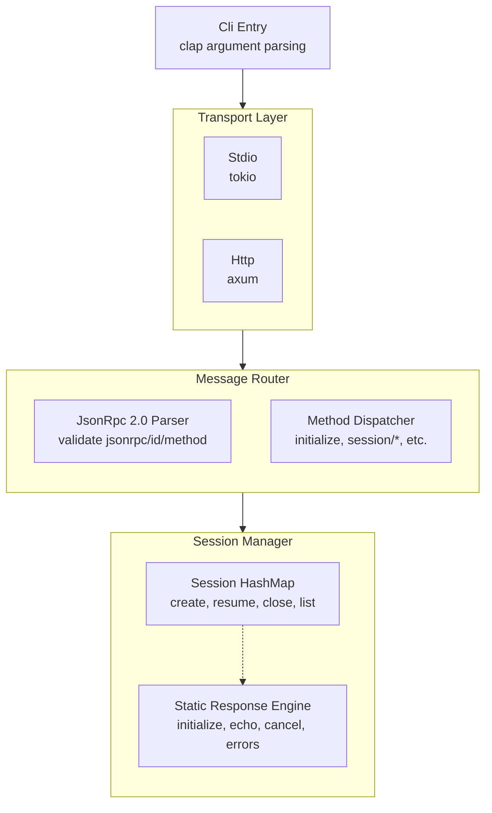
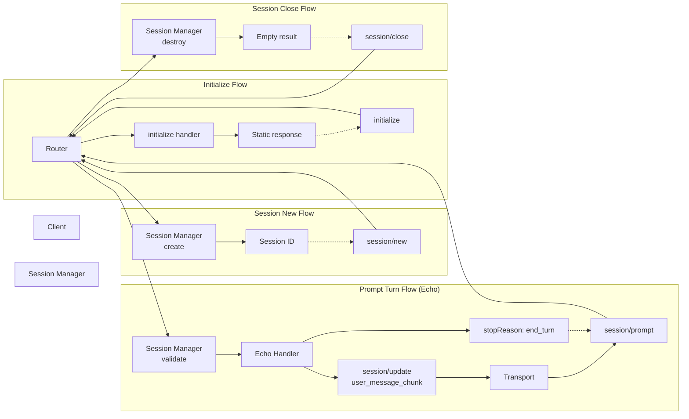
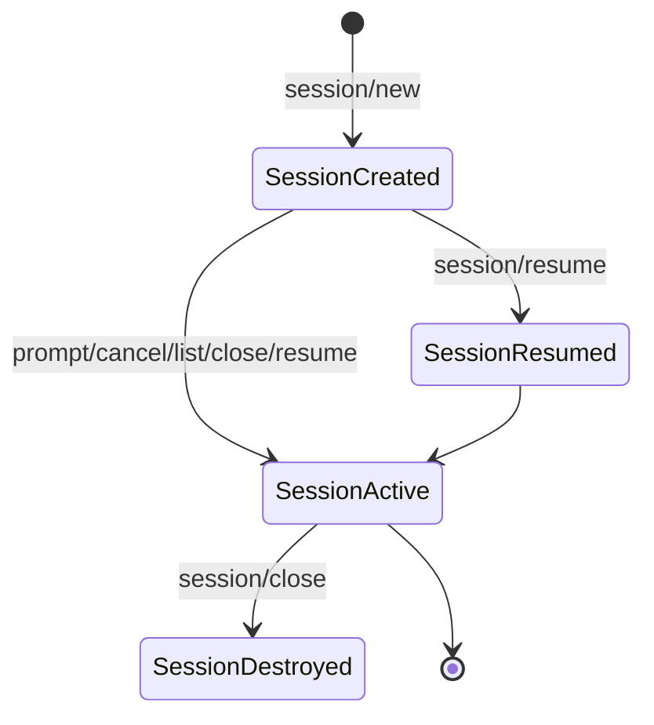

# ACP Server Implementation Plan

## Architecture Overview



## Module Structure

```mermaid
graph TD
    SourceRoot["src/"]
    MainRs["main.rs<br/>CLI entry, transport selection"]
    ConfigRs["config.rs<br/>CLI arguments, runtime config"]
    TypesRs["types.rs<br/>AcpMessage, SessionId, etc."]
    JsonRpcRs["jsonrpc.rs<br/>JSON-RPC 2.0 parser/encoder"]
    ErrorRs["error.rs<br/>Error types and conversion"]

    SessionDir["session/"]
    SessionMod["mod.rs<br/>Session module"]
    ManagerRs["manager.rs<br/>Lifecycle: create, resume, close, list"]
    StoreRs["store.rs<br/>In-memory session storage"]

    HandlersDir["handlers/"]
    HandlersMod["mod.rs<br/>Handler trait"]
    InitializeRs["initialize.rs"]
    SessionNewRs["session_new.rs"]
    SessionLoadRs["session_load.rs"]
    SessionResumeRs["session_resume.rs"]
    SessionListRs["session_list.rs"]
    SessionCloseRs["session_close.rs"]
    SessionPromptRs["session_prompt.rs"]
    SessionCancelRs["session_cancel.rs"]
    SessionSetModeRs["session_set_mode.rs"]
    EchoRs["echo.rs<br/>Static response generation"]

    TransportsDir["transports/"]
    TransportsMod["mod.rs<br/>Transport trait"]
    StdioRs["stdio.rs"]
    HttpRs["http.rs"]

    SourceRoot --> MainRs
    SourceRoot --> ConfigRs
    SourceRoot --> TypesRs
    SourceRoot --> JsonRpcRs
    SourceRoot --> ErrorRs
    SourceRoot --> SessionDir
    SourceRoot --> HandlersDir
    SourceRoot --> TransportsDir

    SessionDir --> SessionMod
    SessionDir --> ManagerRs
    SessionDir --> StoreRs

    HandlersDir --> HandlersMod
    HandlersDir --> InitializeRs
    HandlersDir --> SessionNewRs
    HandlersDir --> SessionLoadRs
    HandlersDir --> SessionResumeRs
    HandlersDir --> SessionListRs
    HandlersDir --> SessionCloseRs
    HandlersDir --> SessionPromptRs
    HandlersDir --> SessionCancelRs
    HandlersDir --> SessionSetModeRs
    HandlersDir --> EchoRs

    TransportsDir --> TransportsMod
    TransportsDir --> StdioRs
    TransportsDir --> HttpRs
```



## Dependencies

```toml
# Cargo.toml (actual)
tokio = { version = "1", features = ["full"] }
serde = { version = "1", features = ["derive"] }
serde_json = "1"
clap = { version = "4", features = ["derive"] }
axum = { version = "0.7", features = ["http1"] }
uuid = { version = "1", features = ["v4", "serde"] }
thiserror = "1"
anyhow = "1"
```

**Dependency Justification:**
- **axum 0.7**: HTTP transport uses JSON-RPC over HTTP POST. axum provides clean routing and JSON body parsing.
- Diagnostics use `eprintln!` to stderr, keeping stdout clean for JSON-RPC messages (per ACP transport spec).

## Transport Implementations

### Stdio Transport
- **Behavior**: Client launches agent as subprocess; agent reads from stdin, writes to stdout
- **Message framing**: Newline-delimited JSON (NDJSON), no embedded newlines
- **Constraints**: Single client, synchronous message processing per message, stderr for logging only
- **Lifecycle**: Server runs until stdin closes or receives SIGTERM/SIGINT

### HTTP Transport (Streamable HTTP)
- **Behavior**: ACP's native HTTP transport using JSON-RPC over HTTP POST
- **Endpoint**: `POST /` with `Content-Type: application/json`
- **Encoding**: JSON-RPC 2.0 messages in HTTP request body, response in HTTP response body
- **Constraints**: Single client per connection, request/response model
- **Lifecycle**: Server runs until SIGTERM/SIGINT
- **Reference**: ACP Transports defines HTTP transport as JSON-RPC over HTTP

## Data Flow



## Message Routing

All messages pass through a single router:

1. **Parse** JSON-RPC 2.0 envelope
2. **Validate** required fields (`jsonrpc`, `id` for requests, `method`)
3. **Route** to handler by `method` name
4. **Execute** handler logic
5. **Encode** response or notification
6. **Transmit** via current transport

**Unknown methods** return JSON-RPC `-32601 Method not found` error.

**Invalid requests** return JSON-RPC `-32600 Invalid Request` error.

**Parse errors** return JSON-RPC `-32700 Parse error` error.

## Session Management

### Session Lifecycle



### Session Data Model

```rust
struct Session {
    id: SessionId,          // UUIDv4
    cwd: String,            // echoed back to client
    created_at: DateTime<Utc>,
}
```

### Session Store

- `RwLock<HashMap<SessionId, Session>>` — concurrent read, exclusive write
- No expiration, no limits, no persistence
- Simple create/remove/list operations
- `RwLock` chosen because reads (list, validation) are more frequent than writes (create, close)

### `session/load` vs `session/resume`

These are distinct methods per ACP spec:

| Method | Capability | Behavior |
|--------|-----------|----------|
| `session/load` | `loadSession` | Replays conversation history via `session/update` notifications |
| `session/resume` | `sessionCapabilities.resume` | Restores session context, does NOT replay history |

- Basic harness does NOT support either (no conversation history to restore)
- `session/load` returns `-32602` (loadSession capability is false)
- `session/resume` returns empty result `{}` (session restored, no history replayed)

## Static Response Engine

Each handler returns a predetermined response:

| Handler | Response | Notes |
|---------|----------|-------|
| `initialize` | Static capabilities + version | `loadSession: false`, no auth |
| `authenticate` | Error `-32601` | Method not found (no auth methods advertised) |
| `session/new` | `SessionId::new_v4()` + modes | Echo `cwd` back in result |
| `session/load` | Error `-32602` | `loadSession` not supported |
| `session/resume` | Empty result `{}` + `session/update` notifications | Replay dummy echo conversation via notifications, then return `{}` |
| `session/list` | List of active sessions | No filtering needed |
| `session/close` | Empty result `{}` | Remove session, no error if missing |
| `session/set_mode` | Empty result `{}` | Store mode on session object |
| `session/set_config_option` | Error `-32601` | Method not found (config out of scope) |
| `session/prompt` | Echo + `end_turn` | Sends `session/update` with user message text, then `end_turn` |
| `session/cancel` | Notification + `cancelled` | Sends cancellation notice, then responds to original prompt |

## Error Handling

### JSON-RPC 2.0 Error Codes
| Code | Name | When |
|------|------|------|
| -32700 | Parse error | Invalid JSON or not a valid message object |
| -32600 | Invalid Request | Missing `jsonrpc`, `method`, or invalid `params` |
| -32601 | Method not found | Unknown method name |
| -32602 | Invalid params | Missing required params or type mismatch |
| -32603 | Internal error | Unexpected handler error |

### Transport-Level Errors
- Port already in use → exit with error message
- Stdio disconnect → graceful shutdown
- SIGINT/SIGTERM → graceful shutdown (close all sessions)

## Testing Strategy

### Unit Tests (`tests/unit/`)

| Test | File | What it validates |
|------|------|-------------------|
| JSON-RPC parsing | `jsonrpc_tests.rs` | Valid/invalid JSON-RPC messages round-trip |
| Initialize handler | `handlers/initialize_tests.rs` | Response structure matches spec |
| Session CRUD | `session/store_tests.rs` | Create, list, close sessions |
| Prompt echo | `handlers/prompt_tests.rs` | session/update notification + end_turn response |
| Error formatting | `error_tests.rs` | Correct JSON-RPC error codes and messages |
| Session ID generation | `types_tests.rs` | UUIDv4 uniqueness |

### Integration Tests (`tests/integration/`)

| Test | What it validates |
|------|-------------------|
| `stdio_roundtrip.rs` | Send messages via stdin, verify stdout output |
| `http_roundtrip.rs` | Internal HTTP client sends request, verifies response |
| `lifecycle.rs` | Full ACP lifecycle: initialize → new → prompt → close |

### Test Harness

Since workflow tests cannot run directly in CI, the integration test harness:

1. **Stdio tests**: Spawn the binary as a child process, send JSON to stdin, read and validate stdout lines
2. **HTTP tests**: Use `reqwest` async client against a local test server

All integration tests use a test harness that:
- Starts the server on a random available port
- Waits for it to be ready (poll endpoint)
- Runs test messages
- Verifies responses
- Shuts down the server

**CI validation**: `cargo test` runs all unit and integration tests. The `--transport` flag is not needed in tests as each test module explicitly uses its transport.

### Test Commands

```bash
# Run all tests
cargo test

# Run only unit tests
cargo test --lib

# Run only integration tests
cargo test --test integration

# Run stdio-specific tests
cargo test --test stdio_roundtrip
```

## Risks and Mitigations

| Risk | Impact | Mitigation |
|------|--------|------------|
| Single-threaded message processing | Concurrency | Tokio single-threaded runtime per connection; not multi-client |
| Stdio buffer blocking on slow client | Deadlock | Non-blocking writes; handle WriteError gracefully |

## Deployment

- Single binary `acp-server`
- No configuration files
- Environment variables not required
- Logs to stderr
