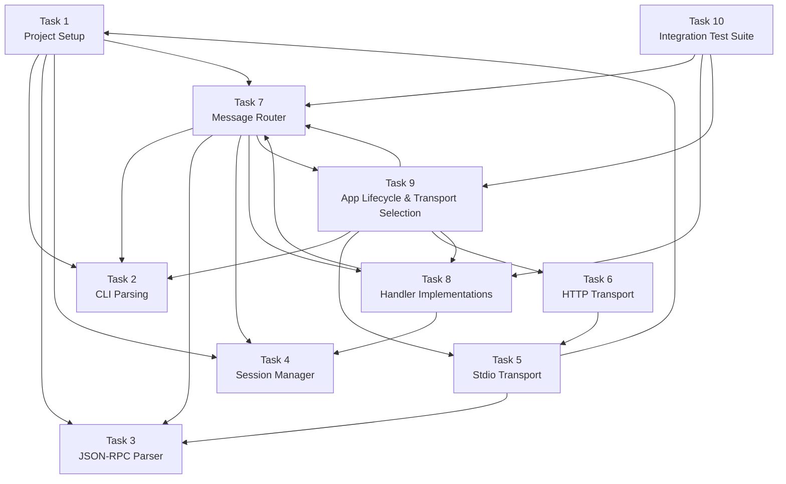

# ACP Server Tasks

## Task 1: Project Setup and Build Infrastructure

**Description**: Create the Rust project structure with all dependencies and module scaffolding.

**Spec Reference**: N/A (infrastructure)

**Dependencies**: None

**Acceptance Criteria**:
- `cargo init` creates project
- `Cargo.toml` includes all dependencies: tokio, serde, serde_json, clap, axum (http1), uuid, thiserror, anyhow
- `cargo build` succeeds without warnings
- Module structure matches plan: `src/main.rs`, `src/config.rs`, `src/types.rs`, `src/jsonrpc.rs`, `src/error.rs`, `src/session/`, `src/handlers/`, `src/transports/`

**Testing**: `cargo test` passes (no-op for now)

---

## Task 2: CLI Argument Parsing

**Description**: Implement command-line argument parsing for `--transport`, `--bind`, and `--http-port`.

**Spec Reference**: Transport Options, Port Configuration

**Dependencies**: Task 1

**Acceptance Criteria**:
- `--transport` flag accepts `stdio` or `http`; required flag
- `--bind` defaults to `127.0.0.1`
- `--http-port` defaults to 3811
- Invalid or missing `--transport` exits with code 1 and error message
- `cargo run -- --help` shows usage

**Testing**: Unit tests in `src/config.rs` for argument parsing

---

## Task 3: JSON-RPC 2.0 Parser and Encoder

**Description**: Implement JSON-RPC 2.0 message validation, parsing, and encoding.

**Spec Reference**: Message Format, Error Handling

**Dependencies**: Task 1

**Acceptance Criteria**:
- Parses valid JSON-RPC 2.0 messages (requests, responses, notifications, errors)
- Rejects invalid JSON with `-32700 Parse error`
- Rejects missing `jsonrpc` field with `-32600 Invalid Request`
- Rejects unknown method names with `-32601 Method not found`
- Generates correct response envelope with matching `id`
- Notifications have no `id` field
- Round-trip: parse → encode → parse produces identical structure

**Testing**: `tests/unit/jsonrpc_tests.rs` with 10+ test cases covering valid/invalid input

---

## Task 4: Session Manager (In-Memory Store)

**Description**: Implement session lifecycle management using a thread-safe in-memory `HashMap`.

**Spec Reference**: Session Management, Static Response Behavior

**Dependencies**: Task 1

**Acceptance Criteria**:
- `create(id, cwd)` creates new session with timestamp
- `load(id)` returns `None` (not implemented in basic harness)
- `resume(id)` returns `true` if session exists, `false` otherwise
- `list()` returns all sessions (no filtering — no expiry)
- `close(id)` removes session; returns `false` if not found
- Thread-safe access using `RwLock`
- No persistence, no expiry, no limits

**Testing**: `src/session/store_tests.rs` covering CRUD operations, concurrency

---

## Task 5: Transport Trait and Stdio Implementation

**Description**: Define transport trait and implement stdio transport (line-delimited JSON-RPC over stdin/stdout).

**Spec Reference**: Transport Options (stdio), Message Format

**Dependencies**: Task 1, Task 3

**Acceptance Criteria**:
- Transport trait defines `send(message) -> Result`, `recv() -> Result<Message>`
- Stdio transport reads newline-delimited JSON from stdin
- Stdio transport writes newline-delimited JSON to stdout
- Stderr used for logging only
- Handles EOF and WriteError gracefully
- Notifications from handlers (e.g. `session/update`) are written to stdout before response

**Testing**: `tests/integration/stdio_roundtrip.rs` spawning binary, sending messages, verifying output

---

## Task 6: HTTP Transport

**Description**: Implement HTTP transport using axum with streamable HTTP support.

**Spec Reference**: Transport Options (http)

**Dependencies**: Task 5

**Acceptance Criteria**:
- HTTP transport listens on `--bind` and `--http-port` (default `127.0.0.1:3811`)
- HTTP endpoint `POST /` accepts JSON-RPC messages
- HTTP transport follows streamable HTTP format (JSON-RPC over HTTP POST)
- Single-client enforcement per connection
- Graceful shutdown on SIGINT/SIGTERM

**Testing**: `tests/integration/http_roundtrip.rs`

---

## Task 7: Message Router

**Description**: Implement the central message router that dispatches messages to handlers.

**Spec Reference**: Message Routing, Error Handling

**Dependencies**: Task 3, Task 4, Task 5, Task 6

**Acceptance Criteria**:
- Routes `initialize` → initialize handler
- Routes `authenticate` → error handler (`-32601`, not required)
- Routes `session/new`, `session/load`, `session/resume`, `session/list`, `session/close`, `session/set_mode`, `session/prompt`, `session/cancel` → respective handlers
- Routes `session/set_config_option` → error handler (`-32601`, out of scope)
- Routes unknown methods to `-32601` error handler
- Returns errors for invalid messages per JSON-RPC 2.0 spec
- Supports both request-response and notification flows

**Testing**: Integration test routing all methods to correct handlers

---

## Task 8: Handler Implementations

**Description**: Implement all ACP method handlers with static responses.

**Spec Reference**: Static Response Behavior, Session Management, Prompt Turn

**Dependencies**: Task 4, Task 7

**Acceptance Criteria**:

### `initialize`
- Returns protocol version 1 and capabilities
- `loadSession: false` in agentCapabilities
- `sessionCapabilities.list: {}`, `sessionCapabilities.close: {}`, `sessionCapabilities.resume: {}`
- `promptCapabilities` with all text/image/audio/embeddedContext set to false
- `mcpCapabilities` with http and sse set to false
- Empty `authMethods`
- `agentInfo` with name `acp-server`, title `ACP Server Harness`, version `0.1.0`

### `session/new`
- Creates session via SessionManager
- Returns `sessionId` (UUIDv4) and `modes` (current mode + available modes)
- Echoes `cwd` in result

### `session/load`
- Returns `-32602` error (loadSession capability is false)

### `session/resume`
- Returns empty result `{}` unconditionally (dummy resume — no persistent state)
- No session validation — session may have been lost on host restart

### `session/list`
- Returns list of active sessions with `sessionId`, `cwd`, `title`, `updatedAt`, `_meta`
- No pagination (`nextCursor` absent)

### `session/close`
- Destroys session via SessionManager
- Returns empty result `{}`

### `session/set_mode`
- Stores mode on session object
- Returns empty result `{}`
- Returns error if session doesn't exist

### `session/set_config_option`
- Returns `-32601` error (config options out of scope for text-echo harness)

### `session/prompt`
- Sends `session/update` notification with user message echo (user_message_chunk)
- Responds with `stopReason: "end_turn"`

### `session/cancel`
- Processes cancellation notification (no response to cancel itself, no `session/update` sent)
- Responds to the original pending `session/prompt` with `stopReason: "cancelled"`

### Error handler
- Unknown methods return `-32601`
- Missing params return `-32602`
- Invalid request returns `-32600`
- Parse errors return `-32700`

**Testing**: `src/handlers/initialize_tests.rs`, `src/handlers/prompt_tests.rs`, `src/handlers/error_tests.rs`

---

## Task 9: Application Lifecycle and Transport Selection

**Description**: Wire up main.rs to select and start the appropriate transport based on CLI args.

**Spec Reference**: Transport Options, Non-Functional Requirements

**Dependencies**: Task 2, Task 5, Task 6, Task 7, Task 8

**Acceptance Criteria**:
- `cargo run -- --transport stdio` starts stdio transport
- `cargo run -- --transport http --bind 127.0.0.1 --http-port 9999` starts HTTP on custom port
- SIGINT/SIGTERM triggers graceful shutdown (close sessions, drain connections)
- Port-in-use error exits with code 1

**Testing**: Integration test starting each transport, sending initialize message, verifying response

---

## Task 10: Integration Test Suite and CI Validation

**Description**: Create comprehensive integration tests covering the full ACP lifecycle.

**Spec Reference**: Test Strategy

**Dependencies**: Task 7, Task 8, Task 9

**Acceptance Criteria**:
- `tests/integration/lifecycle.rs` tests full flow: initialize → session/new → session/prompt → session/close
- Stdio roundtrip tests: 5+ message exchanges verified
- HTTP roundtrip tests: 3+ message exchanges verified
- Error handling tests: all JSON-RPC error codes verified
- Test harness auto-selects available ports
- `cargo test` passes all tests (unit + integration)
- Tests documented with exact harness details in plan.md

**Testing**: `cargo test` runs successfully; all tests pass

---

## Implementation Order

**Estimated total**: 5-10 days of implementation work.
