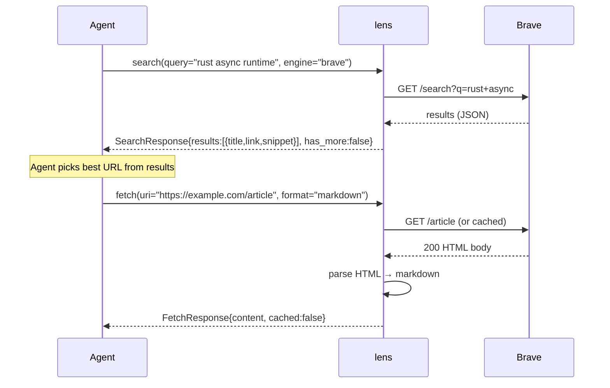
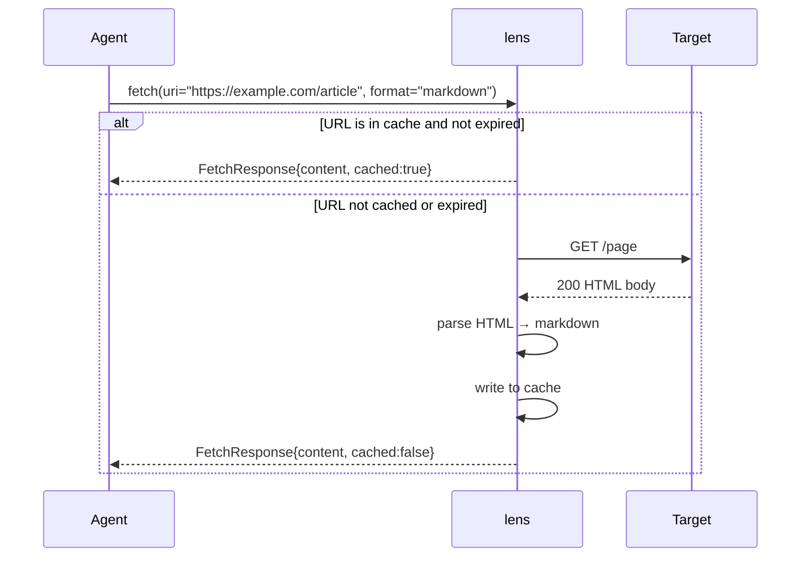
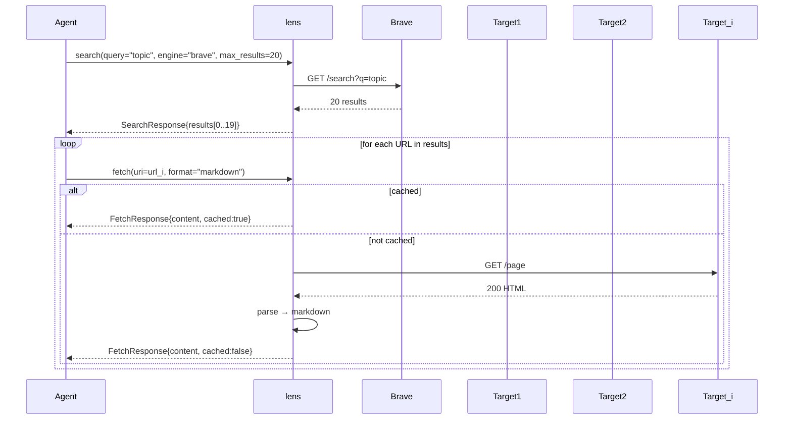
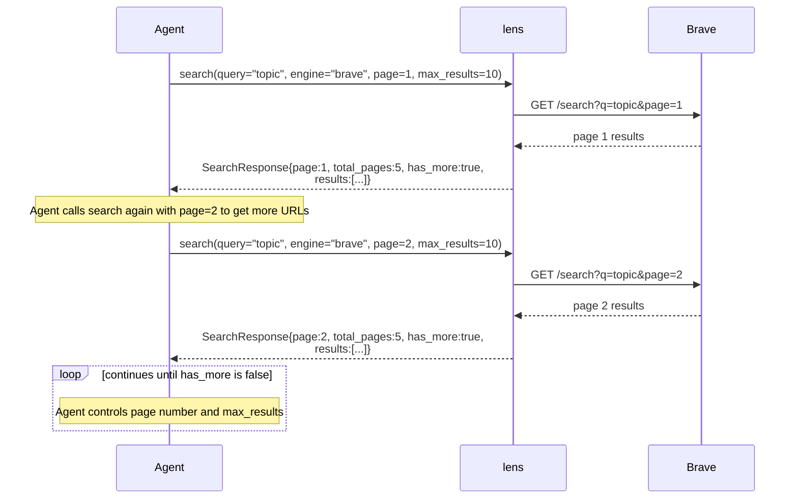
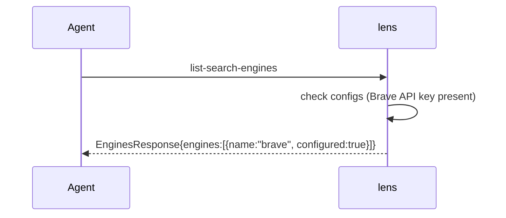

# `lens` MCP Server Specification

## Problem Statement

Agents need a lightweight, reliable way to search the web and fetch remote content. The `lens` MCP server provides tools for searching (via pluggable backends) and fetching web pages, enabling agents to discover information and retrieve webpage content. It supports Brave Search (for structured, reliable results) and implements LAN IP blocking and optional response caching for safe, controlled access. Configuration is provided via CLI arguments at startup (`--brave-api-key`, `--cache-ttl`). The architecture uses a search engine trait to ensure adding new engines (e.g., Kagi) is trivial and the caller interface remains unchanged.

## User Journeys

### 1. Research Workflow

The agent searches for a topic and fetches the best result.



### 2. Direct Fetch Workflow

Agent has a known URL and wants its content.



### 3. Bulk Fetch Workflow

Agent extracts multiple URLs from a search and fetches each one.



### 4. Deep Research Workflow

Agent iterates through search result pages to find more URLs.



### 5. List Search Engines Workflow

Agent discovers which search backends are available and configured.



## Functional Requirements

| ID | Requirement | Acceptance Criteria |
|----|-------------|---------------------|
| F1 | `search` tool with Brave backend | Accepts `query` (string), `engine` (string, e.g., "brave"), optional `page` (int, default 1), optional `max_results` (1-20, default 10), optional `region` (ISO 3166-1 alpha-2) |
| F2 | Search result format | Each result includes `title` (string), `link` (URL), `snippet` (string), `position` (int) |
| F3 | Pagination handling | Response includes `has_more` (bool). If omitted, defaults to `page: 1`. |
| F4 | `list-search-engines` tool | Accepts no arguments. Returns list of all supported search engines with `name` and `configured` (bool) |
| F5 | `fetch` tool | Accepts `uri` (string), optional `max_length` (int, default 8000), optional `start_index` (int, default 0), optional `format` (enum: "markdown") |
| F6 | GET-only HTTP requests | No POST, PUT, PATCH, DELETE support; tool signature reflects GET semantics only |
| F7 | HTML-to-markdown parsing | Strips `<script>`, `<style>`, `<nav>`, `<header>`, `<footer>` tags; preserves structure and semantic meaning |
| F8 | Redirect following | Follows HTTP redirects (up to 10 hops) |
| F9 | LAN IP blocking | DNS resolution for any IP in RFC 1918 (10.x, 172.16-31.x, 192.168.x), 127.x, 169.254.x, or ::1 must be rejected before connection |
| F10 | Look-aside caching | HTTP 200 responses cached with TTL (default 300s) keyed by normalized URL. On fetch: check cache first (cache hit → return), if miss → fetch, write to cache, return. Cache never updates in place; stale entries expire naturally. |
| F11 | Output format selection | `format` parameter: "markdown" |
| F12 | Search engine abstraction | A trait/interface must exist for search engine backends. Engine instances are constructed at startup with an options struct. Adding a new engine requires only implementing the trait and wiring it up — no changes to tool handlers or MCP layer. |

## Non-Functional Requirements

| ID | Requirement | Acceptance Criteria |
|----|-------------|---------------------|
| NF1 | Timeout | HTTP requests timeout after 30s |
| NF2 | Max content size | Fetch returns max 8000 characters by default; configurable via `max_length` |
| NF3 | Transport | stdio (MCP standard); no network listening |
| NF4 | Dependencies | Minimal: only `reqwest` for HTTP, `html-to-markdown-rs` (3.3.3) for HTML-to-markdown conversion |
| NF5 | No authentication | No auth checks; anyone who can reach the MCP server can call tools |
| NF6 | No environment differentiation | Single binary, no environment-specific behavior beyond CLI arguments |

## Edge Cases & Error Handling

| Scenario | Behavior |
|----------|----------|
| Brave API error | Return error message with hint to retry |
| Invalid URL format | Return parse error before making HTTP request |
| DNS resolves to LAN IP | Reject with error; do not attempt connection |
| 403/404 response | Return error with status code and message |
| Timeout | Return error with "timed out after 30s" |
| Cached response expired | Bypass cache, fetch fresh, update cache |
| Empty search results | Return empty array, not error |
| Fetch returns 0 bytes | Return empty string, not error |
| Markdown parse failure | Return raw HTML body or sanitized text as fallback |
| Cache TTL invalid | Fail fast at startup with clear error message |

## Architecture Decisions

| ID | Decision | Rationale |
|----|----------|-----------|
| AD1 | Standalone binary at `crates/agentkit-lens` | Keeps lens logic isolated from sandbox logic |
| AD2 | `rmcp` crate as MCP framework | Consistent with existing agentkit-litterbox conventions |
| AD3 | Brave Search | Structured, reliable JSON API; no scraping fragility |
| AD4 | In-memory cache | Simple, no persistence needed; TTL-based eviction |
| AD5 | Mock implementations for testing | Real web scraping is unreliable in CI; mocks ensure deterministic tests |
| AD6 | Search engine trait abstraction | Single interface (`SearchEngine`) for all backends. New engines add only a module, no changes to tools. |
| AD7 | CLI args over env vars | Explicit, inspectable configuration; aligns with user requirement |

## Data Models

### SearchRequest
```json
{
  "query": "rust async runtime",
  "engine": "brave",
  "page": 1,
  "max_results": 10,
  "region": "us-en"
}
```

### SearchResponse
```json
{
  "results": [
    {
      "title": "Async Rust...",
      "link": "https://example.com",
      "snippet": "...",
      "position": 1
    }
  ],
  "query": "rust async runtime",
  "engine": "brave",
  "page": 1,
  "total_pages": 3,
  "has_more": true
}
```

### EnginesResponse
```json
{
  "engines": [
    {
      "name": "brave",
      "configured": true
    }
  ]
}
```

### FetchRequest
```json
{
  "uri": "https://example.com/article",
  "max_length": 8000,
  "start_index": 0,
  "format": "markdown"
}
```

### FetchResponse
```json
{
  "content": "Cleaned markdown content...",
  "url": "https://example.com/article",
  "status": 200,
  "content_type": "text/html; charset=utf-8",
  "content_length": 7500,
  "cached": false
}
```

## Implementation Notes

- Brave Search API key is provided via CLI argument (`--brave-api-key`) at startup. Engine is constructed with an options struct (`BraveOptions`).
- Cache TTL is provided via CLI argument (`--cache-ttl`, default 5m). Supports duration strings: `1s`, `30m`, `4h`, `2d`, `1w` (descending order of size).
- Cache TTL validation occurs at startup. If the string is invalid or represents 0/negative duration, the server exits with a clear error message.
- Cache key should normalize URLs (remove fragments, lowercase scheme+host+path).
- LAN IP blocking must resolve DNS first, then validate against RFC 1918/localhost/link-local ranges.
- Search engine trait must define: `name(&self) -> &str`, `search(&self, req: SearchRequest) -> SearchResponse`.
- Kagi is deferred until release.
- New engines are added as modules under `src/search/` (e.g., `search/brave.rs`, `search/kagi.rs`) with no changes to `mcp.rs`.
