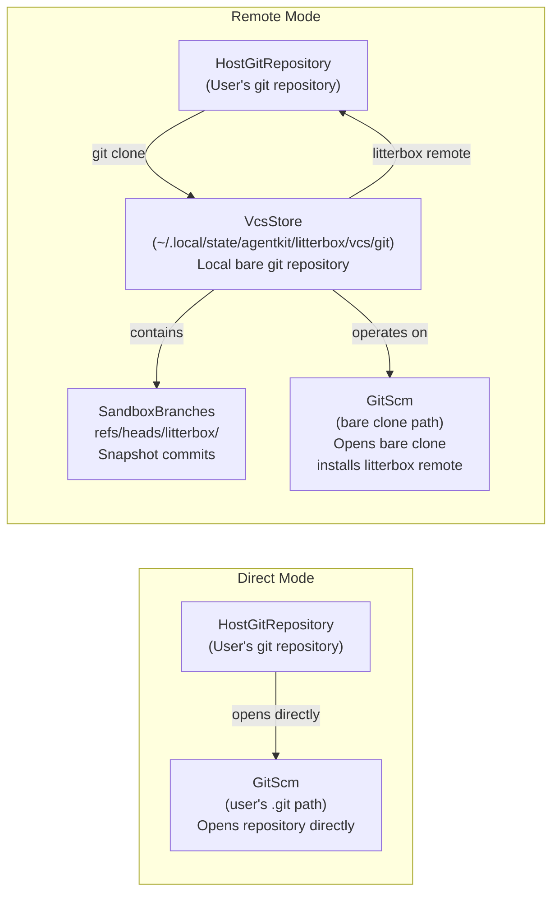

# ADR: git-modes — Direct vs. Remote Git Snapshots

## 1. Problem

The current `GitScm` implementation operates directly on the user's git repository using `git2`. Every sandbox operation — branch creation, snapshots, deletion — mutates the user's repository in place. If a crash, corruption, or concurrent `jj` update interferes during a snapshot commit or branch rename, the user's repository becomes corrupt.

The feature request is explicit: stop writing to the user's repo directly. Instead, maintain a bare git clone at a known path. The sandbox branch lives there, isolated.

Rather than replacing the existing behavior, we introduce a configuration-gated mode switch.

## 2. Goals

1. **Dual modes:** Support both the existing direct mode and the new remote (bare clone) mode.
2. **Isolation:** Remote mode sandbox branch operations (create, snapshot, delete) happen in a bare clone. Corruption cannot reach the user's repository.
3. **Seamless history:** Remote mode changes appear in the user's repository. A `litterbox` remote is installed into the user's repo so sandbox branches can be pushed and merged normally.
4. **Zero-risk migration:** Existing direct-mode sandboxes are untouched. Remote mode is opt-in (but will be the default).
5. **Simplicity:** The `Scm` trait is the same in both modes. The mode is an implementation detail of `GitScm::new(mode, config)`.

## 3. Configuration

```toml
[git]
snapshot-mode = "direct" | "remote"
```

- **Default:** `"remote"`
- **`direct`:** Original behavior — all operations on the user's repository.
- **`remote`:** New behavior — bare clone at a project-specific path, isolated writes, `litterbox` remote installed into the user's repo.
- **Mode binding:** Each sandbox instance is bound to the mode active at creation time. The mode is recorded in a per-sandbox metadata file (§5.4) at creation time. Changing `snapshot-mode` in config affects only newly created sandboxes; existing sandboxes load their persisted mode on any subsequent operation.
- **Migration path:** Switching from `direct` to `remote` does not migrate existing sandbox state — new sandboxes get a bare clone. Users can manually migrate by re-creating sandboxes under the new mode.

## 4. Non-Goals

- Concurrent bare clones with different remotes. Each Litterbox project has one bare clone per mode.
- Incremental updates to the bare clone — we clone fresh each sandbox.
- Remote configuration (e.g. SSH keys, credentials). The bare clone reuses the host repo's git config or clones via `git2::Repository::clone` with the same remote URL.
- Push/pull to the original repository (direct mode only). That's a later feature. (For now, only a `litterbox` remote is installed in remote mode; actual pushes are implicit via `git push litterbox <branch>`.)

## 5. System Context



### 5.1 Path Resolution (Remote Mode)

When `snapshot-mode = "remote"`, the bare clone path is resolved as follows:
1. Use the **project slug** if configured (e.g. `.litterbox.toml` has `project.slug`).
2. Otherwise, default to the **basename** of the VCS root directory (e.g. `/home/user/code/myproject` → `myproject`).

The resulting path is:
- **macOS**: `~/Application Support/AgentKit/Litterbox/vcs/git/<project-slug>/`
- **Windows**: `~/AppData/LocalLow/AgentKit/Litterbox/vcs/git/<project-slug>/`
- **Default**: `~/.local/state/agentkit/litterbox/vcs/git/<project-slug>/`

The bare clone path is deterministic from the project slug — VcsStore listing is purely for discovery, not an index. Per-sandbox metadata lives in a separate store (§5.4).

### 5.2 Direct Mode (existing)

- `GitScm::open(path)` opens a `Repository` at the user's `.git` path.
- All `Scm` methods read/write directly.
- No cloning, no index, no remote management.
- **Corruption risk:** If a crash or concurrent `jj` update interferes during a snapshot commit or branch rename, the user's repository becomes corrupt.

### 5.3 Remote Mode (new)

- `GitScm::open(mode="remote", config)` clones the user's repo as a bare repo at the path resolved in §5.1.
- A `litterbox` remote is installed into the user's repo, pointing to the bare clone path.
- All `Scm` methods operate on the bare clone.
- **Exception — `make_archive`:** `make_archive("HEAD")` must read from the host repo, not the bare clone. The bare clone's HEAD is the initial shallow clone commit, not the user's working tree. GitScm stores `host_repo_path` and opens the host repo temporarily for archive reads.
- **Shallow clone (`--depth 1`):** Snapshots are full-tree commits — each replaces the entire tree on the branch. The parent reference is for linear ordering, not delta computation. A shallow clone keeps space proportional to one commit's metadata, not the full repo history.
- **Self-healing:** If the bare clone corrupts, it is destroyed and re-cloned (shallow, depth 1).

### 5.4 Metadata Store

Each sandbox's `SandboxMetadata` is persisted to an independent TOML file at:

`~/.local/state/agentkit/litterbox/metadata/<project-slug>/<sandbox-slug>.toml`

**Contents:** The full `SandboxMetadata` struct serialized as TOML.

```toml
name = "my-feature"
branch_name = "litterbox/my-feature"
container_id = "litterbox-myproject-my-feature"
status = "Active"
mode = "Remote"
project_slug = "myproject"
```

**Lifecycle:**
- **Write:** Once at sandbox creation, before the MCP response is returned.
- **Read:** On every tool invocation (`resolve_sandbox_metadata`), instead of reconstructing metadata from config.
- **Delete:** On sandbox deletion, atomically with the SCM branch removal.

**Locking:** An advisory `flock` is held on the metadata file during writes. If `EAGAIN` is returned (another process holds the lock), the caller retries up to 3 times with exponential backoff (50ms, 150ms, 350ms).

**Backward compatibility:** If no metadata file exists, the sandbox is treated as legacy Direct mode (§5.2). Metadata is reconstructed from the container naming convention. This ensures sandboxes created before this change continue to work.

## 6. User Journey

### 6.1 `snapshot-mode = "direct"`

1. User calls `sandbox-create` with name `my-feature`.
2. `GitScm::open(path)` opens the user's repository directly.
3. Creates branch `litterbox/<slug>` directly in the user's repo.
4. Snapshots write to the user's repo.
5. `delete` removes the branch from the user's repo.

### 6.2 `snapshot-mode = "remote"` — First `sandbox-create`

1. User calls `sandbox-create` with name `my-feature`.
2. Litterbox resolves the **project slug** for bare clone path (see §5.1).
3. Checks if a bare clone exists at the project-specific VcsStore path.
4. If not, clones the user's repo as a bare repo there with `--depth 1` (shallow).
5. Installs the bare clone as a `litterbox` remote in the user's repo (if not already present).
6. Creates branch `litterbox/my-feature` inside the bare clone.
7. The GitScm stores `host_repo_path` pointing to the user's working repo so that `make_archive("HEAD")` reads from the correct location (not the bare clone's empty HEAD).
8. Returns `SandboxMetadata` with the project slug.

**Wiring requirement:** The `build_provider_with_config()` function in `mcp.rs` orchestrates steps 2-7. It must detect `snapshot-mode = "remote"`, compute the project slug, clone the bare repo, install the remote, and open the SCM on the bare clone with the host path set. Prior to the fix, `build_provider_with_config()` opened the SCM on `"."` (user's repo) regardless of mode — VcsStore operations were never called and remote mode was a no-op.

### 6.3 `snapshot-mode = "remote"` — Subsequent `sandbox-create` (same project)

1. Litterbox finds the existing bare clone at the project-specific VcsStore path.
2. Installs the `litterbox` remote (no-op if already present).
3. Creates a new branch inside it.
4. No extra network I/O needed for the clone.

### 6.4 `write` / `patch` / `bash` (snapshot triggers) — Remote Mode

1. After mutation, the snapshot layer commits a delta into the bare clone's branch.
2. The snapshot is a full tree of the staging directory — self-contained. Parent reference is for linear ordering, not delta computation.

### 6.5 `delete` — Remote Mode

1. Remove the branch from the bare clone.
2. If this was the last sandbox for the project, remove the bare clone from the VcsStore path.
3. The `litterbox` remote in the user's repo is **never removed automatically** — it persists across all sandbox deletions.

### 6.6 Error Recovery — Remote Mode

1. If the bare clone is corrupt, Litterbox destroys it and re-clones from the host repo (shallow, depth 1).
2. Branch names use the `litterbox/<slug>` prefix to avoid collisions.

## 7. Requirements

### 7.1 Functional Requirements

| ID | Requirement | Priority |
|----|-------------|----------|
| FR-1 | `snapshot-mode = "direct"`: all operations on the user's repository (no bare clone, no path resolution via §5.1) | Must |
| FR-2 | `snapshot-mode = "remote"`: bare clone at the path resolved in §5.1, shallow `--depth 1`, filesystem path is the index | Must |
| FR-3 | Remote mode installs a `litterbox` remote into the user's repo, pointing to the bare clone path | Must |
| FR-4 | Remote mode `sandbox-create` creates a `litterbox/<slug>` branch inside the bare clone | Must |
| FR-5 | Remote mode `commit_snapshot` writes to the bare clone's branch, not the host repo | Must |
| FR-6 | Remote mode `delete` removes the branch from the bare clone; if last sandbox, removes the bare clone. The `litterbox` remote is never removed | Must |
| FR-7 | Remote mode: if the bare clone is missing or corrupt, Litterbox re-creates it automatically | Should |
| FR-8 | Direct mode: all operations are read/write against the host repo (no index writes) | Must |
| FR-9 | Remote mode: the bare clone uses the `git2` library, not external `git` CLI | Must |
| FR-10 | Remote mode: `snapshot-mode` defaults to `"remote"`, backward-compatible with existing `"direct"` | Must |
| FR-11 | Sandbox metadata is persisted at creation time and loaded on every subsequent operation; no runtime git probing or config re-reading for mode binding | Must |

### 7.2 Non-Functional Requirements

| ID | Requirement | Priority |
|----|-------------|----------|
| NFR-1 | Direct mode: no additional disk space beyond the user's repository | Must |
| NFR-2 | Remote mode: no additional disk space beyond one bare clone per project (typically << project size) | Must |
| NFR-3 | Remote mode: no network round-trips after initial clone for subsequent sandboxes | Must |
| NFR-4 | Remote mode: bare clone creation must not block or race with other `create` calls | Must |
| NFR-5 | Direct mode: if the host repo changes (e.g. user commits), the working copy stays in sync | Must |
| NFR-6 | Remote mode: if the host repo changes (e.g. user commits), the bare clone may become stale — handled gracefully on re-clone | Should |
| NFR-7 | Existing sandbox metadata (`SandboxMetadata`) remains compatible — no breaking API change for the MCP client | Must |
| NFR-8 | Installing the `litterbox` remote must not conflict with existing remotes (skip if already present) | Must |
| NFR-9 | Metadata file writes use advisory `flock` with `EAGAIN` retry for multi-instance safety | Must |
| NFR-10 | Absent metadata file is handled gracefully as legacy Direct mode; no crash or incorrect behavior | Must |

### 7.3 Acceptance Criteria

| AC | Description | Verification |
|----|-------------|-------------|
| AC-1 | `snapshot-mode = "direct"`: sandbox branches live in the user's repo | `git branch` shows `litterbox/<slug>` |
| AC-2 | `snapshot-mode = "remote"`: bare clone exists at the path resolved in §5.1 | File exists check |
| AC-3 | `snapshot-mode = "remote"`: the bare clone's `litterbox/<slug>` branch exists and points to a valid commit | `git2` branch lookup |
| AC-4 | `snapshot-mode = "remote"`: a `commit_snapshot_from_staging` after mutation results in a new commit on the bare clone's branch | `git log` verifies chain |
| AC-5 | `snapshot-mode = "remote"`: a `litterbox` remote exists in the user's repo pointing to the bare clone | `git remote get-url litterbox` |
| AC-6 | `snapshot-mode = "remote"`: repeated `sandbox-create` for the same project does not re-clone the bare repo | Single clone on first call |
| AC-7 | `snapshot-mode = "remote"`: corrupt bare clone self-heals (destroy + re-clone shallow) | Corrupt a file, call `create`, verify it works |
| AC-8 | `snapshot-mode = "remote"`: sandbox metadata includes the project slug so the sandbox server can derive the bare clone path | `SandboxMetadata` fields |
| AC-9 | `snapshot-mode = "remote"`: `delete` removes the bare clone if this was the last sandbox for the project; the `litterbox` remote persists | `git remote get-url litterbox` returns the (stale) URL; bare clone path is deleted |
| AC-10 | `snapshot-mode = "remote"`: bare clone is shallow (depth 1) by default; re-clone after corruption uses depth 1 | `git rev-parse --is-shallow` |
| AC-11 | `snapshot-mode = "remote"`: the `litterbox` remote installs if not present, does nothing if already present | No duplicate remote entries on repeated creates |
| AC-12 | `snapshot-mode = "remote"`: project slug derived from config or defaults to basename of VCS root dir | Path exists at expected location |
| AC-13 | `snapshot-mode = "remote"`: rebases in the user's repo do not break fetch/merge from the remote | User can fetch our branch and merge even after their own history changed |
| AC-14 | `snapshot-mode = "remote"`: after aggressive GC prunes the shallow root, a simple `git fetch origin litterbox/<slug>` restores it | Re-fetch re-establishes the base commit |
| AC-15 | `snapshot-mode = "remote"`: changing config to `"direct"` after sandbox creation does not affect existing sandbox operations — mode is loaded from persisted metadata | Create sandbox, change config, call `read`/`bash` — succeeds with original mode |
| AC-16 | `snapshot-mode = "direct"`: no metadata file written (backward compat), `resolve_sandbox_metadata` falls back to legacy reconstruction | No file in metadata dir |

### 7.4 Edge Cases

| Case | Handling |
|------|----------|
| User repo already has `litterbox/*` branches from a prior run (direct mode) | Remote mode's bare clone is independent. No overlap. Direct mode users keep their branches. |
| Host repo is moved or deleted between sandboxes | Remote mode stores the bare clone path; it survives host repo moves. On first missing reference, re-clone from host. |
| Concurrency: two `sandbox-create` calls race to create the bare clone | Use a lock file or mutex in `ThreadSafeScm`. Only one clone at a time. |
| Host repo has many large files (git-lfs, large blobs) | Shallow clone (`--depth 1`) fetches blobs for one commit only. Large blobs on HEAD are fetched. Document as a known limitation. |
| Snapshots reference commits that may have been pruned by `jj` or other tools | Remote mode's bare clone is independent. Direct mode shares the same history. As long as commits exist, snapshots work. |
| VcsStore path is on a different filesystem than user's repo | No special handling needed; `git clone` copies everything. Path is stored in metadata. |
| User has multiple sandboxes for the same project | All share the same bare clone and `litterbox` remote. Each gets its own `litterbox/<slug>` branch. The remote is never removed automatically; the bare clone is removed when all sandboxes for the project are deleted. |
| Bare clone remote URL becomes invalid (host repo moved) | Remote stays as-is; `git push litterbox` will fail. Litterbox should detect this and offer to re-clone. |
| User rebases or squashes history after initiating a remote sandbox | Our branch retains its original base commit. If the user's history changed, our branch is a fork of their pre-rebase history. Merge/rebase works fine. |

## 8. Terminology

| Term | Definition |
|------|-------------|
| **Bare clone** | A `git2::Repository` opened with `bare=true`. No working tree. Contains only `.git` data. |
| **Host repo** | The user's repository on disk. Read-only after initial clone (remote mode). Direct access in direct mode. |
| **Sandbox branch** | A branch named `litterbox/<slug>` inside the repository. Each sandbox gets its own. |
| **Bare clone path** | The filesystem path where the bare repository lives (e.g. `~/.local/state/agentkit/litterbox/vcs/git/<project-slug>/`). |
| **litterbox remote** | A git remote in the user's repo pointing to the bare clone path. Enables `git push litterbox <branch>` to publish sandbox changes. |
| **Project slug** | Identifier used to derive the bare clone path. Set explicitly in config, or defaults to the basename of the VCS root directory. |
| **Direct mode** | Original behavior — all `Scm` operations on the user's repository directly. |
| **Remote mode** | New behavior — bare clone at a project-specific path, isolated writes, `litterbox` remote installed into the user's repo. |
| **Snapshot** | A full-tree commit in the sandbox branch. Parent reference is for ordering, not delta computation. |
| **Metadata file** | A TOML file at `~/.local/state/agentkit/litterbox/metadata/<project>/<slug>.toml` containing the sandbox's `SandboxMetadata`. One file per sandbox. |
