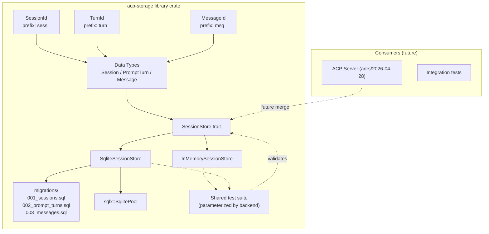

# ACP Server Session Storage Implementation Plan

## Scope

This plan covers a **standalone library crate** (`acp-storage`) that
implements persistent session storage with session forking via a message
DAG, backed by SQLite via sqlx. It is tested independently of the
existing ACP server at `adrs/2026-04-28-acp-server/`. Merging the two
will be a future ADR.

## Architecture



The crate is a library with no binary. It exposes:
- Three ID types: `SessionId`, `TurnId`, `MessageId`
- Three data types: `Session`, `PromptTurn`, `Message`
- A `SessionStore` trait with two implementations
- A `StoreError` type

## ID Types (not a prefix enum)

Each entity has its own struct with dedicated encode/decode methods.
No generic `IdKind` enum, no shared dispatch logic.

```rust
/// acp-storage::id::SessionId
pub struct SessionId(String);

impl SessionId {
    pub fn new() -> Self;                              // random UUID
    pub fn from_uuid(uuid: String) -> Self;            // from existing UUID
    pub fn encode(&self) -> String;                    // "abc" → "sess_abc"
    pub fn decode(prefixed: &str) -> Result<String, IdError>;  // "sess_abc" → "abc"
    pub fn as_str(&self) -> &str;                      // bare UUID
}
```

```rust
/// acp-storage::id::TurnId
pub struct TurnId(String);

impl TurnId {
    pub fn new() -> Self;
    pub fn encode(&self) -> String;                    // "abc" → "turn_abc"
    pub fn decode(prefixed: &str) -> Result<String, IdError>;
    pub fn as_str(&self) -> &str;
}
```

```rust
/// acp-storage::id::MessageId
pub struct MessageId(String);

impl MessageId {
    pub fn new() -> Self;
    pub fn encode(&self) -> String;                    // "abc" → "msg_abc"
    pub fn decode(prefixed: &str) -> Result<String, IdError>;
    pub fn as_str(&self) -> &str;
}
```

Common `IdError`:

```rust
#[derive(Debug, thiserror::Error)]
pub enum IdError {
    #[error("Invalid ID format: {0}")]
    InvalidFormat(String),
    #[error("Wrong prefix: expected '{expected}', got '{actual}'")]
    WrongPrefix { expected: String, actual: String },
}
```

**Prefix rules**:
- `SessionId.encode()` prepends `sess_`
- `TurnId.encode()` prepends `turn_` (internal — never exposed to ACP clients)
- `MessageId.encode()` prepends `msg_`
- `decode()` strips the prefix and validates it matches the expected type
- Bare UUIDs (no prefix) are accepted for backward compatibility during migration

**Tests (inline in each struct's test module)**:
- Round-trip: `decode(encode(x)) == x`
- Wrong prefix rejected: decoding `turn_xxx` as a SessionId produces `IdError`
- Bare UUID accepted: decoding `abc` as any type succeeds
- Malformed input: empty string, prefix-only, prefix+empty produce `IdError`

## Data Types

```rust
/// acp-storage::types
use std::collections::VecDeque;

pub struct Session {
    pub id: String,                        // bare UUID
    pub cwd: String,
    pub title: String,
    pub mode: Option<String>,
    pub prompt_turns: VecDeque<PromptTurn>,  // populated by context queries
    pub prompt_turn_count: usize,           // populated by list() / get()
    pub forked_from_session_id: Option<String>,
    pub fork_point_turn_id: Option<String>,
    pub created_at: u64,
    pub updated_at: u64,
    pub active: bool,
    pub transport: String,
}

pub struct PromptTurn {
    pub id: String,
    pub session_id: String,
    pub parent_id: Option<String>,
    pub messages: Vec<Message>,
    pub position: usize,
    pub created_at: u64,
}

pub struct Message {
    pub id: String,
    pub prompt_turn_id: String,
    pub role: String,
    pub content: String,
    pub position: usize,
    pub created_at: u64,
}
```

All strings internally are bare UUIDs (no prefixes). The ID types' `as_str()`
provides the bare UUID for store operations; `encode()` is used only at the
serialization boundary (future handler integration).

## SessionStore Trait

```rust
#[async_trait]
pub trait SessionStore: Send + Sync {
    // Session CRUD
    async fn create_session(&self, session: Session) -> Result<(), StoreError>;
    async fn get_session(&self, id: &str) -> Result<Session, StoreError>;
    async fn list_sessions(&self) -> Result<Vec<Session>, StoreError>;
    async fn close_session(&self, id: &str) -> Result<(), StoreError>;
    async fn set_session_mode(&self, id: &str, mode: String) -> Result<(), StoreError>;
    async fn set_session_head(&self, id: &str, head_prompt_turn_id: &str) -> Result<(), StoreError>;

    // Prompt Turn CRUD
    async fn append_prompt_turn(&self, turn: PromptTurn) -> Result<(), StoreError>;
    async fn get_prompt_turn_children(&self, id: &str) -> Result<Vec<PromptTurn>, StoreError>;
    async fn get_session_prompt_turns(&self, session_id: &str) -> Result<Vec<PromptTurn>, StoreError>;

    // Message CRUD
    async fn append_message(&self, message: Message) -> Result<(), StoreError>;
    async fn get_messages_for_turn(&self, turn_id: &str) -> Result<Vec<Message>, StoreError>;

    // Context assembly
    async fn get_context(&self, session_id: &str, max_turns: Option<usize>) -> Result<Vec<Message>, StoreError>;

    // Fork
    async fn fork_session(&self, new_session: Session, source_session_id: &str, fork_point_turn_id: &str) -> Result<(), StoreError>;

    // Test support
    async fn clear(&self) -> Result<(), StoreError>;
}
```

The trait uses `&str` for bare UUID references (not the ID wrapper types),
keeping the store interface agnostic about prefix handling. The ID types
live at the library boundary — consumers use them, the store does not.

### StoreError

```rust
#[derive(Debug, thiserror::Error)]
pub enum StoreError {
    #[error("{entity} not found: {id}")]
    NotFound { entity: &'static str, id: String },
    #[error("{entity} already exists: {id}")]
    AlreadyExists { entity: &'static str, id: String },
    #[error("Database error: {0}")]
    Database(String),
}
```

Error mapping (sqlx → StoreError):

| sqlx error | StoreError |
|------------|------------|
| `RowNotFound` | `NotFound { entity, id }` |
| `Database(SQLITE_CONSTRAINT_UNIQUE)` | `AlreadyExists { entity, id }` |
| any other `Database` | `Database(description)` |

The `entity` field is a static string (`"session"`, `"prompt_turn"`,
`"message"`) set by the caller, making errors self-describing without
requiring the store to parse SQL error messages.

## InMemorySessionStore

Internal storage:

```rust
pub struct InMemorySessionStore {
    sessions: Arc<RwLock<HashMap<String, Session>>>,
    prompt_turns: Arc<RwLock<HashMap<String, PromptTurn>>>,
    messages: Arc<RwLock<HashMap<String, Message>>>,
}
```

Context assembly walks the prompt turn DAG:
1. Load session → get `head_prompt_turn_id`
2. Walk `parent_id` from head to root, collecting turn IDs
3. For each turn (root first), collect messages sorted by `position`
4. Apply `max_turns` limit by truncating the turn chain

## SqliteSessionStore

Holds `sqlx::SqlitePool`. All operations use runtime-checked queries
(`query()` / `query_as()`, not `query!()`) to avoid compile-time
`DATABASE_URL`.

Context assembly uses a recursive CTE:

```sql
WITH RECURSIVE turn_chain AS (
    SELECT id, parent_id, position, 1 AS depth
    FROM prompt_turns
    WHERE id = (SELECT head_prompt_turn_id FROM sessions WHERE id = ?)
    UNION ALL
    SELECT pt.id, pt.parent_id, pt.position, tc.depth + 1
    FROM prompt_turns pt
    JOIN turn_chain tc ON tc.parent_id = pt.id
)
SELECT m.id, m.prompt_turn_id, m.role, m.content, m.position, m.created_at
FROM turn_chain tc
JOIN messages m ON m.prompt_turn_id = tc.id
ORDER BY tc.depth DESC, m.position ASC
LIMIT ?;
```

## Migration Files

Three migration files, one per entity, applied in order:

**`migrations/001_sessions.sql`**:
```sql
CREATE TABLE IF NOT EXISTS sessions (
    id                    TEXT PRIMARY KEY,
    head_prompt_turn_id   TEXT,                     -- nullable; set after first turn
    forked_from_session_id TEXT,
    fork_point_turn_id    TEXT,
    cwd                   TEXT NOT NULL DEFAULT '',
    title                 TEXT NOT NULL DEFAULT '',
    mode                  TEXT,
    created_at            INTEGER NOT NULL,
    updated_at            INTEGER NOT NULL,
    active                INTEGER NOT NULL DEFAULT 1,
    transport             TEXT NOT NULL DEFAULT ''
);
```

**`migrations/002_prompt_turns.sql`**:
```sql
CREATE TABLE IF NOT EXISTS prompt_turns (
    id         TEXT PRIMARY KEY,
    session_id TEXT NOT NULL REFERENCES sessions(id),
    parent_id  TEXT REFERENCES prompt_turns(id),
    position   INTEGER NOT NULL,
    created_at INTEGER NOT NULL
);

CREATE INDEX IF NOT EXISTS idx_prompt_turns_session
    ON prompt_turns(session_id, position);
CREATE INDEX IF NOT EXISTS idx_prompt_turns_parent
    ON prompt_turns(parent_id);
CREATE INDEX IF NOT EXISTS idx_sessions_head
    ON sessions(head_prompt_turn_id);
CREATE INDEX IF NOT EXISTS idx_sessions_forked_from
    ON sessions(forked_from_session_id);
```

**`migrations/003_messages.sql`**:
```sql
CREATE TABLE IF NOT EXISTS messages (
    id             TEXT PRIMARY KEY,
    prompt_turn_id TEXT NOT NULL REFERENCES prompt_turns(id),
    role           TEXT NOT NULL,
    content        TEXT NOT NULL DEFAULT '',
    position       INTEGER NOT NULL,
    created_at     INTEGER NOT NULL
);

CREATE INDEX IF NOT EXISTS idx_messages_turn
    ON messages(prompt_turn_id, position);
CREATE INDEX IF NOT EXISTS idx_sessions_fork_point
    ON sessions(fork_point_turn_id);
CREATE INDEX IF NOT EXISTS idx_sessions_updated
    ON sessions(updated_at DESC);
```

## Module Structure

```
acp-storage/
├── Cargo.toml
├── src/
│   ├── lib.rs           # pub mod declarations
│   ├── id.rs            # SessionId, TurnId, MessageId
│   ├── store/
│   │   ├── mod.rs        # SessionStore trait, StoreError
│   │   ├── memory.rs     # InMemorySessionStore
│   │   └── sqlite.rs     # SqliteSessionStore
│   ├── types.rs          # Session, PromptTurn, Message structs
│   └── test_helpers.rs   # Shared test scenarios
├── migrations/
│   ├── 001_sessions.sql
│   ├── 002_prompt_turns.sql
│   └── 003_messages.sql
```

## Testing Strategy

### ID prefix tests (inline in `id.rs`)

| Test | What it validates |
|------|-------------------|
| `session_id_roundtrip` | `SessionId::decode(&SessionId::new().encode())` succeeds |
| `session_id_wrong_prefix` | Decoding `msg_xxx` as SessionId returns `IdError::WrongPrefix` |
| `session_id_internal_prefix` | Decoding `turn_xxx` as SessionId returns error |
| `session_id_bare_uuid` | Decoding `abc` (no prefix) returns `Ok("abc")` |
| `turn_id_roundtrip` | Same for TurnId |
| `message_id_roundtrip` | Same for MessageId |

### Store tests (parameterized by backend)

All tests run against both `InMemorySessionStore` and
`SqliteSessionStore` (with `:memory:`) via a shared function
`run_store_tests(store: &impl SessionStore)`.

#### Session entity

| Test | What it validates | Spec |
|------|-------------------|------|
| `session_create_and_get` | Create then get returns matching session | FR2 |
| `session_create_duplicate` | Second create with same ID returns AlreadyExists | FR2 |
| `session_list` | List returns all created sessions | FR2 |
| `session_close` | Close sets active=false; can still get | FR2 |
| `session_close_missing` | Close on nonexistent session returns NotFound | FR2 |

#### PromptTurn entity

| Test | What it validates | Spec |
|------|-------------------|------|
| `prompt_turn_append` | Append turn to existing session succeeds | FR3 |
| `prompt_turn_append_missing_session` | Append with bad session_id returns NotFound | FR3 |
| `prompt_turn_dag_parent` | Turn with parent_id correctly links | FR3 |
| `prompt_turn_children` | `get_prompt_turn_children` returns direct children | FR3 |
| `prompt_turn_session_list` | `get_session_prompt_turns` returns turns in order | FR3 |

#### Message entity

| Test | What it validates | Spec |
|------|-------------------|------|
| `message_append` | Append message to existing turn succeeds | FR3 |
| `message_append_missing_turn` | Append with bad turn_id returns NotFound | FR3 |
| `message_get_by_turn` | `get_messages_for_turn` returns messages in position order | FR3 |

#### Context assembly

| Test | What it validates | Spec |
|------|-------------------|------|
| `context_linear` | Single chain of turns → messages in chronological order | FR3 |
| `context_after_fork` | Forked session's context includes source session's ancestor messages | FR4 |
| `context_max_turns` | Limit of N turns returns at most N turns | FR3 |
| `context_no_messages` | Session with zero turns returns empty vec | FR3 |

#### Fork

| Test | What it validates | Spec |
|------|-------------------|------|
| `fork_session` | Fork creates new session with shared head prompt turn | FR4 |
| `fork_preserves_source` | Source session's head and messages are unchanged | FR4 |
| `fork_list_children` | Querying source session returns forked session IDs | FR4 |
| `fork_independent_append` | Adding turn to forked session does not affect source | FR4 |

#### Concurrency (SQLite only)

| Test | What it validates | Spec |
|------|-------------------|------|
| `concurrent_creates` | Two concurrent create_session calls on different IDs succeed | FR5 |
| `concurrent_appends` | Two concurrent append_prompt_turn calls to same session succeed | FR5 |

## Data Flow

### Creating a session

```
1. Caller creates SessionId::new() (generates bare UUID)
2. Caller constructs Session { id: session_id.as_str(), ... }
3. store.create_session(session)
4. → INSERT INTO sessions (id, ..., head_prompt_turn_id=NULL)
```

### Appending a prompt turn

```
1. Generate TurnId::new() for the new turn
2. Get current head from session (or None for first turn)
3. Call store.append_prompt_turn(PromptTurn {
       id: turn_id.as_str(),
       session_id: session.id,
       parent_id: current_head,
       position: next_position,
       ...
   })
4. Call store.set_session_head(session_id, turn_id.as_str())
5. → INSERT INTO prompt_turns + UPDATE sessions SET head_prompt_turn_id
```

### Appending messages to a turn

```
1. Generate MessageId::new() for each message
2. Call store.append_message(Message {
       id: msg_id.as_str(),
       prompt_turn_id: turn.id,
       role, content, position,
       ...
   })
3. → INSERT INTO messages
```

### Forking

```
1. Resolve fork point message ID to its containing prompt turn ID
   (lookup in messages table, get prompt_turn_id)
2. Create new SessionId
3. Call store.fork_session(Session { id: new_id, ... }, source_id, fork_point_turn_id)
4. → INSERT INTO sessions with head_prompt_turn_id = fork_point_turn_id,
     forked_from_session_id = source_id, fork_point_turn_id = fork_point_turn_id
```

## Cargo.toml

```toml
[package]
name = "acp-storage"
version = "0.1.0"
edition = "2021"

[dependencies]
tokio = { version = "1", features = ["sync"] }
uuid = { version = "1", features = ["v4"] }
thiserror = "1"
serde = { version = "1", features = ["derive"], optional = true }
async-trait = "0.1"
sqlx = { version = "0.9", features = ["runtime-tokio", "sqlite", "migrate"], optional = true }

[features]
default = []
sqlite = ["dep:sqlx"]
serde = ["dep:serde"]

[dev-dependencies]
tokio = { version = "1", features = ["full"] }
```

sqlx is optional. The crate compiles without it (for consumers that only
need the in-memory store and ID types). The `sqlite` feature enables the
SqliteSessionStore. The `serde` feature enables (De)Serialize on data types
for consumers that need JSON serialization.

## Risks and Mitigations

| Risk | Impact | Likelihood | Mitigation |
|------|--------|------------|------------|
| **sqlx MSRV 1.94** is newer than project's toolchain | Build failure | Medium | Pin version in rust-toolchain.toml. The crate uses runtime queries only, so sqlx's own MSRV check is the only constraint. |
| **Schema chicken-egg**: session head references prompt_turn, prompt_turn references session | Insert ordering | High (design) | `sessions.head_prompt_turn_id` is nullable. Create session first, then prompt turns, then update head. |
| **Fork point resolution**: client provides `messageId` at protocol level, but store operates on prompt turns | Extra lookup needed | Low | Handler resolves `messageId → prompt_turn_id` via a single SELECT before calling `fork_session()`. The store only sees prompt turn IDs. |
| **Concurrent head updates** race on `head_prompt_turn_id` | Lost update | Low | Compare-and-swap `UPDATE sessions SET head_prompt_turn_id=? WHERE id=? AND head_prompt_turn_id=OLD`. SQLite serializes writes, so this is safe. |

## Traceability: Spec Requirements → Plan

| Spec Requirement | Plan Coverage |
|-----------------|---------------|
| FR1: Database initialization | Migration files, `SqliteSessionStore::connect()` |
| FR2: Session CRUD | `SessionStore` trait: `create_session`, `get_session`, `list_sessions`, `close_session` |
| FR3: Prompt Turn and Message CRUD | `SessionStore` trait: `append_prompt_turn`, `get_prompt_turn_children`, `get_session_prompt_turns`, `append_message`, `get_messages_for_turn`, `get_context` |
| FR4: Fork storage support | `fork_session` method + `get_context` after fork |
| FR5: Concurrent access | sqlx pool, compare-and-swap head updates |
| NFR1: File-based persistence | Single SQLite file |
| NFR4: Async-first | sqlx with runtime-tokio; no spawn_blocking in in-memory store |
| NFR5: Testability | `:memory:` SQLite, shared trait test suite |
| ID prefix (sess_/turn_/msg_) | Three standalone structs: `SessionId`, `TurnId`, `MessageId` |
| Turn is internal-only | `TurnId` exists in the crate but is not used at the ACP protocol boundary |
