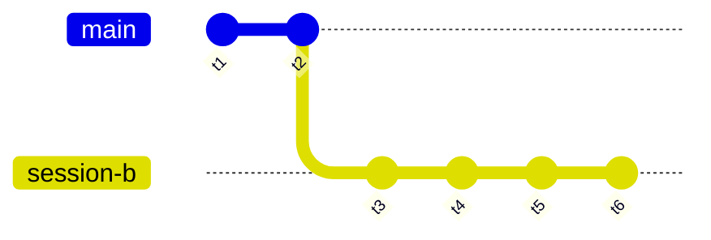

# ACP Server Session Storage Specification

## Problem

The current ACP server stores sessions in an in-memory `HashMap`. All state is lost on restart. Sessions cannot be forked (branched) because the data model has no concept of parent-child relationships between messages. As we move toward a production-grade ACP server, we need:

1. **Persistence** — sessions and their message history survive server restarts.
2. **Forking** — a client can fork a session at a specific message, creating a new session that shares ancestor history without duplicating messages.
3. **Context assembly** — when resuming a session, all ancestor messages (potentially spanning multiple sessions) are assembled into the conversation context.

## Scope

This ADR covers the data model, storage engine selection, schema, and migration strategy for a **standalone library crate** (`acp-storage`) that is tested independently. Merging it into the ACP server is a future ADR. It does **not** cover the `session/fork` method handler itself (that is a separate feature building on this storage layer).

## Data Model: Three-Level Hierarchy

### Core Insight

The storage layer uses a three-level hierarchy internally. Only `session` and `message` are exposed to ACP clients:

```
Session                        (client-facing via sessionId)
 └── Prompt Turn               (internal: groups messages into interaction cycles)
      └── Message              (client-facing via messageId in session/update)
```

- **Prompt turns** are the DAG nodes. Each prompt turn has a single `parent_id` pointer (the previous turn in the conversation), forming a directed acyclic graph. Forking creates a new prompt turn whose parent is the fork point.
- **Messages** are linear within a prompt turn — ordered by position, no branching. A turn typically contains 1+ messages (user message → optional tool calls → agent response chunks).
- **Sessions** are opaque handles for prompt turn pointers — internally, a session record stores a `head_prompt_turn_id` pointing to the latest prompt turn in that session's view.

**Client-facing IDs carry a type prefix** so clients treat them as opaque:
- Session IDs: `sess_<uuid>` (e.g., `sess_a1b2c3d4`)
- Message IDs: `msg_<uuid>` (e.g., `msg_a1b2c3d4`) — matches the `messageId` field in ACP `session/update` notifications

Only `session` and `message` are first-class concepts in the ACP protocol. **Prompt turns** (our internal grouping of messages into interaction cycles) are not exposed to clients. Internally, the database stores bare UUIDs; prefixes are added/removed at serialization boundaries.



- Session A was created first. Prompt turns t1 → t2 → t3 → t4 were added in sequence. Each turn contains 1+ messages (user input → agent response).
- A user forked from prompt turn t2, creating Session B.
- Session B's initial head was t2 (the fork point).
- Prompt turns t5 and t6 were added to Session B, each pointing to the prior head.
- **No ancestor prompt turns were copied.** Session B's context includes the messages from t1, t2, t5, t6 (assembled by walking the prompt turn DAG from head t6, then expanding each turn's messages).
- Session A's context remains t1, t2, t3, t4 and their messages.

### Fork Semantics

When a client calls [`session/fork`](https://agentclientprotocol.com/rfds/session-fork#implementation-details-and-plan) (per the ACP draft RFD) with a source `sessionId` and optionally a `messageId`:

1. If no `messageId` is given, the fork point is the source session's current head (its latest message, which maps to the containing prompt turn internally).
2. If a `messageId` is given, the storage layer resolves it to its containing prompt turn — the fork point is that prompt turn. (Splitting a prompt turn at an interior message is a future extension.)
3. A new session is created with `head_prompt_turn_id` pointing to the fork point prompt turn. The new session has its own `sess_`-prefixed ID, its own metadata (cwd, MCP server configuration, etc.), and records its origin as `forked_from_session_id` and `fork_point_turn_id` — just like `session/new`, but with lineage metadata.
4. **No ancestor prompt turns are copied.** The fork shares the existing prompt turn DAG — the new session's context walk follows parent pointers into the source session's history. This is the core storage invariant: the DAG structure means forks are free, storage-wise.
4. The handler may optionally seed the forked session with a new system prompt turn (e.g., to configure the agent for the fork's purpose). This prompt turn is created with `parent_id` = fork point turn, and the session's `head_prompt_turn_id` is updated to point to it — same as any other prompt turn append.
5. When the client subsequently sends a prompt to the new session, a new prompt turn is created with `parent_id` = current head (which may be the seeded turn from step 4, or the fork point if no seed was used), and the session's head is updated again.

The fork relationship is stored directly on the sessions table — `forked_from_session_id` and `fork_point_turn_id` are set at creation time and never modified. A session forks exactly once; these two columns capture its origin atomically in the INSERT.

**Client UX: "branches within one view"** — The client presents forked sessions as branches of a single conversation view. The storage supports this by enabling the client to:
1. Find fork points: `SELECT id, fork_point_turn_id FROM sessions WHERE forked_from_session_id = ?` — indexed lookup, O(k) where k = number of forks.
2. Navigate the fork tree: use recursive CTEs on the sessions table to walk parent or child fork chains.
3. Switch branches: load a different session by its session ID (same ancestors, different head path).

### Context Assembly

Given a session ID:

1. Load the session record → get `head_prompt_turn_id`.
2. Walk `parent_id` pointers from `head_prompt_turn_id` up to the root (a prompt turn with `parent_id IS NULL`) using a recursive CTE on `prompt_turns`.
3. For each prompt turn in the chain, load its messages ordered by `position`.
4. Flatten into a single ordered message list as the conversation context.
5. Prompt turns from ancestor sessions are included — the graph does not track session boundaries during context assembly. Only the single parent chain is followed, which naturally excludes sibling branches.

Implementation note: SQLite recursive CTEs (`WITH RECURSIVE`) make step 2 a single query. Steps 3–4 can be done with a second query (`SELECT * FROM messages WHERE prompt_turn_id IN (...) ORDER BY prompt_turn_id, position`) or a join on the recursive CTE.

## Storage Engine Options

Three candidates were evaluated. All are embedded (no external service required).

### Option A: SQLite via `sqlx` (Recommended)

| Property | Detail |
|----------|--------|
| **Crate** | [`sqlx`](https://crates.io/crates/sqlx) 0.9.0 |
| **Status** | Very actively maintained (May 2026 release). 106M downloads, 2,800+ dependents, 16K GitHub stars. |
| **Async** | Native async with tokio runtime support (`runtime-tokio` feature). |
| **SQLite** | Bundled SQLite via `sqlite` feature. No system dependency. |
| **Migrations** | Built-in migration runner using timestamped SQL files in `migrations/`. |
| **DAG support** | Recursive CTEs for parent-chain traversal. |
| **Type safety** | `FromRow` derive for row mapping; optional compile-time checked queries. |
| **Testability** | In-memory SQLite (`:memory:`) for tests. |

**Why it wins**: Async-native (matches the existing tokio codebase), built-in migration engine, recursive CTEs handle the DAG traversal in a single query, in-memory mode for tests, and it's the most widely used Rust SQL toolkit.

### Option B: SQLite via `rusqlite`

| Property | Detail |
|----------|--------|
| **Crate** | [`rusqlite`](https://crates.io/crates/rusqlite) 0.39.0 |
| **Status** | Very actively maintained (March 2026 release). 54M downloads, 4K GitHub stars. |
| **Async** | Sync-only. Requires `tokio::task::spawn_blocking` wrappers for async use. |
| **Migrations** | No built-in migration engine. Would need `refinery` crate or manual version table. |
| **DAG support** | Same as Option A (SQLite recursive CTEs). |

**Why it's second**: A solid choice, but the sync API adds friction in an async codebase. Every DB operation needs `spawn_blocking`, which complicates connection pooling and error handling. The lack of built-in migrations means another dependency (`refinery`) or custom tooling.

### Option C: `oxigraph` (SPARQL/ RDF Graph Database)

| Property | Detail |
|----------|--------|
| **Crate** | [`oxigraph`](https://crates.io/crates/oxigraph) 0.5.8 |
| **Status** | Actively maintained (April 2026 release). 212K total downloads, 51K in 90 days, 1,700 GitHub stars. |
| **Async** | Sync-only. |
| **Persistence** | RocksDB-backed (requires C++20 compiler, system `libclang` for bindgen). |
| **Query** | SPARQL 1.1 with property paths (supports transitive closure via `(^:hasParent)*`). |
| **Model** | RDF triples (subject-predicate-object). Data modeled as statements, not rows. |

**Why it doesn't fit**, despite being well-maintained:

- **RDF overhead**: A single turn becomes 5+ triples (type, parent, role, content, timestamp, session). A session becomes another 3+ triples. This adds complexity without benefit — our graph is a single-parent-pointer tree, not a multi-edge property graph.
- **RocksDB dependency**: Persistent storage requires RocksDB, a C++ library that needs a C++20 compiler and the `libclang` system package. This violates "no external service" in the same way SQLite's bundled C does, but with a much heavier build chain.
- **SPARQL for simple queries**: Property paths like `(^:hasParent)*` express the ancestor walk, but every other operation (create session, list sessions, update head) becomes more verbose than SQL.
- **Pre-1.0 API**: v0.5.x — still in heavy development, API is not guaranteed stable ("SPARQL query evaluation has not been optimized yet").
- **Single-writer restriction**: Only one read-write store instance can exist at a time per database file, which complicates connection pooling.

SQLite recursive CTEs achieve the same ancestor traversal with simpler tooling and fewer dependencies.

### Graph Database Evaluation

The requirement to evaluate at least one graph database was met by examining **`oxigraph`** (the most prominent actively-maintained Rust graph database). See Option C above for the detailed evaluation.

For completeness, **`indradb`** (v5.0.0, August 2025) was also considered but not evaluated in depth because its 90-day download count (~104) and last-release date suggest very low adoption.

**Verdict**: The session turn DAG is a single-parent-pointer tree. This is not a use case that benefits from RDF/SPARQL or typed property graphs. SQLite recursive CTEs handle the ancestor walk in one query, with far less dependency complexity.

## Schema

### Tables

```sql
-- Migration 001: Initial schema

CREATE TABLE prompt_turns (
    id TEXT PRIMARY KEY,                                -- UUIDv4
    session_id TEXT NOT NULL REFERENCES sessions(id),   -- The session that created this turn
    parent_id TEXT REFERENCES prompt_turns(id),         -- NULL for root turns; previous turn in the DAG
    position INTEGER NOT NULL,                          -- Ordering within session's linear chain
    created_at INTEGER NOT NULL,                        -- Unix timestamp (seconds)
    metadata TEXT DEFAULT '{}'                          -- JSON blob for extensible data
);

CREATE INDEX idx_prompt_turns_parent ON prompt_turns(parent_id);
CREATE INDEX idx_prompt_turns_session ON prompt_turns(session_id, position);

CREATE TABLE messages (
    id TEXT PRIMARY KEY,                                -- UUIDv4
    prompt_turn_id TEXT NOT NULL REFERENCES prompt_turns(id),  -- The turn this message belongs to
    role TEXT NOT NULL,                                 -- "user", "assistant", "tool"
    content TEXT NOT NULL DEFAULT '',                   -- Message body
    position INTEGER NOT NULL,                          -- Ordering within the prompt turn
    created_at INTEGER NOT NULL,                        -- Unix timestamp (seconds)
    metadata TEXT DEFAULT '{}'                          -- JSON blob for extensible data
);

CREATE INDEX idx_messages_turn ON messages(prompt_turn_id, position);

CREATE TABLE sessions (
    id TEXT PRIMARY KEY,                                -- UUIDv4
    head_prompt_turn_id TEXT REFERENCES prompt_turns(id),  -- Current head prompt turn (nullable: before first turn)
    forked_from_session_id TEXT REFERENCES sessions(id),   -- NULL for root sessions
    fork_point_turn_id TEXT REFERENCES prompt_turns(id),   -- NULL for root sessions; the prompt turn at which this session diverged
    cwd TEXT NOT NULL DEFAULT '',
    title TEXT NOT NULL DEFAULT '',
    mode TEXT DEFAULT 'ask',
    created_at INTEGER NOT NULL,
    updated_at INTEGER NOT NULL,
    active INTEGER NOT NULL DEFAULT 1,                  -- 0 = closed, 1 = active
    metadata TEXT DEFAULT '{}'                          -- JSON blob
);

CREATE INDEX idx_sessions_head ON sessions(head_prompt_turn_id);
CREATE INDEX idx_sessions_forked_from ON sessions(forked_from_session_id);
CREATE INDEX idx_sessions_fork_point ON sessions(fork_point_turn_id);
CREATE INDEX idx_sessions_updated ON sessions(updated_at DESC);
```

### Why `session_id` on prompt turns?

Even though context assembly walks parent pointers (ignoring session boundaries), `session_id` on prompt turns serves two purposes:

1. **Listing prompt turns "owned" by a session** for UI display.
2. **Session-level cleanup** when a session is closed and garbage-collected.

Fork lineage is tracked by `sessions.forked_from_session_id`, not by scanning turns.

### Fork Markers

When a session is forked, we **do not** create a special fork marker in the graph. The fork relationship lives on the sessions table: the new session's `forked_from_session_id` and `fork_point_turn_id` columns record its origin. Applications find all forks of a session via `SELECT id, fork_point_turn_id FROM sessions WHERE forked_from_session_id = ?` — an indexed lookup.

No special prompt turn type or message type is needed.

### Context Assembly Query

```sql
-- Given a session ID, walk up the prompt turn DAG, then expand messages
WITH RECURSIVE turn_chain AS (
    -- Base: start at the session's head prompt turn
    SELECT pt.id, pt.parent_id, pt.session_id, pt.position, pt.created_at, 1 AS depth
    FROM prompt_turns pt
    JOIN sessions s ON s.head_prompt_turn_id = pt.id
    WHERE s.id = ?

    UNION ALL

    -- Recursive: walk up the parent chain
    SELECT pt.id, pt.parent_id, pt.session_id, pt.position, pt.created_at, c.depth + 1
    FROM prompt_turns pt
    JOIN turn_chain c ON c.parent_id = pt.id
)
SELECT m.id, m.prompt_turn_id, m.role, m.content, m.position, m.created_at
FROM turn_chain tc
JOIN messages m ON m.prompt_turn_id = tc.id
ORDER BY tc.depth DESC, m.position ASC;  -- chronological by turn, then by position within turn
```

## Migrations

We use `sqlx`'s built-in migration system:

- Migration files are stored in `migrations/` at the crate root (alongside `src/`).
- Naming convention: sequential numbers with entity name (`001_sessions.sql`, `002_prompt_turns.sql`, `003_messages.sql`).
- `sqlx::migrate!()` runs all pending migrations in filename order on connection.
- The migration runner creates a `_sqlx_migrations` table to track applied migrations.

**Future migrations** (anticipated but not committed):
- Adding columns for new ACP features (e.g., `temperature` setting per session).
- Adding indexes for query patterns that emerge from production use.

### Database File Path

The `SqliteSessionStore::connect(path)` method accepts any path string:

| Path | Behavior |
|------|----------|
| `:memory:` | In-memory SQLite database (no file) |
| `./acp-sessions.db` | File-based database, created if absent |

Consumers decide the default path and CLI flag in their own configuration.
The crate's test suite uses `:memory:` to avoid filesystem dependencies.

## Functional Requirements

### FR1: Database Initialization

**Description**: The server creates or opens the SQLite database at the configured path on startup. If the database file does not exist, it is created with the initial schema.

**Acceptance Criteria**:
- Server starts with `--db-path ./sessions.db`; creates the file and tables if absent.
- Server starts with `--db-path :memory:`; uses an in-memory database (no file created).
- Server starts with an existing database; tables are verified (not recreated).
- Server exits with a clear error message if the database path is unwritable.
- All schema migrations are applied on startup before accepting connections.

### FR2: Session CRUD

**Description**: The store supports create, read, update (mode, title, head), close (mark inactive), and list operations.

**Acceptance Criteria**:
- `create_session(id, head_prompt_turn_id, cwd, title, mode)` inserts a row and returns the session.
- `get_session(id)` returns the session row or `None` if not found.
- `close_session(id)` sets `active = 0` and `updated_at`.
- `list_sessions()` returns all active sessions ordered by `updated_at DESC`.
- `list_sessions(include_closed: true)` returns all sessions including closed.
- `update_session_head(id, new_head_prompt_turn_id)` updates the head and `updated_at` timestamp.

### FR3: Prompt Turn and Message CRUD

**Description**: The store supports appending prompt turns (with messages) to a session and reading context.

**Acceptance Criteria**:
- `append_prompt_turn(id, session_id, parent_id, position)` inserts a prompt turn row and returns it.
- `append_message(id, prompt_turn_id, role, content, position)` inserts a message row within a prompt turn.
- `get_context(session_id)` returns all ancestor messages in chronological order (root first, by turn then position) by walking the prompt turn DAG.
- `get_context(session_id, max_turns: 100)` limits context depth to N prompt turns.
- `get_prompt_turn(id)` returns a single prompt turn or `None`.
- `get_prompt_turn_children(id)` returns all direct children prompt turns (used to detect DAG branching).
- `get_session_prompt_turns(session_id)` returns all prompt turns created directly by a session, ordered by `position`.

### FR4: Session Forking (Storage Support)

**Description**: The store can create a new session forked from an existing session.

**Acceptance Criteria**:
- `fork_session(new_session_id, source_session_id, source_prompt_turn_id)` creates a new session with `head_prompt_turn_id`, `forked_from_session_id`, and `fork_point_turn_id` all set from the source.
- Returns the new session.
- The source session is unaffected (its head and prompt turns are unchanged).
- Walking context from the new session's head produces the ancestor message chain including messages from the source session's prompt turns.
- Querying `SELECT id, fork_point_turn_id FROM sessions WHERE forked_from_session_id = ?` returns all forks of a session.

### FR5: Concurrent Access

**Description**: Multiple handlers can read/write the database concurrently without data corruption.

**Acceptance Criteria**:
- Two concurrent `append_turn` calls on different sessions succeed.
- Two concurrent `get_context` calls on the same session both return correct results.
- A `close_session` concurrent with a `get_session` does not produce stale data.
- sqlx pool manages connections; SQLite WAL mode handles read/write concurrency.

## Non-Functional Requirements

### NFR1: File-Based Persistence

The database must persist to a single file. No external daemon or service. The file must be portable (copy the file to another machine, open it with the same schema version).

### NFR2: Startup Time

First startup (database creation + schema migration) must complete within 500ms on a modern SSD. Subsequent startups (schema verification only) must complete within 100ms.

### NFR3: Graceful Degradation on DB Failure

If the database is corrupted or an incompatible version, the server must log a clear error message and exit. It must not silently create an empty database or serve requests with partial state.

### NFR4: Async-First

All database operations must be async (tokio-compatible). The code must not block the tokio runtime.

### NFR5: Testability

The storage layer must be testable with an in-memory SQLite database. Tests must not require filesystem setup or teardown beyond what the test framework provides.

## Consumer Integration (Future ADR)

The crate is a library — it has no binary, no CLI, no transport. A consumer
(such as the existing ACP server at `adrs/2026-04-28-acp-server/`) would:

1. Add `acp-storage` with the `sqlite` feature to its `Cargo.toml`.
2. Call `SqliteSessionStore::connect(path)` at startup, where `path` comes
   from its own CLI (e.g., a `--db-path` flag defaulting to
   `./acp-sessions.db`).
3. Use `Arc<dyn SessionStore>` to share the store across handlers.
4. Use `SessionId::decode()` to strip `sess_` on incoming requests and
   `SessionId::encode()` to add it on outgoing responses (same for
   `MessageId`).

The crate exposes `SessionId`, `TurnId`, and `MessageId` for consumers
to use at their serialization boundaries. The store trait operates on bare
UUIDs only.

## Edge Cases & Failure Handling

### Database File Missing

- **Behavior**: sqlx + SQLite will create the file if it doesn't exist (mode `rwc` in connection URL). The migration runner creates the schema.
- **Test**: Delete the DB file, start server, verify tables exist.

### Database File Corrupted

- **Behavior**: SQLite returns `SQLITE_CORRUPT` on first query. The pool returns an error. The server logs "Database corrupted at <path>: <details>" and exits with code 1.
- **Test**: Write garbage bytes to the DB file, start server, verify error and exit.

### Incompatible Schema Version

- **Behavior**: `sqlx::migrate!()` checks the `_sqlx_migrations` table. If the applied migrations don't match the expected set, it returns a clear error at startup.
- **Test**: Create a database with a newer migration, start server with an older binary, verify error.

### Concurrent Fork at Same Prompt Turn

- **Behavior**: Two clients forking from the same parent prompt turn creates two sessions, both pointing to the same head. This is valid — the prompt turn has two children (one from each fork), and both sessions render correctly.
- **Test**: Fork from prompt turn X, fork from prompt turn X again, verify both sessions exist and share the ancestor chain.

### Session Closed During Fork

- **Behavior**: The fork operation reads the source session's head, then creates a new session pointing to it. If the source session is closed between these two operations (concurrent close), the fork still succeeds — it's forking from a specific turn, not from an "active" session. The source session being closed doesn't affect the fork.
- **Test**: Close session A, fork from session A's turn, verify fork succeeds.

### Database WAL Mode

SQLite's default journal mode can cause read concurrency issues (readers block writers). The connection should set WAL (Write-Ahead Logging) mode:

```sql
PRAGMA journal_mode=WAL;
PRAGMA busy_timeout=5000;
```

This allows concurrent reads while a write is in progress and prevents "database is locked" errors under light concurrent load.

## Rollback Plan

If the storage library introduces unacceptable complexity or bugs:

1. Consumers can drop the `sqlite` feature from `acp-storage` and use
   only `InMemorySessionStore` (no SQLite dependency).
2. The `SessionStore` trait interface remains stable regardless of backend,
   so consumer code does not change.
3. The migration files are harmless if unused — they only run when
   `SqliteSessionStore::connect()` is called.

## References

- [ACP Session Fork RFD](https://agentclientprotocol.com/rfds/session-fork) — Fork method specification
- [Existing ACP Server Spec](../2026-04-28-acp-server/spec.md) — Baseline server requirements
- [Existing ACP Server Plan](../2026-04-28-acp-server/plan.md) — Current architecture (in-memory store)
- [sqlx documentation](https://docs.rs/sqlx/latest/sqlx/) — Async SQL toolkit
- [SQLite WITH RECURSIVE](https://www.sqlite.org/lang_with.html) — Recursive CTE documentation
