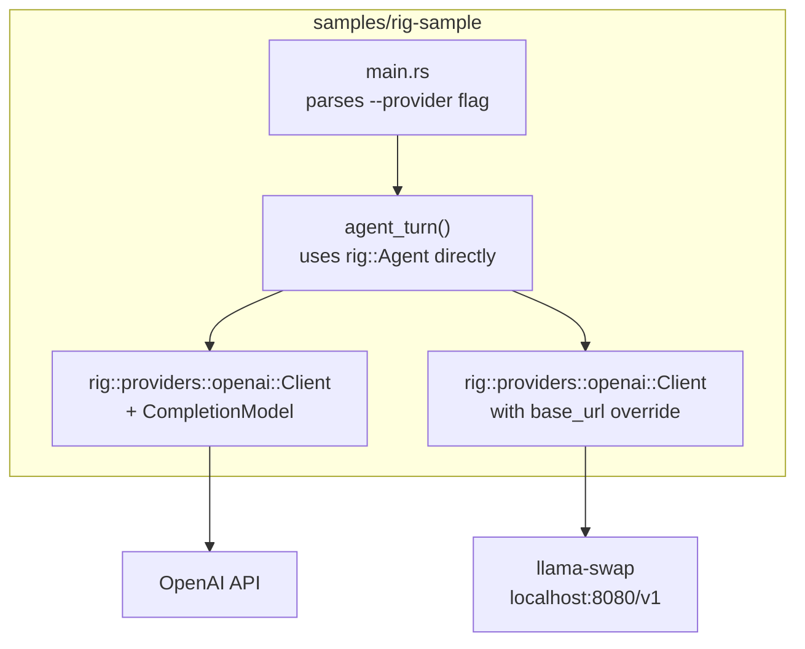
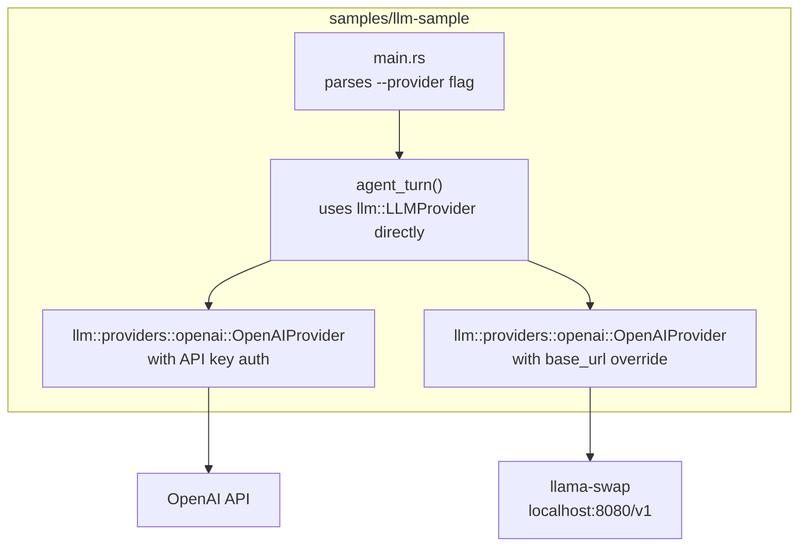

# Plan: Model Provider SDK — Sample Crates for rig and llm

## 1. Requirements Traceability

| Spec Requirement | Plan Coverage | Verification |
|---|---|---|
| **FR1** — Multi-provider completion via unified interface | §3.1 each crate configures two providers (OpenAI + llama-swap) using the library's own client types | Both crates complete a prompt with both providers |
| **FR2** — Tool calling round-trip | §3.2 each crate implements a static echo tool and agent loop | Tool result surfaces in model's final response |
| **FR3** — Streaming | **Out of scope for samples** (§11 spec) | Not tested |
| **FR4** — Token usage reporting | §3.4 usage inspected and logged after each turn in both crates | Non-zero token counts asserted in tests |
| **FR5** — Provider authentication | §3.3 per-provider client construction (API key, env var, no-auth) | Client builds without error given valid env; fails clearly without |
| **FR6** — Custom provider implementation | §4 documents implementing each library's native extensibility trait (rig's `CompletionModel`, llm's `LLMProvider`) | Walkthrough example fits under 200 lines for each library |
| **FR7** — Conversation memory | §3.2 chat_history vector accumulated across turns in both crates | Multi-turn test asserts history grows |
| **NFR1** — Async runtime | Tokio runtime throughout both crates | Compilation check |
| **NFR2** — Binary size | §6.2 measured for both crates | Release binary <15MB with one provider (each crate) |
| **NFR3** — Error handling | Each library's error types surfaced directly | Distinct error variants for auth, rate limit, network |
| **NFR4** — Testability | §5 rig-sample uses cassettes; llm-sample uses wiremock; both have live integration gated | Offline tests pass in CI without network |
| Sample crate validation | §6 side-by-side comparison | Comparison README documents compile times, binary size, tool call behaviour, error messages, docs quality |

## 2. Architecture Overview

Two independent sample crates, each validating a candidate library. No shared abstraction — each crate uses the library's own types directly so the comparison evaluates the library's native API, not a wrapper.

```
adrs/2026-06-14-model-provider-sdk/
├── rig-sample/         # depends on rig-core
│   ├── Cargo.toml
│   ├── src/main.rs     # CLI, agent loop, OpenAI + llama-swap providers
│   └── tests/
│       ├── cassette.rs # offline replay via rig cassette system
│       └── live.rs     # live integration (gated)
└── llm-sample/         # depends on llm
    ├── Cargo.toml
    ├── src/main.rs     # CLI, agent loop, OpenAI + llama-swap providers
    └── tests/
        ├── mock.rs     # offline test via wiremock
        └── live.rs     # live integration (gated)
```

### rig-sample structure



The rig-sample uses rig's native `Agent` type and `CompletionModel` trait directly. No custom wrapper trait — the goal is to evaluate rig's API as-is.

### llm-sample structure



### Boundaries

- **Each sample owns**: Agent loop orchestration, tool execution, chat history, provider selection, auth management.
- **Library handles**: HTTP transport to provider API, serialization/deserialization, token usage collection.
- **No dependency on**: ACP server crate, acp-storage crate, any existing Litterbox code, or each other.

## 3. Component Breakdown

### 3.1 Per-Crate Agent Loop

Both crates implement the same turn protocol using their respective library's native types.

**rig-sample agent loop:**

```rust
use rig::agent::Agent;
use rig::completion::{CompletionModel, ToolDefinition};

async fn agent_turn(
    model: &impl CompletionModel,
    chat_history: &mut Vec<rig::completion::Message>,
    tools: &[ToolDefinition],
    prompt: &str,
    max_turns: usize,
) -> Result<String, Box<dyn std::error::Error>> {
    chat_history.push(rig::completion::Message::user(prompt));

    let agent = Agent::new(model.clone())
        .preamble("You are a helpful assistant with access to tools.")
        .max_tokens(4096);

    for _turn in 0..max_turns {
        let response = agent
            .chat(prompt, chat_history)
            .await?;

        chat_history.push(rig::completion::Message::assistant(&response));

        if response.tool_calls.is_empty() {
            return Ok(response.content);
        }

        for tool_call in &response.tool_calls {
            let result = execute_tool(tool_call);
            chat_history.push(rig::completion::Message::tool(tool_call.id, &result));
        }
    }

    Err("max turns exceeded".into())
}
```

**llm-sample agent loop:**

```rust
use llm::{LLMProvider, ChatProvider, ChatMessage, ToolCall, ToolDefinition};

async fn agent_turn(
    provider: &impl LLMProvider,
    messages: &mut Vec<ChatMessage>,
    tools: &[ToolDefinition],
    prompt: &str,
    max_turns: usize,
) -> Result<String, Box<dyn std::error::Error>> {
    messages.push(ChatMessage::user(prompt));

    for _turn in 0..max_turns {
        let response = provider
            .chat(messages.clone(), tools, Default::default())
            .await?;

        messages.push(ChatMessage::assistant(&response.content));

        if response.tool_calls.is_empty() {
            return Ok(response.content);
        }

        for tool_call in &response.tool_calls {
            let result = execute_tool(tool_call);
            messages.push(ChatMessage::tool(tool_call.id, &result));
        }
    }

    Err("max turns exceeded".into())
}
```

### 3.2 Static Tool Execution

Both crates use the same echo tool — identical logic, just adapted to each library's `ToolCall` type:

```rust
fn execute_tool(call: &ToolCall) -> String {
    match call.name.as_str() {
        "echo" => serde_json::json!({ "result": call.arguments }).to_string(),
        _ => serde_json::json!({ "error": format!("unknown tool: {}", call.name) }).to_string(),
    }
}
```

Tool definition sent to the model (identical for both):

```json
{
    "name": "echo",
    "description": "Echoes the input arguments back as a result",
    "parameters": {
        "type": "object",
        "properties": {
            "message": { "type": "string" }
        },
        "required": ["message"]
    }
}
```

### 3.3 Provider Configuration

**rig-sample:**
| CLI flag | Provider | Auth method |
|---|---|---|
| `--provider openai` | OpenAI | `OPENAI_API_KEY` env |
| `--provider llama-swap` | llama-swap (reuses rig's OpenAI client with base_url override) | None (local) |

**llm-sample:**
| CLI flag | Provider | Auth method |
|---|---|---|
| `--provider openai` | OpenAI | `OPENAI_API_KEY` env |
| `--provider llama-swap` | llama-swap (llm's OpenAI provider with base_url override) | None (local) |

Both crates use the same pattern for local testing: OpenAI provider with a base URL override pointing at `http://localhost:8080/v1`. No separate "llama-swap" provider exists in either library — both treat it as an OpenAI-compatible endpoint.

### 3.4 Usage Collection

Each crate logs token usage after each turn:

```
Turn 1:  input_tokens=45  output_tokens=120  total_tokens=165
Turn 2:  input_tokens=210  output_tokens=85  total_tokens=295
Session total:  input=255  output=205  total=460
```

**rig** — `CompletionResponse.usage` provides 7 fields (input, output, total, cached_input, cache_creation, tool_use, reasoning). Accessed via `response.usage`.

**llm** — `response.usage()` returns `prompt_tokens` and `completion_tokens`. Fewer fields but sufficient for basic tracking.

No cost estimation (deferred per spec §9).

## 4. Provider Author Journey (Validating FR6)

Each crate documents how to add a custom provider using that library's extensibility model.

**rig-sample:** Document implementing `rig::completion::CompletionModel` for a dummy provider. Reference the official custom provider example (<https://github.com/joshua-mo-143/rig-custom-provider-example>). Target: <200 lines.

**llm-sample:** Document implementing `llm::LLMProvider` (which combines `ChatProvider` + `CompletionProvider` + `EmbeddingProvider`). Target: <200 lines.

Both examples are verified by line count and by registering the custom provider in the CLI alongside existing providers without changing the agent loop.

## 5. Testing Strategy

### 5.1 Test Layers

| Layer | rig-sample | llm-sample | Network required |
|---|---|---|---|
| Unit | `cargo test` — message serialization, tool parsing, Usage accumulation | `cargo test` — same | No |
| Offline | rig cassette system — recorded HTTP fixtures replayed | `wiremock` — mock HTTP server with recorded responses | No |
| Live integration | `cargo test -- --ignored` — real OpenAI API | `cargo test -- --ignored` — real OpenAI API | Yes |

### 5.2 Offline Testing

**rig-sample** uses rig's built-in cassette system:

1. Record a session with `OPENAI_API_KEY` set (one prompt → tool call → response)
2. Store the cassette file in `tests/cassettes/`
3. Replay in CI without network access

```rust
#[tokio::test]
async fn test_agent_turn_cassette() {
    let provider = rig::providers::openai::Client::from_env()
        .unwrap()
        .completion_model("gpt-4o");
    // Cassette recording activated by RECORDING=true env var

    let mut history = vec![];
    let tools = vec![echo_tool_definition()];

    let result = agent_turn(&provider, &mut history, &tools, "Say hello and call echo with 'hi'", 3).await;
    assert!(result.is_ok());
    assert!(!history.is_empty());
}
```

**llm-sample** uses wiremock since llm has no built-in recording:

1. Capture a real HTTP exchange (curl or test run with logging)
2. Store the request/response pair in `tests/fixtures/`
3. Mock the HTTP server in tests

```rust
#[tokio::test]
async fn test_agent_turn_mock() {
    let mock_server = wiremock::MockServer::start().await;
    let fixture = std::fs::read_to_string("tests/fixtures/echo_tool.json").unwrap();
    let response: serde_json::Value = serde_json::from_str(&fixture).unwrap();

    wiremock::Mock::given(wiremock::matchers::method("POST"))
        .respond_with(wiremock::ResponseTemplate::new(200).set_body_json(response))
        .mount(&mock_server)
        .await;

    let provider = llm::providers::openai::OpenAIProvider::builder()
        .api_key("test-key")
        .base_url(mock_server.uri())
        .build()
        .unwrap();

    let mut messages = vec![];
    let tools = vec![echo_tool_definition()];

    let result = agent_turn(&provider, &mut messages, &tools, "Say hello and call echo with 'hi'", 3).await;
    assert!(result.is_ok());
}
```

### 5.3 Live Integration Test

Both crates:

```rust
#[ignore = "requires OPENAI_API_KEY"]
#[tokio::test]
async fn test_agent_turn_live() {
    // ... same pattern, real provider
}
```

### 5.4 CI Commands

```bash
# All offline tests (both crates)
(cd adrs/2026-06-14-model-provider-sdk/rig-sample && cargo test)
(cd adrs/2026-06-14-model-provider-sdk/llm-sample && cargo test)

# Live integration (only when API key is set)
(cd adrs/2026-06-14-model-provider-sdk/rig-sample && cargo test -- --ignored --test-threads=1)
(cd adrs/2026-06-14-model-provider-sdk/llm-sample && cargo test -- --ignored --test-threads=1)

# Record new cassettes (rig-sample only, requires API key)
(cd adrs/2026-06-14-model-provider-sdk/rig-sample && RECORDING=true cargo test --test record -- --ignored)
```

## 6. Comparison Dimensions

After both crates are working, the comparison README (`samples/README.md`) documents:

| Dimension | rig-sample | llm-sample |
|---|---|---|
| Lines of code (agent loop + tool def) | counted | counted |
| Compile time (first `cargo build`) | measured | measured |
| Binary size (release, stripped) | measured | measured |
| Provider count available | 24 | 12+ |
| Tool calling supported | yes | yes |
| Usage detail | 7 fields | 2 fields |
| Offline testing | built-in cassettes | wiremock |
| WASM support | yes | no |
| Version stability | pre-1.0 (0.38) | stable (1.3.8) |
| Documentation quality | assessed | assessed |
| Error message quality | assessed | assessed |

The comparison produces a final recommendation: either confirm the provisional rig selection or override it with llm.

## 7. Risk List

| # | Risk | Likelihood | Impact | Mitigation |
|---|---|---|---|---|
| R1 | rig pre-1.0 breaking change during development | Medium | Medium — would require adapting sample code | Pin to exact version in Cargo.toml; samples are throwaway so impact is limited |
| R2 | llm's tool calling API differs enough from OpenAI expectations to cause issues | Medium | Medium — may require provider-specific tool serialization | Test both crates with same prompt; document differences in comparison README |
| R3 | llama-swap incompatibility with either library | Medium | High — blocks offline testing | Test llama-swap endpoint independently first with curl; fall back to Ollama or wiremock |
| R4 | rig's cassette infrastructure doesn't capture tool-call round-trips cleanly | Low | Medium — would lose offline testing for rig agent loop | Fall back to wiremock for rig-sample too |
| R5 | llm has no cassette system, so offline testing requires more setup | High | Low — wiremock is straightforward | Document wiremock setup in crate README; fixture files committed to repo |
| R6 | llm's OpenAI provider does not support base URL override, preventing llama-swap testing | Medium | High — llm-sample would only have one provider to test | Verify by reading llm's OpenAI client builder API before scaffolding; fall back to using real Ollama (native) as second provider if override is unsupported |
| R7 | Comparison dimensions are subjective (docs quality, error messages) | Medium | Low — recommendation can still be made with objective data | Prefer objective metrics where possible (LoC, binary size, compile time); mark subjective assessments as opinion |

## 8. Rollout and Rollback

Since both crates are standalone (not integrated into the ACP server):

- **Go**: Both crates have offline tests passing in CI, comparison README published with final recommendation
- **No-go**: Either library cannot complete a tool call round-trip with at least one provider → document the blocker, recommend the other library
- **Rollback**: Delete `rig-sample/` and `llm-sample/` directories under the ADR

## 9. Spec Alignment Check

The plan maps every spec requirement to component work across both crates:

- Both crates cover FR1 (multi-provider), FR2 (tool calling), FR4 (usage), FR5 (auth), FR7 (memory), NFR1–NFR4
- FR3 (streaming) and cost estimation are deferred per spec §11
- FR6 (custom provider) is covered in §4 documentation for both libraries
- The side-by-side comparison (§6 of this plan) covers the sample crate validation requirement added to spec §10
