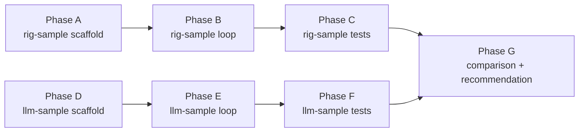

# Tasks: Model Provider SDK — Sample Crates

## Sequence overview

Phases A–C (rig) and D–F (llm) can run in parallel if two implementers are available. Phase G is the merge point.

## Phase A: rig-sample scaffold

**Spec reference**: §11 (Sample Crates), §4.1 (rig candidate)

### A1: Create rig-sample crate

**Status: ✅ complete**

| Field | Value |
|---|---|
| **Description** | Scaffold `adrs/2026-06-14-model-provider-sdk/rig-sample/` with `Cargo.toml` depending on `rig-core`, tokio, clap, serde, serde_json |
| **Acceptance** | `cargo build` succeeds, `cargo run -- --help` prints CLI flags |
| **Dependencies** | None |
| **Testing** | Compilation check only |

### A2: Wire CLI argument parsing

**Status: ✅ complete**

| Field | Value |
|---|---|
| **Description** | Add `--model` (string, default "gpt-4o"), `--prompt` (string, default "Say hello") arguments via clap |
| **Acceptance** | `cargo run -- --help` shows both flags with descriptions |
| **Dependencies** | A1 |
| **Owner** | Implementation agent |
| **Testing** | Manual: run with `--prompt "hello"` |

### A3: Configure OpenAI provider

**Status: ✅ complete**

| Field | Value |
|---|---|
| **Description** | Initialize `rig_core::providers::openai::Client` from `SWITCHBOARD_OPENAI_API_KEY` env var. Build an agent and send a simple text prompt, print the response |
| **Acceptance** | `cargo build` succeeds. With API key set, `cargo run` reaches OpenAI and returns a response (or a provider error like 429 if quota exhausted) |
| **Dependencies** | A2 |
| **Owner** | Implementation agent |
| **Testing** | Manual live test: `SWITCHBOARD_OPENAI_API_KEY=$KEY cargo run -- --prompt "hello"` |

## Phase B: rig-sample agent loop

**Spec reference**: §11 (Sample Crates scope items 1–3), FR2 (Tool Calling), FR7 (Conversation Memory)

### B1: Define echo tool

| Field | Value |
|---|---|
| **Description** | Define a static `echo` tool using rig's `ToolDefinition` struct. Single parameter `message: string`. Execute function returns `{ "result": <arguments> }` as JSON |
| **Acceptance** | Tool definition serializes to valid JSON Schema; tool execution returns expected JSON string |
| **Dependencies** | A1 |
| **Owner** | Implementation agent |
| **Testing** | Unit test for tool definition serialization; unit test for execution output |

### B2: Implement agent_turn()

| Field | Value |
|---|---|
| **Description** | Implement the turn protocol using rig's `Agent` type: accept prompt, push to history, call `agent.chat()`, detect tool calls, execute tools, feed results back, repeat until no tool calls or max turns reached |
| **Acceptance** | Single text prompt returns response without error. Prompt that triggers a tool call results in tool execution + final response |
| **Dependencies** | A3, B1 |
| **Owner** | Implementation agent |
| **Testing** | Manual test with both providers; verify tool call round-trip with a prompt like "call echo with 'hi' and tell me what it returned" |

### B3: Accumulate chat history

| Field | Value |
|---|---|
| **Description** | Maintain a `Vec<Message>` across turns in agent_turn(). Log total token usage after each turn. Assert history grows on each iteration |
| **Acceptance** | After a multi-turn interaction, chat history contains >1 message. Token counts are non-zero and printed to stdout |
| **Dependencies** | B2 |
| **Owner** | Implementation agent |
| **Testing** | Unit test asserting history length after N turns; verify usage log format |

## Phase C: rig-sample testing

**Spec reference**: §11 (Testing subsection), NFR4 (Testability)

### C1: Record cassette fixture

| Field | Value |
|---|---|
| **Description** | Run the agent loop against real OpenAI with `RECORDING=true` env var to capture HTTP interactions. Store cassette file in `tests/cassettes/echo_tool.json` |
| **Acceptance** | Cassette file committed to repo, contains request/response pairs for a full tool-call round-trip |
| **Dependencies** | B2 |
| **Owner** | Implementation agent |
| **Testing** | N/A — this is fixture generation |

### C2: Write offline cassette test

| Field | Value |
|---|---|
| **Description** | Write `tests/cassette.rs` that initializes a cassette provider from the recorded fixture and runs the agent loop without network access |
| **Acceptance** | `cargo test` passes without network; verifies tool call round-trip and non-zero usage |
| **Dependencies** | C1 |
| **Owner** | Implementation agent |
| **Testing** | Run offline; assert no HTTP calls reach real API |

### C3: Write live integration test

| Field | Value |
|---|---|
| **Description** | Write `tests/live.rs` gated with `#[ignore = "requires OPENAI_API_KEY"]`. Runs full agent loop against real OpenAI |
| **Acceptance** | `cargo test -- --ignored` passes when `OPENAI_API_KEY` is set |
| **Dependencies** | B2 |
| **Owner** | Implementation agent |
| **Testing** | Assert tool was called and result used in final response |

### C4: Measure binary size

| Field | Value |
|---|---|
| **Description** | Build release binary (`cargo build --release`), run `du -sh target/release/rig-sample`, verify <15MB stripped |
| **Acceptance** | Binary size recorded in task output; add measurement to comparison data |
| **Dependencies** | A1 |
| **Owner** | Implementation agent |
| **Testing** | Manual measurement |

## Phase D: llm-sample scaffold

**Spec reference**: §11 (Sample Crates), §4.2 (llm candidate)

### D1: Create llm-sample crate

| Field | Value |
|---|---|
| **Description** | Scaffold `adrs/2026-06-14-model-provider-sdk/llm-sample/` with `Cargo.toml` depending on `llm` (v1.3.8), tokio, clap, serde, serde_json, wiremock (dev-dependency) |
| **Acceptance** | `cargo build` succeeds, `cargo run -- --help` prints CLI flags |
| **Dependencies** | None |
| **Owner** | Implementation agent |
| **Testing** | Compilation check only |

### D2: Wire CLI argument parsing

| Field | Value |
|---|---|
| **Description** | Same `--provider`, `--model`, `--prompt` flags as rig-sample (interface should be identical for apples-to-apples comparison) |
| **Acceptance** | `cargo run -- --help` shows all three flags |
| **Dependencies** | D1 |
| **Owner** | Implementation agent |
| **Testing** | Manual |

### D3: Configure OpenAI provider

| Field | Value |
|---|---|
| **Description** | Initialize `llm::providers::openai::OpenAIProvider` from `OPENAI_API_KEY` env var. Send a simple text prompt via `.chat()`, print the response |
| **Acceptance** | With `OPENAI_API_KEY` set, `cargo run -- --provider openai` returns a coherent text response |
| **Dependencies** | D2 |
| **Owner** | Implementation agent |
| **Testing** | Manual live test with real API key |

### D4: Configure OpenAI provider

| Field | Value |
|---|---|
| **Description** | Initialize `llm::providers::openai::OpenAIProvider` from `SWITCHBOARD_OPENAI_API_KEY` env var. Same pattern as rig-sample's A3. Send a simple text prompt, print the response |
| **Acceptance** | `cargo build` succeeds. With API key set, `cargo run` reaches OpenAI and returns a response (or a provider error if quota exhausted) |
| **Dependencies** | D2 |
| **Owner** | Implementation agent |
| **Testing** | Manual live test against OpenAI API |

## Phase E: llm-sample agent loop

**Spec reference**: §11 (Sample Crates scope items 1–3), FR2 (Tool Calling), FR7 (Conversation Memory)

### E1: Define echo tool

| Field | Value |
|---|---|
| **Description** | Define a static `echo` tool using llm's `ToolDefinition` struct. Same JSON Schema shape as rig-sample's echo tool. Execution function returns `{ "result": <arguments> }` |
| **Acceptance** | Tool definition and execution match rig-sample behaviour exactly |
| **Dependencies** | D1 |
| **Owner** | Implementation agent |
| **Testing** | Unit test for tool definition serialization; unit test for execution output |

### E2: Implement agent_turn()

| Field | Value |
|---|---|
| **Description** | Implement the turn protocol using llm's `LLMProvider::chat()`. Same logic as B2: push message, call provider, detect tool calls, execute, feed results back, repeat |
| **Acceptance** | Single text prompt returns response. Prompt that triggers a tool call completes the round-trip |
| **Dependencies** | D3, D4, E1 |
| **Owner** | Implementation agent |
| **Testing** | Manual test with both providers |

### E3: Accumulate chat history

| Field | Value |
|---|---|
| **Description** | Maintain `Vec<ChatMessage>` across turns. Log token usage after each turn via `response.usage()` |
| **Acceptance** | History grows on each turn; non-zero usage logged to stdout |
| **Dependencies** | E2 |
| **Owner** | Implementation agent |
| **Testing** | Unit test asserting history length; verify usage log format |

## Phase F: llm-sample testing

**Spec reference**: §11 (Testing subsection), NFR4 (Testability)

### F1: Capture HTTP fixture

| Field | Value |
|---|---|
| **Description** | Capture a real OpenAI chat completions exchange with tool calls. Use the echo tool prompt (e.g., "call echo with 'hello' and tell me what it said"). Save the full HTTP response body to `tests/fixtures/echo_tool_response.json`. The response must include at least one `tool_calls` entry and the follow-up assistant message that uses the tool result |
| **Acceptance** | Fixture file committed, contains a valid chat completions response with tool calls array and subsequent assistant message |
| **Dependencies** | E1 |
| **Owner** | Implementation agent |
| **Testing** | N/A — fixture generation. Verify with: `cat tests/fixtures/echo_tool_response.json \| jq '.choices[0].message.tool_calls \| length > 0'` |

### F2: Write offline wiremock test

| Field | Value |
|---|---|
| **Description** | Write `tests/mock.rs` that starts a `wiremock::MockServer`, loads the fixture, and runs the agent loop against the mock. No network access |
| **Acceptance** | `cargo test` passes without network; verifies tool call round-trip and non-zero usage |
| **Dependencies** | F1 |
| **Owner** | Implementation agent |
| **Testing** | Run offline; assert mock server received exactly one request matching expected path |

### F3: Write live integration test

| Field | Value |
|---|---|
| **Description** | Write `tests/live.rs` gated with `#[ignore = "requires OPENAI_API_KEY"]`. Full agent loop against real OpenAI |
| **Acceptance** | `cargo test -- --ignored` passes when `OPENAI_API_KEY` is set |
| **Dependencies** | E2 |
| **Owner** | Implementation agent |
| **Testing** | Assert tool was called and result used in final response |

### F4: Measure binary size

| Field | Value |
|---|---|
| **Description** | `cargo build --release`, `du -sh target/release/llm-sample`, verify <15MB stripped |
| **Acceptance** | Binary size recorded; added to comparison data |
| **Dependencies** | D1 |
| **Owner** | Implementation agent |
| **Testing** | Manual measurement |

## Phase G: Comparison and recommendation

**Spec reference**: §6 (Recommendation), §11 (Deliverables), FR6 (Custom Provider)

### G1: Document rig-sample custom provider example

| Field | Value |
|---|---|
| **Description** | Implement a dummy `CompletionModel` for rig-sample. Keep it under 200 lines including all boilerplate. Walk through the implementation steps in comments or a markdown block alongside the code |
| **Acceptance** | Line count verified (<200). Can be registered in CLI without modifying agent loop |
| **Dependencies** | B2 |
| **Owner** | Implementation agent |
| **Testing** | Count lines; run with custom provider flag, verify it returns expected static response |

### G2: Document llm-sample custom provider example

| Field | Value |
|---|---|
| **Description** | Implement a dummy `LLMProvider` for llm-sample. Under 200 lines. Walk through steps |
| **Acceptance** | Line count verified (<200). Can be registered in CLI without modifying agent loop |
| **Dependencies** | E2 |
| **Owner** | Implementation agent |
| **Testing** | Count lines; run with custom provider flag |

### G3: Write comparison README

| Field | Value |
|---|---|
| **Description** | Create `adrs/2026-06-14-model-provider-sdk/README.md` with side-by-side comparison table covering all dimensions from plan §6 (Lines of code, compile time, binary size, provider count, usage detail, offline testing approach, WASM, stability, docs quality, error messages). Include architecture overview of each crate. Document any surprises or friction points encountered |
| **Acceptance** | All dimensions populated with measured values. Subjective assessments clearly labeled as opinion. README ends with a final recommendation (confirm rig or switch to llm) |
| **Dependencies** | A1–F4 complete |
| **Owner** | Implementation agent |
| **Testing** | Review; verify all measurements exist and are internally consistent |

### G4: Update spec with final recommendation

| Field | Value |
|---|---|
| **Description** | If recommendation changes from provisional (§6), update spec.md recommendation section and change `decision` frontmatter from "pending" to "accepted" or "rejected". If recommendation stays, update spec.md status to confirmed |
| **Acceptance** | spec.md accurately reflects final decision. decision field updated |
| **Dependencies** | G3 |
| **Owner** | Implementation agent |
| **Testing** | Review spec.md for consistency with README conclusion |

## Rollout plan

Refer to plan.md §8 for go/no-go criteria. Rollback is `git rm -r adrs/2026-06-14-model-provider-sdk/rig-sample/ adrs/2026-06-14-model-provider-sdk/llm-sample/`.
