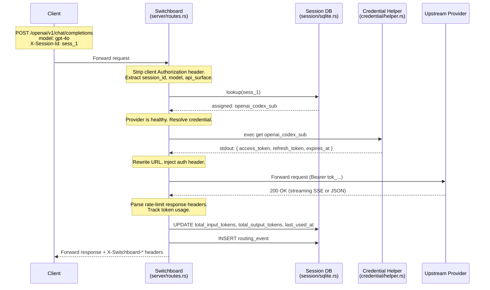
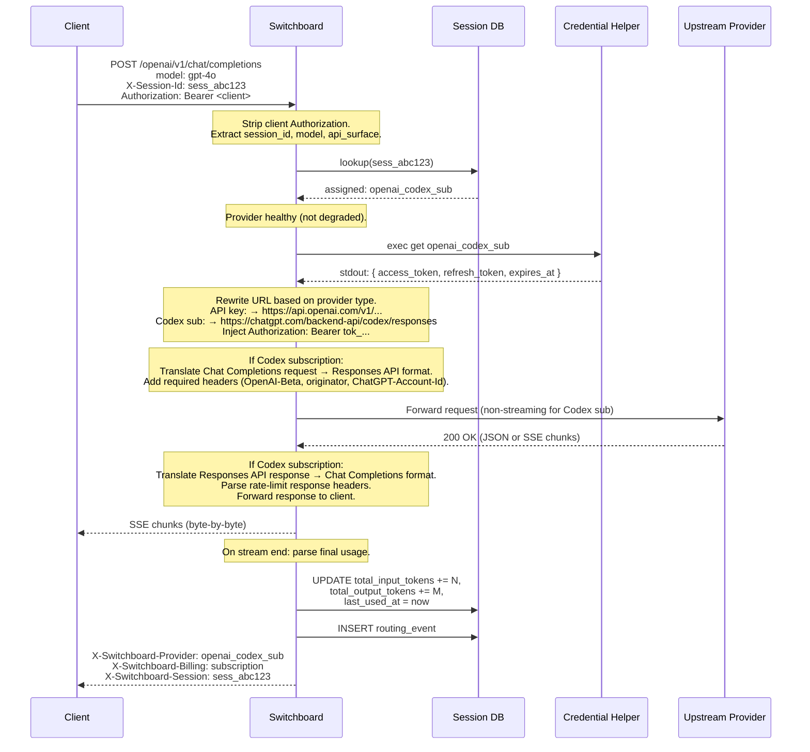
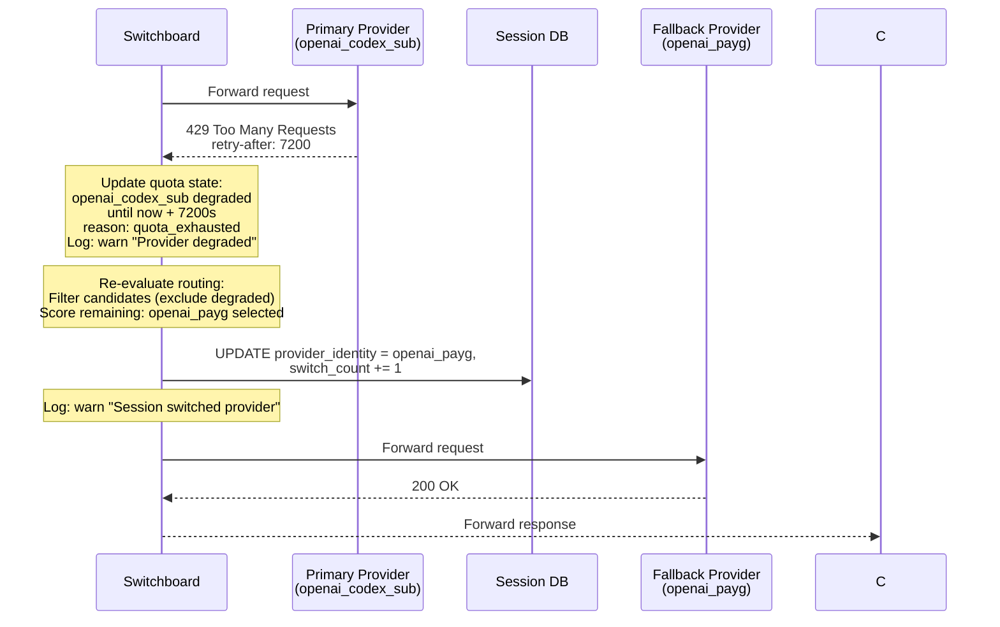
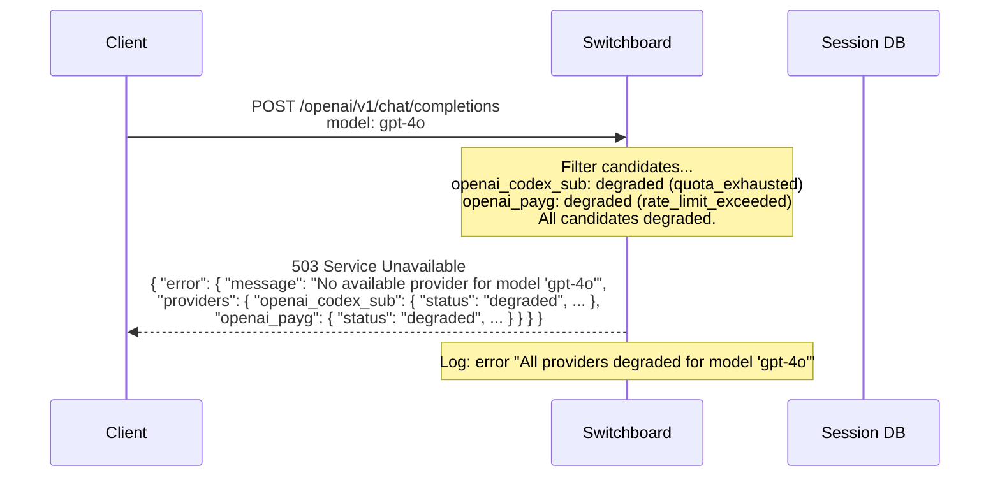
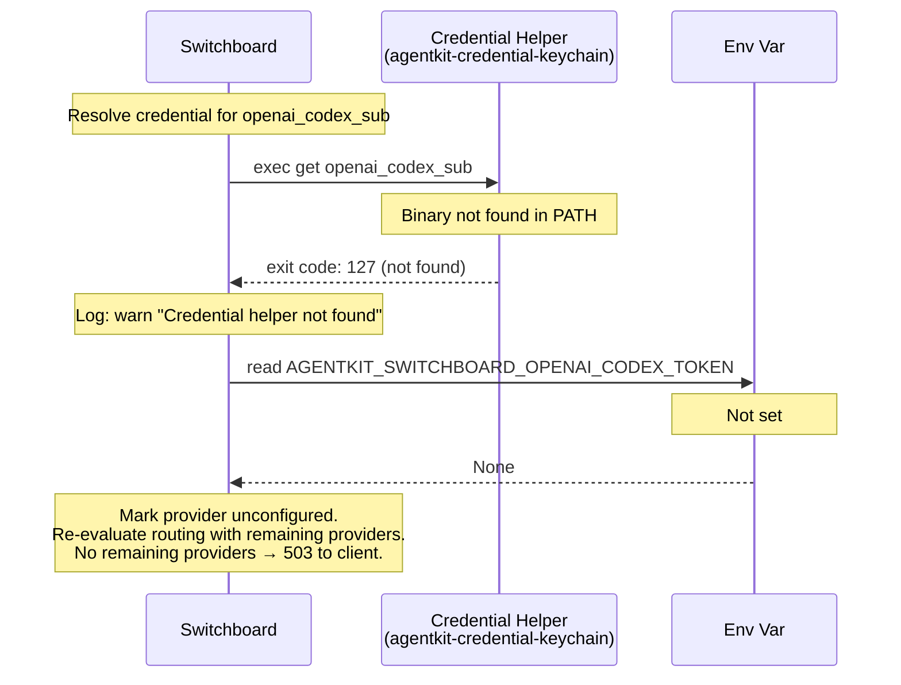
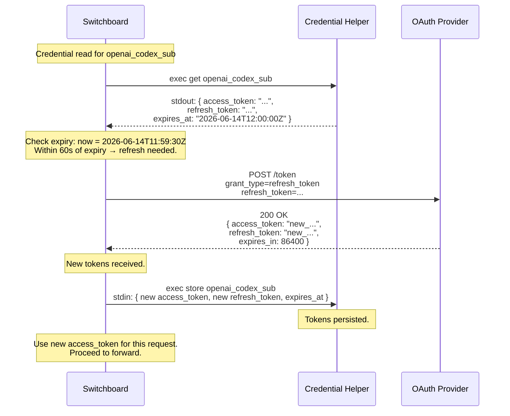

# Plan: Switchboard — Cost-Aware Model Provider Proxy

## 1. Requirements Traceability

| Spec Requirement | Plan Section | Verification |
|---|---|---|
| **FR1** — Route dispatch by API surface | §4.1 Route registry, §4.2.1 Path prefix matching | Unit: `route_dispatch_by_path`. Integration: path 404 test. |
| **FR2** — Multi-provider routing | §4.2.2 Candidate selection + scoring | Unit: `routing_prefers_subscription`, `routing_ranks_by_cost`, `routing_model_not_available`. Integration: `proxy_completes_request`. |
| **FR3** — Quota-preserving routing | §4.2.3 Scoring algorithm, §5 Quota state | Unit: `routing_prefers_subscription`, `routing_falls_through_on_quota_exhausted`. Integration: `proxy_429_retry`. |
| **FR4** — Session affinity with persistence | §6 Session manager (in-memory + SQLite) | Unit: `routing_session_affinity`, `routing_session_persisted_after_restart`. Integration: `proxy_session_persistence`. |
| **FR5** — Streaming passthrough | §4.4 Forwarder (SSE byte copy) | Unit: `streaming_passthrough`. Integration: `proxy_streams_response`. |
| **FR6** — Model metadata resolution | §3 Model DB (models.dev + TOML merge) | Unit: `config_models_dev_merge`. Integration: `proxy_model_list`. |
| **FR7** — Credential pooling | §4.2.2 Step 3 per-provider credential check | Unit: `credential_env_var`, `credential_helper_not_found`. |
| **FR8** — Provider degradation and recovery | §5.3 Degradation state machine | Unit: `degradation_recovers_after_timeout`, `degradation_permanent_on_401`. Integration: `proxy_all_degraded_503`. |
| **FR9** — Configuration and CLI | §2 CLI + config loader | Unit: `config_parse_valid`, `config_parse_duplicate_identity`. BATS: flag parsing. |
| **FR10** — Auth login subcommand | §7 OAuth flow + credential helper | Unit: `credential_helper_store`, `credential_helper_get`. Integration: mocked OAuth callback. |
| **FR11** — Session database persistence | §6.3 SQLite schema + migrations | Unit: `session_db_create_and_query`, `session_db_corruption_handling`. |
| **FR12** — Rate-limit header parsing | §5.1 Header parser | Unit: `quota_headers_openai`, `quota_headers_anthropic`, `quota_headers_missing`. |
| **NFR1** — Startup time < 2s | §8.1 Lazy credential validation | Benchmark gate in CI (`cargo bench`). |
| **NFR2** — Proxy latency overhead | §4.4 Streaming without body buffering | Benchmark: P95 overhead measured against wiremock. |
| **NFR3** — Memory footprint < 50MB idle | §8.3 No in-memory session table | `memory-profiling` test gated. |
| **NFR4** — Credential security | §7.3 Redaction in logs, helper-only access | Audit: grep for credential values in logs. |
| **NFR5** — Observability | §4.5 Structured logging + routing_events DB | Unit: tracing-test assertion on routing decisions. |
| **NFR6** — Async runtime | All I/O on tokio | Compilation: tokio-annotated. Clippy: `disallowed_methods` for blocking calls. |

## 2. Architecture Overview

### 2.1 Crate Dependency Graph

The switchboard ships as four crates (+ existing workspace crates):

```
Workspace root
├── crates/agentkit-switchboard/          # Proxy binary (no keyring dependency)
│   ├── depends on: tokio, axum, reqwest, sqlx, serde, oauth2, agentkit-models
│   └── does NOT depend on: keyring, rig-core, acp-storage
├── crates/agentkit-credentials/          # Credential helper binaries (single crate)
│   ├── src/lib.rs                        # Shared protocol types + JSON serde
│   ├── src/bin/agentkit-credential-keychain.rs  # keyring backend
│   ├── src/bin/agentkit-credential-file.rs      # file backend
│   └── depends on: keyring (keychain bin only), serde_json
├── crates/agentkit-models/               # Bundled models.dev snapshot
│   ├── build.rs                          # Fetches + converts at compile time
│   └── src/lib.rs                        # Exposes bundled data
└── existing workspace crates (litterbox, lens)
```

### 2.2 Module Map

```
agentkit-switchboard/src/
├── main.rs                     # CLI entry — clap derive, ExitCode, tokio::main
├── lib.rs                      # pub mod declarations
│
├── config/
│   ├── mod.rs                  # SwitchboardConfig, ProviderConfig, AuthConfig, PricingConfig
│   │                          # HashMap<identity, ProviderConfig>
│   ├── authenticator.rs        # AuthType enum, Authenticator trait, impls for each variant
│   └── loader.rs               # TOML deserialize → Vec<ProviderConfig> → HashMap
│                              # Models.dev merge + validation
│
├── cli.rs                      # Clap derive struct, subcommands (auth, start)
│
├── server/
│   ├── mod.rs                  # axum Router build, middleware stack, graceful shutdown
│   ├── routes.rs               # Handler functions per endpoint
│   └── middleware.rs           # Request ID, session ID extraction, logging
│
├── proxy/
│   ├── router.rs               # Candidate selection + scoring algorithm
│   └── forwarder.rs            # URL rewrite, auth header injection, SSE passthrough
│
├── provider/
│   ├── mod.rs                  # ProviderState (healthy/degraded, quota, credential)
│   ├── registry.rs             # Arc<HashMap<identity, ProviderState>>, credential resolution
│   └── quota.rs                # QuotaState, header parsing, degradation machine
│
├── session/
│   ├── mod.rs                  # SessionManager trait (get, set, update)
│   ├── memory.rs               # In-memory HashMap implementation (for tests)
│   └── sqlite.rs               # SQLite implementation via sqlx
│
├── credential/
│   ├── mod.rs                  # ResolvedCredential, CredentialSource enum
│   ├── env.rs                  # Env var reader
│   └── helper.rs               # Credential helper exec (std::process::Command)
│
├── auth/
│   ├── mod.rs                  # AuthSubcommand trait, OAuth flow handler
│   └── openai_codex.rs         # OpenAI Codex OAuth (oauth2 crate, local callback server)
│
├── models/
│   ├── mod.rs                  # ModelMetadata, MergedModel struct
│   └── db.rs                   # Bundled snapshot loader + TOML override merger
│
└── db/
    ├── mod.rs                  # Connection pool, run_migrations
    └── migrations/
        └── 001_session_schema.sql

agentkit-switchboard/tests/
├── config.rs                   # Config parse tests
├── routing.rs                  # Pure routing algorithm tests (no HTTP)
├── session.rs                  # Session store parameterized (memory + sqlite)
├── proxy_mock.rs               # Integration tests with wiremock upstreams
└── live.rs                     # Gated live tests (-- --ignored)
```

### 2.3 Component Interactions (Normal Path)



## 3. Technology Choices

| Choice | Selection | Rationale |
|--------|-----------|-----------|
| **HTTP framework** | axum 0.8 | Matches existing project patterns. Well-typed extractors for path/header/JSON. Native SSE. |
| **HTTP client** | reqwest 0.12 | Streaming support for SSE passthrough. Native TLS. tokio-compatible. |
| **Config parsing** | toml + serde | Follows litterbox pattern. Well-known, no alternatives considered. |
| **CLI** | clap derive | Follows litterbox pattern. `ExitCode` return type. |
| **SQLite** | sqlx 0.9 (sqlite + migrate) | Async via `spawn_blocking`. Migration support. No ORM overhead. |
| **Logging** | tracing + tracing-subscriber | Structured JSON logs. Tokio-native. Env-filter for level control. |
| **OAuth** | oauth2 5 | Battle-tested. PKCE support. Minimal feature set (`basic`). |
| **Credential helper exec** | `std::process::Command` | No extra dependency. Each call is a subprocess. Tokio `spawn_blocking` for the exec call. |
| **Credential helper keychain** | keyring 3 | Only in `agentkit-credential-keychain` binary, not in proxy. Cross-platform (macOS/Win/Linux). |
| **Testing (mocked HTTP)** | wiremock 0.6 | Request matching, response templating. Used in model-provider-sdk samples. |
| **Testing (async)** | tokio::test | Standard for the project. |
| **Time types** | chrono 0.4 | RFC 3339 parsing/serialization for token expiry. `serde` feature. |
| **UUID** | uuid 1 (v4) | Request ID generation for routing_events. |

## 4. Component Breakdown and Sequencing

### Phase 1: Scaffolding, Config, and CLI (Days 1-2)

**Files created:**
- `crates/agentkit-switchboard/Cargo.toml`
- `crates/agentkit-switchboard/src/main.rs` (tokio main, clap derive)
- `crates/agentkit-switchboard/src/lib.rs` (pub mod declarations)
- `crates/agentkit-switchboard/src/cli.rs` (clap struct, subcommands)
- `crates/agentkit-switchboard/src/config/mod.rs` (all config types)
- `crates/agentkit-switchboard/src/config/loader.rs` (TOML parse → HashMap)

**Key decisions:**
- The config example in the spec uses `[[providers]]` array-of-tables. Deserialize as `Vec<ProviderConfig>`, then build `HashMap<String, ProviderConfig>` keyed by `identity`. Reject duplicates at this step.
- `credential_helper` is a top-level `Option<String>` with default `"keychain"`.
- `session_db_path` defaults to `~/.switchboard/sessions.db` via `dirs::data_dir()`.
- CLI mirrors `crates/agentkit-litterbox/src/main.rs`: `#[derive(Parser)]`, `ExitCode`, `--help`.

**Acceptance criteria:**
- `switchboard --config tests/fixtures/minimal.toml` parses and prints config.
- `switchboard --help` lists all flags and subcommands.
- Duplicate identity in TOML produces a clear error with the duplicate value.
- Missing `--config` prints error and usage.

### Phase 2: Model Metadata Layer (Day 2-3)

**Files created:**
- `crates/agentkit-switchboard/src/models/mod.rs`
- `crates/agentkit-switchboard/src/models/db.rs`
- `models.dev.json` (placeholder snapshot, CI-generated later)

**Key decisions:**
- Snapshot is a JSON file bundled via `include_bytes!()` in the binary (`models.dev.json` at crate root). A future improvement may use `build.rs` to fetch it.
- Merge order: bundled snapshot as base → `[models.*]` TOML overrides win on field-by-field basis.
- `GET /openai/v1/models` response is assembled from merged metadata + per-provider pricing overlay.

**Acceptance criteria:**
- Model metadata loads and merges in < 100ms for 1000+ models.
- TOML override takes precedence over bundled value.
- Unknown model name returns `None` (used by routing for 503).

### Phase 3: HTTP Server, Routing, and Request Forwarding (Days 3-6)

**Files created:**
- `crates/agentkit-switchboard/src/server/mod.rs`
- `crates/agentkit-switchboard/src/server/routes.rs`
- `crates/agentkit-switchboard/src/server/middleware.rs`
- `crates/agentkit-switchboard/src/proxy/router.rs`
- `crates/agentkit-switchboard/src/proxy/forwarder.rs`
- `crates/agentkit-switchboard/src/provider/mod.rs`
- `crates/agentkit-switchboard/src/provider/registry.rs`

**Key decisions:**
- Axum router built in `server/mod.rs`, handlers in `routes.rs`.
- Route dispatch by path prefix: extract first path segment, match to API surface.
- Router scoring algorithm (spec §8.2) is a pure function: `(model, candidates, session_opt) → Result<ProviderIdentity, NoProviderError>`. This makes it unit-testable without HTTP.
- Forwarder uses `reqwest::Client` with streaming: `response.bytes_stream()` → `StreamBody` for axum. No buffering for streaming requests.
- The client's `Authorization` header is stripped before forwarding; the authenticator's resolved credential is injected instead.
- URL rewriting: strip `/openai/v1` prefix, use `base_url` from provider config as the new origin.
  - API key providers: `/openai/v1/chat/completions` → `https://api.openai.com/v1/chat/completions`
  - Codex subscription: `/openai/v1/chat/completions` → `https://chatgpt.com/backend-api/codex/responses`
- **Request translation** (Codex subscription only): Convert Chat Completions `messages` array to Responses API `input` format. Map `system` role to `instructions`. Add `store: false`, `reasoning: {effort: "medium"}`, required headers (`OpenAI-Beta`, `originator`, `ChatGPT-Account-Id`).
- **Response translation** (Codex subscription only): Convert Responses API `output` array back to Chat Completions `choices` format. Non-streaming only in MVP — streaming requests to Codex subscription return 400 with a message to use non-streaming.
- Token counts for non-streaming: parse response body JSON. For streaming: accumulate `usage` from final SSE chunk.

**Acceptance criteria:**
- `POST /openai/v1/chat/completions` with `stream: true` returns SSE.
- `POST /openai/v1/chat/completions` with `stream: false` returns single JSON.
- `GET /openai/v1/models` returns merged model list with provider pricing.
- `GET /health` returns status, provider states, session DB info.
- Unknown path returns 404.
- Request for model not served by any provider returns 503.
- Proxy adds `X-Switchboard-Provider` and `X-Switchboard-Billing` headers.

### Phase 4: Session Management with SQLite Persistence (Days 5-7)

**Files created:**
- `crates/agentkit-switchboard/src/session/mod.rs` (SessionManager trait)
- `crates/agentkit-switchboard/src/session/memory.rs`
- `crates/agentkit-switchboard/src/session/sqlite.rs`
- `crates/agentkit-switchboard/src/db/mod.rs`
- `crates/agentkit-switchboard/src/db/migrations/001_session_schema.sql`

**Key decisions:**
- `SessionManager` trait with `lookup`, `assign`, `update_tokens`, `increment_switch` methods.
- SQLite connection via `sqlx::SqlitePool`, migrations run at startup.
- Session DB writes use `spawn_blocking` (sqlx sqlite is synchronous under the hood; use the `sqlx` runtime-tokio feature which handles this).
- Failed write logs error but does not block the request — the session assignment is already committed in the routing decision.
- `memory.rs` implements the same trait for testing without a real database file.
- Session affinity is checked *after* credential resolution but *before* forwarding. If the assigned provider is degraded, re-route and update the DB.

**Acceptance criteria:**
- First request with new `X-Session-Id` creates a row in `session_affinity`.
- Second request with same ID returns the same provider (healthy).
- Restart switchboard → same ID → same provider (SQLite persistence).
- Provider switch during session increments `switch_count` and updates `provider_identity`.
- Database write failure logged, request still proceeds.

### Phase 5: Quota Tracking and Degradation (Days 6-8)

**Files created:**
- `crates/agentkit-switchboard/src/provider/quota.rs`

**Key decisions:**
- Quota state lives in `Arc<RwLock<HashMap<identity, ProviderQuotaState>>>` — shared across requests, updated after each response.
- Header parsing: extract known header names, parse integer values. Missing headers → `None`.
- Degradation state machine (spec §8.5):
  - 429 → set `degraded_until = now + retry-after` (or default window).
  - 5xx → set `degraded_until = now + min(backoff, 5min)`, increment `retry_count`.
  - 401/403 → set `degraded_until = None` (permanent).
  - On successful response → clear degradation, reset `retry_count`.
- Periodic check for expired degradation: checked lazily on each routing decision (if `degraded_until` is in the past, clear it).
- Subscription provider quota: after 429, degrade for 5-hour cooldown. No per-response header tracking.

**Acceptance criteria:**
- OpenAI `x-ratelimit-remaining-requests` parsed and stored.
- Anthropic `anthropic-ratelimit-requests-remaining` parsed and stored.
- 429 with `retry-after: 30` → degraded for 30s.
- 401 → permanently degraded.
- Successful response clears degradation.
- All providers degraded → 503 with provider status details.

### Phase 6: Credential Helper Protocol and Auth Login (Days 8-11)

**Files created:**
- `crates/agentkit-switchboard/src/credential/mod.rs`
- `crates/agentkit-switchboard/src/credential/env.rs`
- `crates/agentkit-switchboard/src/credential/helper.rs`
- `crates/agentkit-switchboard/src/auth/mod.rs`
- `crates/agentkit-switchboard/src/auth/openai_codex.rs`

**Key decisions:**
- `credential/helper.rs` executes `agentkit-credential-{helper}` via `std::process::Command` on a `spawn_blocking` thread.
- Protocol parsing: `serde_json::from_slice` on stdout. Exit code 0 = success, 1 = not found.
- Token refresh: compare current time to `expires_at`. If expired (or within 60s of expiry), exchange refresh token via OAuth provider, then call `helper store` to persist the new pair.
- `auth/openai_codex.rs` implements the OAuth authorization code flow with PKCE:
  - Starts a local HTTP server on an ephemeral port.
  - Constructs the authorize URL with the redirect pointing to `http://127.0.0.1:{port}/callback`.
  - Opens the browser via `open` (macOS) / `xdg-open` (Linux) / `cmd /c start` (Windows).
  - Exchanges the authorization code for access + refresh tokens.
  - Calls `agentkit-credential-{helper} store {identity}` with the token JSON.
- `auth login` reads the config to determine auth type but does NOT modify the config.

**Acceptance criteria:**
- `credential_helper_get` — mock helper binary returns JSON, parsed correctly.
- `credential_helper_store` — helper binary invoked with correct identity and JSON on stdin.
- `credential_helper_refresh` — expired token triggers refresh flow; new tokens written via store.
- `credential_helper_not_found` — helper missing from PATH → fallback to env var.
- `switchboard auth login openai_codex_sub` — opens browser, completes flow, calls helper store.
- `switchboard auth token openai_codex_sub` — prints env var assignment.
- `switchboard auth status` — shows credential source and expiry for all providers.

### Phase 7: Credential Helper Binaries (Days 10-13)

**Files created:**
- `crates/agentkit-credentials/Cargo.toml` (single crate, two binary targets)
- `crates/agentkit-credentials/src/lib.rs` (shared protocol types)
- `crates/agentkit-credentials/src/bin/agentkit-credential-keychain.rs`
- `crates/agentkit-credentials/src/bin/agentkit-credential-file.rs`

**Key decisions:**
- Each helper is a standalone binary that reads command + identity from argv, credential JSON from stdin (for `store`), and writes JSON to stdout (for `get`). Exit codes follow the protocol spec (§6.7.1).
- `agentkit-credential-keychain`:
  - Uses `keyring` crate. Service name: `agentkit-credential-keychain`. Account: the identity string.
  - `get` → reads from keychain, deserializes JSON, writes to stdout.
  - `store` → reads JSON from stdin, serializes, writes to keychain.
  - `erase` → deletes the keychain entry.
- `agentkit-credential-file`:
  - File at `~/.agentkit/credentials.json` with `0600` permissions.
  - JSON format: `{ "<identity>": { "access_token": "...", "refresh_token": "...", "expires_at": "..." } }`.
  - Creates `~/.agentkit` directory on first write with `0700` perms.
  - No file locking — single-user workstation, writes only during `auth login`.

**Acceptance criteria:**
- `agentkit-credential-keychain get foo` returns stored credential or exits 1.
- `agentkit-credential-keychain store foo < creds.json` stores it.
- `agentkit-credential-keychain erase foo` removes it.
- `agentkit-credential-file` same operations work without keychain daemon.
- Both helpers handle invalid JSON on stdin with non-zero exit + error message on stderr.

### Phase 8: Hardening, Testing, and Documentation (Days 12-15)

- Integration test suite with wiremock (spec §15.3).
- Live test suite (gated with `-- --ignored`).
- Benchmark gates for NFR1-NFR3.
- `.github/workflows/` CI additions:
  - Build all 4 crates.
  - Run tests with wiremock.
  - Build credential helper binaries.
  - (Optional) models.dev snapshot refresh script.
- Documentation: README for each crate, switchboard usage examples.

## 5. Data Flow Diagrams

### 5.1 Normal Path (Session Affinity + Healthy Provider)



### 5.2 Degradation Path (Provider Returns 429)



### 5.3 All Providers Degraded Path



### 5.4 Credential Helper Failure Path



### 5.5 Token Refresh Path



## 6. Testing Strategy

### 6.1 Test Layers

| Layer | Harness | What It Covers | CI Gate |
|-------|---------|----------------|---------|
| **Unit** | `cargo test --lib` | Config, routing algorithm, quota math, session affinity, header parsing, credential protocol parsing | Yes — required |
| **Integration (mocked)** | `cargo test` with wiremock | Full HTTP lifecycle, streaming, degradation, session persistence, model list | Yes — required |
| **Integration (live)** | `cargo test -- --ignored` | Real OpenAI/Ollama round-trips | Manual — uses real credentials |
| **Benchmark** | `cargo bench` | Startup time, latency overhead, memory | Informational — no hard gate |

### 6.2 Credential Helper Test Harness

The credential helper protocol is tested at two levels:

**Switchboard-side (credential/helper.rs):** The `helper.rs` module that execs the helper binary is tested by pointing it at the `agentkit-credential-file` binary (always available since it's in the same workspace). Tests set `credential_helper = "file"` and use a temp directory for `~/.agentkit/`. This exercises the real exec path with a controlled backend — no mocking of `std::process::Command`.

**Helper-side (crates/agentkit-credentials/tests/):** Each binary target has integration tests:
1. `tests/keychain.rs` — tests `get`/`store`/`erase` against a temporary keyring entry (using `keyring`'s mock entry feature or a test-only entry that is cleaned up after).
2. `tests/file.rs` — tests `get`/`store`/`erase` against a temp file via `tempfile`. Validates JSON format, permissions, and concurrent write safety.

### 6.3 Mock HTTP Upstream (wiremock)

All proxy integration tests use wiremock to simulate upstream providers:

- **Successful response**: wiremock returns 200 with configurable JSON body.
- **Streaming**: wiremock returns chunks with `Transfer-Encoding: chunked`.
- **429**: wiremock returns 429 with `retry-after` header.
- **Auth failure**: wiremock returns 401.
- **Timeout**: wiremock delays response beyond configured timeout.

### 6.4 Routing Algorithm as Pure Function

The core routing algorithm in `proxy/router.rs` is a pure function:

```rust
fn select_provider(
    model: &str,
    api_surface: ApiSurface,
    session: Option<&SessionAffinity>,
    providers: &HashMap<String, ProviderState>,
) -> Result<ProviderSelection, RoutingError>
```

This function can be tested without instantiating an HTTP server, without a database connection, and without credential helpers — it takes all state as arguments and returns a deterministic result.

### 6.5 CI Pipeline

```
[Build]
  ├── cargo build --workspace
  └── cargo clippy --workspace -- -D warnings

[Test]
  ├── cargo test --lib                          # unit tests
  ├── cargo test                                 # integration (mocked)
  ├── cargo test -p agentkit-credential-keychain  # helper tests
  └── cargo test -p agentkit-credential-file      # helper tests

[Optional]
  └── cargo bench                                # benchmark comparison
```

## 7. Risks and Mitigations

| Risk | Likelihood | Impact | Mitigation |
|------|-----------|--------|------------|
| **Credential helper exec latency**: `std::process::Command` adds 1-5ms per request | Medium | Low | Cache credential in-memory with TTL (deferred) — acceptable for MVP. Monitor via `routing_events.latency_ms`. |
| **Keyring crate platform issues**: Linux libsecret/D-Bus not available | Medium | Medium | Fallback to env var. User can set `credential_helper = "file"` for headless. |
| **OAuth flow browser open fails**: Headless server without display | Low | Low | `switchboard auth token` fallback for CI. Error message tells user to set env var manually. |
| **SQLite write contention**: Multiple concurrent requests update the same session row | Low | Medium | Use `INSERT ... ON CONFLICT DO UPDATE` (upsert). sqlx handles serialization within SQLite. `spawn_blocking` ensures tokio doesn't stall. |
| **Streaming response partially forwarded then upstream drops**: Client sees truncated response | Medium | Low | Acceptable per spec §12.3 — send error SSE chunk then `[DONE]`. No retry. |
| **models.dev snapshot drift**: Prices/features change between releases | Low | High | Auto-generated snapshot in CI before each release. If no release in months, user can override via `[models.*]` TOML. |
| **Multiple credentials for same base_url both degrade**: No provider available | Low | Medium | Already handled — 503 with provider status. Alert in logs at error level. |
| **Configuration hot reload needed**: User must restart to change providers | Medium | Low | Spec §12.5 explicitly defers this. Log warning on config file change detected. |

## 8. Operations

The switchboard is a local proxy — no deployment pipeline, no canary, no multi-region. Operations are limited to what a developer does on their own machine.

### 8.1 What to Watch in Logs

| Log Level | Signal | What It Means |
|-----------|--------|---------------|
| `error` | All providers degraded for model X | Every candidate is down. Check credential validity and quota state. |
| `error` | OAuth refresh failed for identity X | Token can't be refreshed. Run `switchboard auth login` to re-auth. |
| `warn` | Provider X degraded (reason) | A provider hit a rate limit or error. Should auto-recover. |
| `warn` | Session X switched from A to B | Cache penalty incurred. Expected when quota exhausts. |
| `warn` | Credential helper not found in PATH | Falling back to env var. Install the helper or set `credential_helper = "file"`. |
| `info` | Routing decision: model X → provider Y | Every request's routing choice. Useful for debugging. |

### 8.2 Undoing Things

| What | How |
|------|-----|
| **Wrong config** | Edit `switchboard.toml`, restart the binary. |
| **Wrong binary version** | Replace the binary, restart. Session DB is forward-compatible (additive migrations only). |
| **Corrupt session DB** | Delete `~/.switchboard/sessions.db`. Switchboard recreates it. Loss of session affinity is acceptable — next request incurs a cache penalty. |
| **Stale OAuth tokens** | Run `switchboard auth login <identity>` to re-auth. Or `switchboard auth logout <identity>` to clear them. |
| **Don't want the proxy anymore** | Kill the process. Point your client directly at the upstream provider. No state left behind beyond the session DB (safe to delete). |

## 9. Alignment Check

This plan covers every requirement FR1-FR12 and NFR1-NFR6 from the spec. No contradictions found between plan and spec. Two spec items that were unclear are now resolved:

1. **`[[providers]]` → `HashMap` conversion**: Plan §4 Phase 1 specifies the deserialize-as-Vec-then-index-by-identity pattern (written into spec §6.6).
2. **`models: None` inference**: Plan §4 Phase 2 specifies `include_bytes!()` for the bundled snapshot + field-level TOML override merge. The inference is: scan the bundled models.dev pricing section for entries matching the provider identity.

If any of the open questions above change the architecture, the spec will be updated before implementation proceeds.
