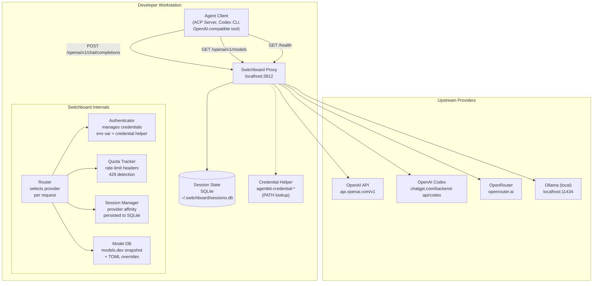
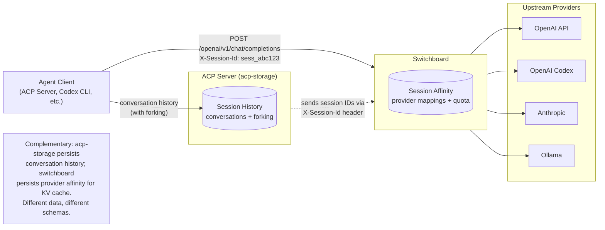

# Switchboard: Cost-Aware Model Provider Proxy

## 0. References

### Prior ADRs

- [ACP Server Spec](../2026-04-28-acp-server/spec.md) — ACP protocol harness (currently static text)
- [ACP Server Session Storage Spec](../2026-06-13-acp-server-session-storage/spec.md) — SQLite session persistence and forking
- [Model Provider SDK Spec](../2026-06-14-model-provider-sdk/spec.md) — rig-core selection rationale, multi-provider analysis
- [Model Provider SDK Plan](../2026-06-14-model-provider-sdk/plan.md) — rig provider architecture
- [Model Provider SDK Comparison](../2026-06-14-model-provider-sdk/README.md) — Sample crate findings, rig `CompletionModel` trait, Usage struct, cassette testing
- [Litterbox Config Pattern](../crates/agentkit-litterbox/src/config.rs) — clap + TOML config file + env vars for secrets

### Model Metadata

- [Models.dev](https://models.dev/) — Open-source database of AI model specifications, pricing, and capabilities. Data stored as TOML in [github.com/anomalyco/models.dev](https://github.com/anomalyco/models.dev). Schema: provider-agnostic model metadata (`models/`) separated from provider-specific pricing (`providers/`). Supports `base_model` inheritance and per-field overrides.

### Authentication

- [Claude Code Auth Docs](https://code.claude.com/docs/en/authentication) — Five auth methods in precedence order. OAuth tokens stored in system keychain (macOS) or `~/.claude/.credentials.json` (Linux).
- [Claude Code OAuth Token](https://code.claude.com/docs/en/authentication#claude_code_oauth_token) — `claude setup-token` generates a one-year OAuth token for CI/script use.
- [OpenAI Codex Auth](https://github.com/openai/codex/issues/9305) — Two auth modes: ChatGPT subscription (OAuth, quota-limited) or API key (usage-based billing, unlimited within rate limits).
- [Claude Code MCP OAuth](https://claudelab.net/en/articles/claude-code/claude-code-mcp-oauth-authentication-guide) — OAuth 2.1 with PKCE, DCR, browser-based authorization flow, automatic token refresh.

### Rate Limits / Quota APIs

- [OpenAI Rate Limit Headers](https://developers.openai.com/api/docs/guides/rate-limits) — `x-ratelimit-remaining-*` headers on every response.
- [OpenAI Admin Project Rate Limits API](https://developers.openai.com/api/reference/resources/admin/subresources/organization/subprojects/rate_limits/methods/list_rate_limits) — `GET /organization/projects/{project_id}/rate_limits`.
- [OpenAI Codex Rate Limits](https://developers.openai.com/api/docs/models/gpt-5.2-codex) — Codex-specific RPM/TPM tiers for API key usage.
- [OpenAI Codex Subscription Quotas](https://blog.laozhang.ai/en/posts/openai-codex-usage-limits) — Messages/5h + weekly limits. Internal `/backend-api/wham/usage` endpoint.
- [Anthropic Rate Limits API](https://platform.claude.com/docs/en/manage-claude/rate-limits-api) — `GET /v1/organizations/rate_limits` per-model-group.
- [Anthropic Response Rate-Limit Headers](https://platform.claude.com/docs/en/api/rate-limits) — `anthropic-ratelimit-*-remaining` headers.
- [Claude Code Usage Endpoint](https://claude-meter.com/t/claude-code-rate-limit) — `GET /api/organizations/{org}/usage` returns 8 utilization floats (0.0–1.0). Each carries `resets_at`.
- [Higher usage limits for Claude (May 2026)](https://www.anthropic.com/news/higher-limits-spacex) — 5-hour limits doubled for all paid plans; peak-hour throttling removed.

### Quota Research Summary

| Provider / Auth | Quota Data Source | What It Reports | Window Types |
|---|---|---|---|
| OpenAI API key | Response headers | `x-ratelimit-remaining-*` | RPM, TPM (per-minute rolling) |
| OpenAI Codex subscription | Internal `/usage` endpoint | Messages / 5h, weekly | 5-hour rolling + weekly |
| Anthropic Platform API key | Response headers | `anthropic-ratelimit-*-remaining` | RPM, ITPM, OTPM (per-minute) |
| Anthropic subscription (Claude Code) | `GET ... /usage` endpoint | 8 utilization floats (0.0–1.0) | 5-hour rolling + 7-day rolling |
| Ollama (local) | None | N/A | No limits |

## 1. Problem

A developer working locally on AI agent tooling typically has access to several model providers:

- **Pay-as-you-go API keys** (OpenAI, Anthropic Platform, OpenRouter, Together, Groq) — per-token billing with rate limits and monthly spend caps.
- **Subscription tokens** (Claude Code OAuth, OpenAI Codex subscription, GitHub Copilot) — flat-rate billing with time-windowed quotas (5-hour rolling windows, weekly caps) and no per-token cost within those quotas.
- **Local models** (Ollama) — free, no auth, no limits beyond hardware.

Currently, choosing which provider to use for a given model request is manual and static: a developer hardcodes `OPENAI_API_KEY` and pays per token even when a subscription with remaining quota is available. When a subscription quota is exhausted, the request fails instead of falling through to a pay-as-you-go provider.

The switchboard solves this by acting as a **local HTTP proxy** that:

1. Accepts requests in an OpenAI Chat Completions-compatible format at `/openai/v1/chat/completions`.
2. Routes each request to the most cost-effective provider that serves the requested model. For providers that use a different API format (e.g., Codex subscription uses the Responses API), the switchboard translates the request and response transparently.
3. Maximises use of time-limited subscription quota by preferentially routing to subscription providers while quota remains, falling back to pay-as-you-go providers only when necessary.
4. Tracks per-provider quota and rate-limit state from response headers, provider quota APIs, and per-request utilization data.
5. Maintains session-aware provider affinity and **persists session-to-provider mappings** so affinity survives restarts and KV cache benefits are preserved.
6. Supports both subscription (OAuth) and pay-as-you-go (API key) authentication for providers that offer both — OpenAI Codex being the primary example.

**Scope**: Designed for a single developer workstation. Multi-tenant quota enforcement, user isolation, and per-organization billing are out of scope.

## 2. Terminology

| Term | Definition |
|------|------------|
| **API surface** | The wire protocol format the proxy speaks and backends speak. Identified by URL path prefix (`/openai/v1/...`, future `/anthropic/v1/...`, `/ollama/...`). The proxy routes within the same surface where possible; for providers using a different wire format (e.g., Codex subscription uses Responses API), the proxy translates request and response bodies transparently. |
| **Provider** | A configurable combination of a base URL, API surface, authenticator implementation, billing model, pricing, and a set of models it can serve. Defined in TOML, stored in a map keyed by identity. |
| **Identity** | The unique key for a provider within the TOML config. Used for lookup, credential reference, response header identification, and credential helper key. |
| **Authenticator** | A component that knows what credentials a provider expects, which env vars or credential helper keys to read, how to present the credential on the wire, and (for OAuth) how to refresh it. |
| **Billing model** | How the credential is charged: `subscription` (flat-rate, time-limited quota, no per-token cost within quota), `pay_as_you_go` (per-token cost, rate-limited), or `free` (local, no auth, no limits). |
| **Quota window** | A time-bounded usage limit enforced by the provider. May be a rolling window (5-hour sliding window where the oldest prompt ages out) or a fixed window (monthly spend cap). |
| **Utilization float** | A 0.0–1.0 value representing how much of a quota window has been consumed. At 1.0, further requests return 429. Used by Claude Code's internal usage endpoint. |
| **Session** | A grouping of requests identified by an `X-Session-Id` HTTP header. Sessions have provider affinity: once assigned, all requests in a session go to the same provider unless that provider becomes unavailable. Session state is persisted to SQLite. |
| **Cache penalty** | The additional cost incurred when a session switches providers, because the new provider has no cached prefix for the conversation context. Preserving session affinity avoids this. |
| **Model metadata** | Provider-agnostic facts about a model: context window size, max output tokens, supported capabilities (tool calling, structured output, reasoning, modalities). Sourced from a bundled snapshot of models.dev data, with TOML overrides. |
| **Provider pricing** | Per-provider, per-model cost per million tokens for input, output, cached input, and reasoning tokens. Defined per provider (not per model), because the same model served by different providers has different prices. |
| **Credential source** | Where a credential value comes from: an environment variable (for API keys and pre-acquired tokens) or a credential helper (for switchboard-managed OAuth tokens with refresh). |

## 3. System Architecture

### 3.1 Deployment Diagram



### 3.2 Request Lifecycle

```mermaid
sequenceDiagram
    participant C as Client
    participant SB as Switchboard
    participant SessionDB as Session DB (SQLite)
    participant CredHelper as agentkit-credential-*
    participant PA as Primary Provider
    participant PB as Fallback Provider

    Note over C: Client sends request with X-Session-Id

    C->>SB: POST /openai/v1/chat/completions
    Note over SB: model: gpt-4o<br/>X-Session-Id: sess_abc123

    SB->>SessionDB: Lookup session sess_abc123
    SessionDB-->>SB: Assigned provider: openai_codex_sub
    
    Note over SB: Provider is healthy (quota > 0).
    Using assigned provider (affinity).

    SB->>CredHelper: exec get openai_codex_sub
    CredHelper-->>SB: stdout: { access_token, refresh_token, expires_at }
    
    SB->>PA: Forward request (Bearer token)
    PA-->>SB: 200 OK (streaming SSE chunks)
    SB-->>C: Forward SSE chunks

    Note over SB: Parse response headers.<br/>Update rate-limit counters.<br/>Track session tokens.

    SB->>SessionDB: UPDATE session_affinity
    Note over SB: Update total_input_tokens,<br/>total_output_tokens, last_used_at.

    C->>SB: POST /openai/v1/chat/completions (same session)
    SB->>SessionDB: Lookup session
    SessionDB-->>SB: Assigned provider: openai_codex_sub
    
    Note over SB: Token expired. Refresh using stored refresh_token.
    SB->>CredHelper: exec get openai_codex_sub
    CredHelper-->>SB: stdout: { access_token, refresh_token, expires_at }
    Note over SB: Exchange refresh_token for new pair.
    SB->>CredHelper: exec store (stdin: new tokens)
    
    SB->>PA: Forward request (refreshed Bearer token)
    PA-->>SB: 429 Rate Limit / Quota Exhausted
    
    Note over SB: Mark openai_codex_sub degraded.<br/>Re-evaluate routing.

    SB->>SB: Select best alternative: openai_api_key
    SB->>SessionDB: UPDATE session_affinity<br/>(provider_identity changed,<br/>switch_count += 1)
    
    SB->>PB: Forward request (Bearer key_2)
    PB-->>SB: 200 OK
    SB-->>C: Forward response
    
    Note over C: Cache penalty incurred on provider switch.<br/>Session now sticks to the new provider.
```

### 3.3 Boundaries

| Owns | Does Not Own |
|------|-------------|
| Provider selection and routing | Session conversation history (ACP server) |
| Credential resolution and rotation | Tool execution / MCP client (ACP server) |
| Rate-limit and quota tracking per provider | User authentication / ACL for the proxy itself |
| Session-to-provider affinity mapping (persisted to SQLite) | ACP session lifecycle (create/close/fork) |
| OAuth token acquisition, storage, and refresh | Multi-tenant quota enforcement |
| Model metadata aggregation (models.dev + overrides) | Cache penalty cost modeling (deferred) |
| Request forwarding and SSE streaming passthrough | Full protocol translation between arbitrary API surfaces |
| Credential security (redaction in logs, helper-based storage) | |
| Model shape enumeration (`GET /openai/v1/models`) | |

### 3.4 Credential Storage Principles

The switchboard does **not** manage credential storage directly. Instead, it delegates to a **credential helper** — a plugin binary found in `PATH` — by invoking it via a protocol similar to Docker's `docker-credential-*` helpers.

The switchboard ships with two credential helpers:

| Helper Binary | Backend | Use Case |
|---------------|---------|----------|
| `agentkit-credential-keychain` | System keychain (macOS Keychain, Windows Credential Manager, Linux libsecret) | Desktop workstation with a keychain daemon |
| `agentkit-credential-file` | JSON file at switchboard data dir (`~/.local/state/agentkit/switchboard/credentials.json` on Linux, `0600` perms). Override with `AGENTKIT_DATA_DIR` env var. | Headless server, CI, WSL without D-Bus |

The helper binary is set once via the top-level `credential_helper` field in the TOML config (or `--credential-helper` CLI flag). All providers share the same credential helper. All credentials — API keys and OAuth tokens alike — are stored and read via the credential helper.

| Storage | Use Case | Supports Refresh? |
|---------|----------|-------------------|
| **Credential helper (default: `keychain`)** | All credentials. Managed via `switchboard auth login` (OAuth) or `switchboard auth add` (API keys). | Yes — OAuth tokens are refreshed automatically. API keys are static. |

Credentials are **never** written to the config file, logged, returned in API responses, or stored in the session database.

## 4. User Journeys

### 4.1 Developer Configures the Switchboard

1. Developer creates `switchboard.toml` with two OpenAI providers: one Codex subscription (OAuth) and one API key (pay-as-you-go fallback).
2. Developer runs `switchboard auth login openai_codex_sub` — this opens a browser, completes the OAuth flow, and stores the access + refresh tokens via `agentkit-credential-keychain store`.
3. Developer sets `AGENTKIT_SWITCHBOARD_OPENAI_API_KEY` env var with their pay-as-you-go key.
4. Developer runs `switchboard --config switchboard.toml`.
5. Switchboard loads the bundled models.dev snapshot, applies TOML overrides, validates both credentials (reads OAuth token via `agentkit-credential-keychain get openai_codex_sub`, API key from env var), and starts the HTTP server.
6. Developer points their ACP server to `http://127.0.0.1:3812/openai/v1/chat/completions`.

**Outcome**: Developer has a single endpoint that routes through the Codex subscription first, falling back to the API key when subscription quota is exhausted.

### 4.2 Automatic Failover on Quota Exhaustion

1. Switchboard routes requests to the Codex subscription while the 5-hour window has quota remaining.
2. Codex returns 429 (quota exhausted).
3. Switchboard marks the subscription provider as degraded for the remainder of the 5-hour window, logs the event, updates the session affinity in SQLite to point to the fallback provider.
4. Subsequent requests are routed to the OpenAI API key (pay-as-you-go).
5. After the 5-hour window rolls, the subscription provider is automatically re-enabled by the quota tracker.

**Outcome**: The developer never sees a 429 — requests silently fall through to the next-best provider.

### 4.3 Multi-Credential Pooling with Session Affinity

1. Developer has two OpenAI API keys with different rate limits, configured as separate providers.
2. A long-running ACP session (`sess_abc123`) is assigned to `openai_key_1`.
3. The session persists across switchboard restarts (session affinity is stored in SQLite).
4. After a restart, the next request for `sess_abc123` reads the persisted affinity and routes to `openai_key_1`, preserving the provider's KV cache for the conversation context.
5. If `openai_key_1` exhausts its rate limit, the session is re-assigned to `openai_key_2` — but a cache penalty is incurred.

**Outcome**: Session affinity survives restarts, maintaining cost benefits from KV cache reuse.

### 4.4 Using the Auth Login Subcommand

1. Developer runs `switchboard auth login openai_codex_sub`.
2. Switchboard detects the provider identity in the config file, determines it needs OAuth auth for OpenAI Codex subscription.
3. Switchboard opens a browser window pointing to OpenAI's OAuth authorization endpoint.
4. Developer logs into their OpenAI account and grants consent.
5. The OAuth provider redirects to the switchboard's local callback URL (`http://localhost:1455/auth/callback?code=...`).
6. Switchboard exchanges the authorization code for an access token + refresh token.
7. Switchboard invokes `agentkit-credential-keychain store openai_codex_sub` with the token JSON on stdin.
8. Developer sees: `✓ Authentication complete. Token stored via agentkit-credential-keychain.`
9. For CI/script use, the developer can run `switchboard auth token openai_codex_sub` to print the env var they need to set:
   ```
   AGENTKIT_SWITCHBOARD_OPENAI_CODEX_TOKEN=<access_token>
   ```

**Outcome**: Interactive OAuth setup without manual token management. CI/script path also supported.

### 4.5 Model Shape Discovery

1. Developer runs `curl http://127.0.0.1:3812/openai/v1/models`.
2. Switchboard returns merged model list from the bundled models.dev data + TOML overrides + provider-specific pricing.
3. Each model entry includes context window, capabilities, and pricing per provider.
4. Developer's tooling uses this to select appropriate models for their tasks.

**Outcome**: Single source of truth for available model shapes across all providers.

## 5. Model Metadata Layer

### 5.1 Data Source

The switchboard ships with a bundled snapshot of model metadata from [models.dev](https://github.com/anomalyco/models.dev). This is an open-source TOML registry that separates provider-agnostic model facts from provider-specific pricing. The snapshot is vendored at build time by the `agentkit-models` crate (a separate workspace crate with a `build.rs` that fetches and converts the models.dev data to JSON).

Two layers of data:

1. **Provider-agnostic model facts** (`models/<lab>/<model>.toml`): context window, max output, capabilities, modalities, knowledge cutoff, release date.
2. **Provider-specific pricing** (`providers/<provider>/models/<model>.toml`): per-million-token costs. Inherits from `base_model` with overrides.

### 5.2 Merge Order

Model metadata is resolved in this precedence order (highest wins):

1. **TOML `[models.*]` overrides** in the user's switchboard config file.
2. **Bundled models.dev snapshot** (provider pricing merged on top of model-agnostic facts).
3. **Built-in defaults** (empty — every model fact must come from a source above).

### 5.3 Refresh Cadence

The models.dev snapshot is regenerated in CI on each release. A future improvement may add periodic refresh at runtime (e.g., weekly check for updated pricing).

## 6. TOML Configuration Schema

### 6.1 Config File

```toml
# ============================================================
# Switchboard Configuration
# ============================================================

# --- Global Settings ---

# Credential helper for persistent token storage.
# Resolved as agentkit-credential-<name> in PATH.
# Default: "keychain" (uses system keychain via agentkit-credential-keychain).
# Set to "file" for encrypted JSON file (headless/CI).
credential_helper = "keychain"

# --- Model Metadata Overrides ---
# Merge on top of the bundled models.dev snapshot.
# Provider-agnostic: context window, capabilities, etc.
# Pricing is NOT here — it's per provider.

[models."gpt-4o"]
context_window = 128000

[models."gpt-4o-mini"]
context_window = 128000

# --- Provider Definitions ---
# Keyed by identity (used for env var naming, credential helper key, routing).

# Provider 1: OpenAI Codex subscription (OAuth, quota-based)
# Uses the Responses API at chatgpt.com, not api.openai.com.
# The switchboard translates Chat Completions requests to Responses API format.
[[providers]]
identity = "openai_codex_sub"
api_surface = "openai"
base_url = "https://chatgpt.com/backend-api/codex"
billing = "subscription"

[providers.auth]
type = "openai_codex_oauth"

[providers.auth.oauth]
authorize_url = "https://provider.example.com/oauth/authorize"
token_url = "https://provider.example.com/oauth/token"
scopes = "openid email profile"

[providers.pricing]
# Subscription — no per-token cost within quota. Pricing shown for
# overflow/usage-credit comparison with pay-as-you-go providers.
input_per_mtok = 0
output_per_mtok = 0

models = ["gpt-4o", "gpt-4o-mini", "gpt-5.4", "gpt-5.3-codex"]

# Provider 2: OpenAI API key (pay-as-you-go, rate-limited)
[[providers]]
identity = "openai_payg"
api_surface = "openai"
base_url = "https://api.openai.com/v1"
billing = "pay_as_you_go"
models = ["gpt-4o", "gpt-4o-mini", "gpt-4.1", "gpt-4.1-mini", "gpt-4.1-nano"]

[providers.auth]
type = "bearer_token"

[providers.pricing]
input_per_mtok = 2.50
output_per_mtok = 10.00

[providers.pricing.models."gpt-4o-mini"]
input_per_mtok = 0.15
output_per_mtok = 0.60

# Provider 3: Ollama (local, free, no auth)
[[providers]]
identity = "ollama_local"
api_surface = "openai"
base_url = "http://localhost:11434/v1"
billing = "free"
models = ["llama-3.2", "mistral"]

[providers.auth]
type = "none"

pricing = {}

# Provider 4: OpenRouter (pay-as-you-go, third-party)
[[providers]]
identity = "openrouter"
api_surface = "openai"
base_url = "https://openrouter.ai/api/v1"
billing = "pay_as_you_go"
models = ["gpt-4o", "claude-sonnet-4-20250514"]

[providers.auth]
type = "bearer_token"

[providers.pricing]
input_per_mtok = 2.50
output_per_mtok = 10.00
```

### 6.2 Schema Reference

```rust
/// Config root
struct SwitchboardConfig {
    /// Per-model metadata overrides. Key is model id.
    models: HashMap<String, ModelConfig>,

    /// Provider definitions, keyed by identity.
    providers: HashMap<String, ProviderConfig>,

    /// Name of the credential helper binary to use for persistent storage.
    /// Resolved as `agentkit-credential-{name}` in PATH.
    /// Default: "keychain".
    credential_helper: Option<String>,

    /// Session database path (default: ~/.switchboard/sessions.db)
    session_db_path: Option<PathBuf>,
}

/// Provider-agnostic model capabilities.
struct ModelConfig {
    context_window: Option<u32>,
    max_output: Option<u32>,
    capabilities: Option<Capabilities>,
}

struct Capabilities {
    tool_calling: Option<bool>,
    reasoning: Option<bool>,
    structured_output: Option<bool>,
}

struct ProviderConfig {
    identity: String,
    api_surface: ApiSurface,
    base_url: String,
    billing: BillingModel,
    auth: AuthConfig,
    pricing: PricingConfig,
    /// Explicit model list. When None, infer from the models.dev
    /// pricing snapshot: find all models in `providers/<identity>/models/*.toml`
    /// that have pricing entries for this provider's identity.
    models: Option<Vec<String>>,
}

enum ApiSurface {
    #[serde(rename = "openai")]
    Openai,
}

enum BillingModel {
    #[serde(rename = "subscription")]
    Subscription,
    #[serde(rename = "pay_as_you_go")]
    PayAsYouGo,
    #[serde(rename = "free")]
    Free,
}

struct AuthConfig {
    r#type: AuthType,

    /// OAuth endpoint configuration for auth types that support login.
    /// Required for `openai_codex_oauth` and similar OAuth-based auth types.
    /// Not used for `bearer_token`, `anthropic_api_key`, or `none`.
    oauth: Option<OAuthEndpointConfig>,
}

/// OAuth 2.1 endpoint configuration for the auth login subcommand.
/// Not shipped in the binary — the user provides these for their provider.
struct OAuthEndpointConfig {
    /// Authorization endpoint URL (RFC 6749 §3.1).
    authorize_url: String,
    /// Token endpoint URL (RFC 6749 §3.2).
    token_url: String,
    /// Space-separated OAuth scopes. Default: "openid email" if absent.
    scopes: Option<String>,
}

/// AuthType selects an authenticator implementation.
/// Each knows which env vars or credential helpers to read,
/// how to present credentials on the wire, and how to refresh.
enum AuthType {
    /// "Authorization: Bearer <value>" — simple static API key
    #[serde(rename = "bearer_token")]
    BearerToken,

    /// OpenAI Codex OAuth flow. Reads access token from env var or
    /// credential helper. Supports automatic token refresh via stored
    /// refresh token. Managed via `switchboard auth login <identity>`.
    #[serde(rename = "openai_codex_oauth")]
    OpenAICodexOAuth,

    /// "x-api-key: <value>" — Anthropic Platform API key
    #[serde(rename = "anthropic_api_key")]
    AnthropicApiKey,

    /// Pre-acquired OAuth token used as "Authorization: Bearer <token>"
    /// No auto-refresh (used for CI/script tokens like CLAUDE_CODE_OAUTH_TOKEN).
    #[serde(rename = "oauth_token")]
    OAuthToken,

    /// No authentication.
    #[serde(rename = "none")]
    None,
}

struct PricingConfig {
    input_per_mtok: f64,
    output_per_mtok: f64,
    cache_read_per_mtok: Option<f64>,
    cache_write_per_mtok: Option<f64>,
    reasoning_per_mtok: Option<f64>,

    /// Per-model pricing overrides.
    #[serde(default)]
    models: HashMap<String, PerModelPricing>,
}

struct PerModelPricing {
    input_per_mtok: Option<f64>,
    output_per_mtok: Option<f64>,
    cache_read_per_mtok: Option<f64>,
    cache_write_per_mtok: Option<f64>,
    reasoning_per_mtok: Option<f64>,
}
```

### 6.3 Authenticator Selection

Each `AuthType` maps to an authenticator implementation:

| AuthType | Uses credential helper? | Wire format | Supports refresh? |
|---|---|---|---|---|
| `bearer_token` | Yes — `auth add <identity>` stores the API key | `Authorization: Bearer <val>` | No |
| `openai_codex_oauth` | Yes — `auth login <identity>` runs OAuth flow, stores tokens | `Authorization: Bearer <val>` | Yes — via stored refresh token |
| `anthropic_api_key` | Yes — `auth add <identity>` stores the API key | `x-api-key: <val>` | No |
| `oauth_token` | Yes — `auth add <identity>` stores the token | `Authorization: Bearer <val>` | No |
| `none` | No | No header | N/A |

All authenticators read credentials exclusively from the credential helper via `agentkit-credential-{helper} get {identity}`. No env var fallback. The `openai_codex_oauth` authenticator additionally supports automatic token refresh: if the access token is expired, it uses the stored refresh token to obtain a new one and writes it back via `agentkit-credential-{helper} store`.

### 6.4 Why HashMap Keyed by Identity

Providers are `HashMap<String, ProviderConfig>` for three reasons:
1. **Enforced uniqueness**: Duplicate identities are impossible at the type level.
2. **O(1) lookup**: Session affinity, health checks, and routing all look up providers by identity.
3. **Stable reference**: The identity string is used across the system (env var naming, credential helper keys, response headers, logs).

### 6.5 Credential Resolution

```rust
/// Resolved credential ready for use on the wire.
struct ResolvedCredential {
    /// The token/value to present in the auth header.
    value: String,
    /// How it was obtained (for logging/status).
    source: CredentialSource,
    /// Optional OAuth metadata for refresh-capable credentials.
    oauth: Option<OAuthState>,
}

enum CredentialSource {
    /// Read from a credential helper binary.
    Helper { helper_name: String },
    /// Read from an environment variable (static, no refresh).
    EnvVar { var_name: String },
    /// No credential needed.
    None,
}

/// OAuth state persisted by the credential helper.
/// Uses chrono for RFC 3339 compatibility with the helper JSON protocol.
struct OAuthState {
    refresh_token: Option<String>,
    expires_at: Option<DateTime<Utc>>,
}
```

Resolution order:
1. If `auth.type == "none"` → `CredentialSource::None`.
2. Invoke `agentkit-credential-{helper} get {identity}`:
   - The helper name comes from the global `credential_helper` config (default: `"keychain"`).
   - If the binary is found and returns valid JSON, extract the credential.
   - If the binary is not in PATH or returns non-zero, the provider is unconfigured.
3. If no valid token → provider is unconfigured.

### 6.6 Config File Loading

Following the Litterbox pattern (`config_loader.rs`):

1. Parse the file at `--config <path>` (required).
2. The TOML uses `[[providers]]` array-of-tables syntax. Deserialize as `Vec<ProviderConfig>`, then index into `HashMap<String, ProviderConfig>` keyed by `identity`. Duplicate identities are rejected at this step.
3. Validation: at least one valid provider, all enums known (`ApiSurface`, `BillingModel`, `AuthType`). The global `credential_helper` is validated by existence check at credential resolution time (not at startup — the binary can be installed later).
4. The session database path defaults to `~/.switchboard/sessions.db`; can be overridden with `--session-db`.

### 6.7 Credential Helper Protocol

Credential helpers are plugin binaries found in `PATH`, named `agentkit-credential-{name}`. The protocol follows the Docker credential helper pattern with three commands:

#### 6.7.1 Commands

| Command | Args | stdin | stdout | Exit code |
|---------|------|-------|--------|-----------|
| `get` | `<identity>` | (none) | JSON credential blob | 0 = success, 1 = not found |
| `store` | `<identity>` | JSON credential blob | (none) | 0 = success |
| `erase` | `<identity>` | (none) | (none) | 0 = success |

#### 6.7.2 Credential JSON Format

```json
{
  "access_token": "gho_abc123...",
  "refresh_token": "ghr_def456...",
  "expires_at": "2026-06-15T00:00:00Z"
}
```

Fields:
- `access_token` (required): The credential value to present in the auth header.
- `refresh_token` (optional): OAuth refresh token, present for refresh-capable auth types.
- `expires_at` (optional): RFC 3339 timestamp of token expiry. `null` or absent = unknown.

#### 6.7.3 Resolution

1. The switchboard resolves the helper name from the global `credential_helper` config (default: `"keychain"`).
2. It searches `PATH` for `agentkit-credential-{helper}`.
3. If not found and `credential_helper` was explicitly set in the config → log an error, fall through to env var.
4. If not found and `credential_helper` was the default → log a debug message, fall through to env var.
5. If found → execute the subcommand and parse stdout.

#### 6.7.4 Shipped Helpers

Both helpers live in a single `crates/agentkit-credentials/` crate with multiple binary targets, sharing credential protocol parsing in a common library module.

**`agentkit-credential-keychain`**: Wraps the system keychain via the `keyring` crate.
- macOS: Keychain
- Windows: Credential Manager
- Linux: libsecret (gnome-keyring / D-Bus secret service)
- Service name: `agentkit-credential-keychain`
- Account name: the provider identity

**`agentkit-credential-file`**: Stores credentials in a JSON file with restricted permissions.
- Path: Switchboard data dir (`~/.local/state/agentkit/switchboard/credentials.json` on Linux, `~/Library/Application Support/AgentKit/switchboard/credentials.json` on macOS, `~/AppData/LocalLow/AgentKit/switchboard/credentials.json` on Windows). Override with `AGENTKIT_DATA_DIR` env var.
- File permissions: `0600` (owner read/write only)
- Created with `mkdir -p` on first write
- The file is a JSON object mapping identity → credential blob
- Warning: plaintext on disk (mitigated by `0600` perms). Intended for CI/headless environments only.

```json
{
  "openai_codex_sub": {
    "access_token": "gho_...",
    "refresh_token": "ghr_...",
    "expires_at": "2026-06-15T00:00:00Z"
  }
}
```

#### 6.7.5 Keyring Crate Dependency

The `keyring` crate is pulled in only by `agentkit-credential-keychain`, not by the switchboard proxy itself. The switchboard only knows how to exec a helper binary. This keeps the proxy's dependency tree minimal and the helper protocol portable.

## 7. CLI Interface

```text
switchboard --config <PATH> [FLAGS]

FLAGS:
  --config <PATH>             Path to TOML configuration file (required)
  --bind <ADDR>               Network interface to bind (default: 127.0.0.1)
  --port <PORT>               HTTP port (default: 3812)
  --log-level <LEVEL>         Log level: error, warn, info, debug, trace (default: info)
  --session-db <PATH>         Path to session SQLite database (default: ~/.switchboard/sessions.db)
  --models-db <PATH>          Path to models.dev JSON snapshot (default: bundled)
  --credential-helper <NAME>  Credential helper name (overrides config; default: "keychain")
  --help                      Print help
  --version                   Print version

SUBCOMMANDS:
  auth                    Manage provider authentication
  start                   Start the proxy server (default if no subcommand given)

auth SUBCOMMANDS:
  login <identity>        Complete OAuth flow for a provider and store tokens
                          via the configured credential helper
  status [identity]       Show authentication status for all providers or one
  token <identity>        Print the env var value for a provider's access token
                          (useful for CI/script setup)
  logout <identity>       Remove stored credentials for a provider
```

Following the existing Litterbox CLI pattern (clap derive, `ExitCode` return type, `--help` for usage).

### 7.1 Auth Login Flow

```
switchboard auth login openai_codex_sub

1. Read config file, find provider "openai_codex_sub"
2. Determine auth type: openai_codex_oauth
3. Read `[auth.oauth]` from the provider config (authorize_url, token_url, scopes)
4. Read global `credential_helper` setting (default: "keychain")
5. Start local HTTP server on port 1455 for OAuth callback (fixed port required by OpenAI)
6. Open browser to the OAuth authorization URL
7. User logs in and grants consent in browser
8. OAuth provider redirects to http://localhost:1455/auth/callback?code=...
9. Exchange authorization code for access token + refresh token
10. Invoke: agentkit-credential-keychain store openai_codex_sub
      stdin: { "access_token": "gho_...", "refresh_token": "ghr_...",
               "expires_at": "2026-06-15T00:00:00Z" }
11. Print: ✓ Authentication complete.
            Token stored via agentkit-credential-keychain.
            For CI/script use, run: switchboard auth token openai_codex_sub
```

### 7.2 Auth Token Command

```
switchboard auth token openai_codex_sub
AGENTKIT_SWITCHBOARD_OPENAI_CODEX_TOKEN=<access_token>

# With --env-file flag:
switchboard auth token openai_codex_sub --env-file
export AGENTKIT_SWITCHBOARD_OPENAI_CODEX_TOKEN=<access_token>
```

## 8. Routing Logic

### 8.1 Route Dispatch

The switchboard dispatches requests by URL path prefix:

| Path | API Surface | Handler |
|------|-------------|---------|
| `POST /openai/v1/chat/completions` | OpenAI | Chat completions proxy |
| `GET /openai/v1/models` | OpenAI | Return merged model list |
| `GET /health` | General | Health check |

Future API surfaces would add their own path prefixes:
- `POST /anthropic/v1/messages` → Anthropic
- `POST /ollama/v1/chat` → Ollama

The API surface is extracted from the path prefix and used to filter candidate providers (a provider with `api_surface = "openai"` only serves requests at `/openai/v1/...`).

**Protocol translation note:** Providers using the Responses API (e.g., Codex subscription at `chatgpt.com/backend-api/codex`) receive translated requests. The switchboard converts Chat Completions request bodies to Responses API format and converts Responses API responses back to Chat Completions format. This translation is limited to basic message passing (non-streaming in MVP; streaming deferred).

### 8.2 Candidate Selection

For each incoming request:

```
Input:  path (determines api_surface), model_name, optional session_id
State:  per-provider quota counters, session DB

1. Determine API surface from path prefix (/openai/v1/... → "openai")

2. Resolve model metadata:
   a. Look up model_name in merged model database
   b. If not found, return 503 (unknown model)

3. Filter candidate providers:
   a. Provider.api_surface matches the request's API surface
   b. Provider's model list includes model_name
   c. Provider has a valid credential (credential helper or env var)
   d. Provider is not currently degraded

4. If session_id is present:
   a. Query session DB for session_id
   b. If found and assigned provider passes the filter in step 3:
      - Use assigned provider (affinity)
      - Skip ranking — go to step 6
   c. If found but assigned provider fails filter (degraded):
      - Log provider switch reason
      - Increment switch_count in session DB
      - Fall through to step 5

5. Rank providers by score:
   a. Primary: billing model
      - subscription with remaining quota > pay_as_you_go > free
   b. Secondary: cost per token (within same billing model)
      - Calculate: est_input_tokens * input_price + est_output_tokens * output_price
      - Lower is better
   c. Tertiary: remaining rate-limit headroom (future)
   d. Tiebreaker: identity string (lexical, deterministic)

6. Assign session (if session_id present):
   a. Upsert session_affinity row in session DB:
      - session_id, provider_identity, model_name,
        assigned_at/updated_at timestamps, switch_count
   b. This assignment persists across restarts

7. Select top-ranked provider
```

### 8.3 Request Forwarding

```
1. Authenticate:
   a. Get the authenticator for the selected provider
   b. For helper-managed credentials: check expiry, refresh if needed
   c. Apply the auth header
   d. Remove the client's original Authorization header

2. Translate request body (if needed):
   a. If the selected provider uses the Responses API (e.g., Codex subscription):
      - Convert Chat Completions `messages` array to Responses API `input` format
      - Map `system` role message to `instructions` field
      - Add Responses API required fields: `store: false`, `reasoning: {effort: "medium"}`
      - Add required headers: `OpenAI-Beta: responses=experimental`, `originator: agentkit-switchboard`
      - Extract `ChatGPT-Account-Id` from the OAuth token JWT if available
   b. If the selected provider uses Chat Completions natively (API key):
      - Pass request body through unchanged

3. Rewrite URL:
   a. Replace the request host/port with the selected provider's base_url
   b. Rewrite path: strip the API surface prefix (/openai/v1/ → /v1/)
   c. Example (API key): /openai/v1/chat/completions → https://api.openai.com/v1/chat/completions
   d. Example (Codex sub): /openai/v1/chat/completions → https://chatgpt.com/backend-api/codex/responses

4. Pass through remaining request body and headers unchanged

5. For streaming: forward SSE chunks byte-by-byte, update quota on end
   - For Responses API providers: translate SSE events to Chat Completions SSE format (deferred in MVP — streaming requests to Codex subscription return 400 with a message to use non-streaming)
5. For non-streaming: buffer full response, update quota, forward
   - For Responses API providers: translate response body from Responses API format to Chat Completions format (map `output` → `choices`, restructure content)

6. Update session DB: cumulative token counts, last_used_at

7. Add switchboard response headers:
   a. X-Switchboard-Provider: <identity>
   b. X-Switchboard-Billing: <billing model>
   c. X-Switchboard-Session: <session_id> (if sent)
```

### 8.4 Quota Tracking

#### 8.4.1 Pay-as-you-go Providers (API Keys)

Derived from response headers on every request:

| Header | Provider | Field |
|--------|----------|-------|
| `x-ratelimit-remaining-requests` | OpenAI | Requests remaining this minute |
| `x-ratelimit-remaining-tokens` | OpenAI | Tokens remaining this minute |
| `anthropic-ratelimit-requests-remaining` | Anthropic | Requests remaining this window |
| `anthropic-ratelimit-input-tokens-remaining` | Anthropic | Input tokens remaining this window |
| `anthropic-ratelimit-output-tokens-remaining` | Anthropic | Output tokens remaining this window |
| `retry-after` | Both | Seconds to wait on 429 |

Missing headers → state remains `None` (unknown). Provider is never degraded by absence of headers.

On 429:
- If `retry-after` present → degrade for that duration.
- If error body contains `insufficient_quota` → degrade until end of billing period (estimated).
- Otherwise → degrade for 60s.

#### 8.4.2 Subscription Providers (OAuth Tokens)

No per-response rate-limit headers. Quota is detected via:

1. **429 responses**: The provider returns 429 when quota is exhausted. The error body or `retry-after` header indicates duration.
2. **Static quota estimates** (TOML-configured): Optional `[quota]` section on the provider config for rough estimation (e.g., `messages_per_window = 45`, `window_hours = 5`).
3. **Provider quota API** (future): For providers where the switchboard has OAuth access to the internal usage API (Claude Code, OpenAI Codex).

The five-hour window is **rolling**: the oldest message ages off after 5 hours, decrementing the utilization float. The switchboard cannot directly observe this without the usage API, so it relies on 429 detection with a cooldown period.

#### 8.4.3 Quota State Structure

```rust
struct ProviderQuotaState {
    quota: QuotaSource,
    degradation: Option<DegradationState>,
    total_input_tokens: u64,
    total_output_tokens: u64,
    last_validated_at: Instant,
}

enum QuotaSource {
    /// Response headers provide per-minute rate-limit state.
    PayAsYouGo(PayAsYouGoState),
    /// Subscription — no per-response headers. 429 detection + optional static estimate.
    Subscription(SubscriptionState),
    /// Local — no limits.
    Free,
}

struct PayAsYouGoState {
    requests_remaining: Option<u32>,
    requests_limit: Option<u32>,
    requests_reset_after: Option<Duration>,
    input_tokens_remaining: Option<u64>,
    input_tokens_limit: Option<u64>,
    output_tokens_remaining: Option<u64>,
    output_tokens_limit: Option<u64>,
    spend_cap_exhausted: bool,
}

struct SubscriptionState {
    /// If true, a 429 has been received; provider is degraded until cooldown elapses.
    exhausted: bool,
    exhausted_at: Option<Instant>,
    cooldown_duration: Duration,          // default: 5 hours

    /// Optional static quota estimate from config (informational only).
    estimated_messages_per_window: Option<u32>,
    estimated_window_hours: Option<u32>,
}
```

### 8.5 Degradation and Recovery

```rust
enum DegradationReason {
    RateLimitExceeded,
    QuotaExhausted,
    ProviderError,            // 5xx
    AuthenticationFailure,    // 401/403
    Timeout,
}

struct DegradationState {
    reason: DegradationReason,
    degraded_until: Option<Instant>,     // None = permanent
    retry_count: u32,
    model_groups: Option<Vec<String>>,   // None = all models affected
}
```

| Event | Action | Recovery |
|-------|--------|----------|
| 429 rate-limit (pay-as-you-go) | Degrade for `retry-after` or `*-reset` time | Auto-recover when reset passes |
| 429 quota exhausted (subscription) | Degrade for `retry-after` or full window duration (default 5h) | Auto-recover after cooldown |
| 429 spend cap (pay-as-you-go) | Degrade permanently (end of billing period) | Manual re-enable or config reload |
| 5xx | Degrade for 30s, exponential backoff (max 5 min) | Auto-recover after backoff |
| 401/403 | Degrade permanently | Requires re-authentication or config reload |
| Timeout | Degrade for 10s, exponential backoff (max 2 min) | Auto-recover after backoff |

When degraded on 429, a session with that provider is **re-assigned** to the next-best provider. The re-assignment is persisted to the session database.

### 8.6 Session Affinity and Persistence

#### 8.6.1 Session Identification

The `X-Session-Id` header carries an opaque session identifier. The ACP server generates and sends these. The switchboard:

1. Reads `X-Session-Id` from every incoming request.
2. Queries the session database for the existing provider assignment.
3. If found and provider is healthy, uses it (affinity).
4. If not found, assigns the best provider and persists the mapping.
5. If the assigned provider degrades, re-assigns and updates the mapping.

#### 8.6.2 Persistence Justification

Session-to-provider mappings **must survive restarts** for two reasons:

1. **KV cache preservation**: Switching providers mid-session destroys the conversation context cached by the first provider. Both OpenAI and Anthropic charge less for cached input tokens. If the switchboard restarts and forgets the provider assignment, it may re-route to a different provider, incurring a full context re-send cost that can be 30–50% of the session's token budget (as demonstrated by [OpenAI Codex context reload overhead](https://github.com/openai/codex/issues/14593)).

2. **Credential pooling stability** (user journey 4.3): With multiple API keys for the same provider, switching keys forces a context cache miss because the cache is keyed by the API key/project. Persisting the assignment ensures the same key is used for the same session across restarts.

#### 8.6.3 Session Database Schema

The session database is a SQLite file at `~/.switchboard/sessions.db` (configurable via `--session-db`).

```sql
-- Session-to-provider affinity mapping
-- Persists across restarts to preserve KV cache benefits.
CREATE TABLE session_affinity (
    session_id          TEXT PRIMARY KEY,        -- X-Session-Id value (e.g. "sess_abc123")
    provider_identity   TEXT NOT NULL,            -- e.g. "openai_codex_sub"
    model_name          TEXT NOT NULL,            -- e.g. "gpt-4o"
    api_surface         TEXT NOT NULL DEFAULT 'openai',
    assigned_at         INTEGER NOT NULL,         -- Unix timestamp (seconds)
    last_used_at        INTEGER NOT NULL,         -- Updated on every request
    total_input_tokens  INTEGER DEFAULT 0,
    total_output_tokens INTEGER DEFAULT 0,
    total_requests      INTEGER DEFAULT 0,
    switch_count        INTEGER DEFAULT 0,        -- How many times provider changed
    is_active           INTEGER DEFAULT 1         -- 0 = session closed / expired
);

CREATE INDEX idx_affinity_last_used ON session_affinity(last_used_at);
CREATE INDEX idx_affinity_provider ON session_affinity(provider_identity);

-- Routing decision audit log
-- Useful for debugging routing behavior and usage aggregation.
CREATE TABLE routing_events (
    id                  INTEGER PRIMARY KEY AUTOINCREMENT,
    session_id          TEXT,                    -- NULL for stateless requests
    request_id          TEXT NOT NULL,            -- UUID for correlation with logs
    model_name          TEXT NOT NULL,
    provider_identity   TEXT NOT NULL,
    billing_model       TEXT NOT NULL,
    decision_reason     TEXT NOT NULL,            -- "affinity", "cost", "fallback", "quota_exhausted"
    input_tokens        INTEGER,
    output_tokens       INTEGER,
    response_status     INTEGER,                 -- HTTP status from upstream provider
    latency_ms          INTEGER,
    degraded_providers  TEXT,                    -- JSON array of degraded providers at decision time
    created_at          INTEGER NOT NULL
);

CREATE INDEX idx_routing_session ON routing_events(session_id);
CREATE INDEX idx_routing_time ON routing_events(created_at);

-- Credential metadata (helper entries tracked here for status reporting)
CREATE TABLE credential_meta (
    identity        TEXT PRIMARY KEY,
    auth_type       TEXT NOT NULL,
    source          TEXT NOT NULL,               -- "helper", "env_var", "none"
    expires_at      INTEGER,                     -- Token expiry (Unix seconds), NULL if unknown
    refresh_enabled INTEGER DEFAULT 1,
    created_at      INTEGER NOT NULL,
    updated_at      INTEGER NOT NULL
);
```

#### 8.6.4 Session Lifecycle Management

The session database has **no explicit session close or expiry** in the MVP. Sessions accumulate. A future cleanup task can remove sessions that haven't been used in N days.

If the session database already has a mapping for a session ID that was closed by the ACP server, the switchboard will still use the old provider assignment. This is acceptable because:
- The ACP server generates a new session ID for each `session/new`.
- Old session IDs are naturally abandoned.
- The session DB acts as a cache; stale entries are harmless.

#### 8.6.5 Cache Penalty Detection

When `switch_count` increments for a session, the switchboard logs at `warn` level:

```
Session sess_abc123 switched from openai_codex_sub to openai_payg
(reason: quota exhausted). Cumulative session tokens: 15000 input,
3000 output. Cache penalty incurred — new provider has no cached context.
```

This is logged for observability. Automatic cost-based factoring of cache penalties into routing decisions is deferred.

## 9. Endpoints

### 9.1 `POST /openai/v1/chat/completions`

Accepts standard OpenAI Chat Completions request body. Streams response in OpenAI SSE format for API key providers. For Codex subscription providers (Responses API), non-streaming only in MVP — streaming requests return 400 with a message to use non-streaming.

**Request**:
```json
{
  "model": "gpt-4o",
  "messages": [
    {"role": "system", "content": "You are a helpful assistant."},
    {"role": "user", "content": "Hello!"}
  ],
  "stream": true
}
```

**Headers**:
- `X-Session-Id: sess_<opaque>` — session affinity. The client sends this on every request in a session.
- `Authorization: Bearer <...>` — forwarded to the selected provider (after rewriting).

**Response**: Standard OpenAI Chat Completions response, streamed SSE or single JSON.

**Errors**:
- `400 Bad Request` — Invalid request body
- `503 Service Unavailable` — No provider could serve the requested model
- `502 Bad Gateway` — Selected provider returned an error

**Response headers**:
- `X-Switchboard-Provider: <identity>`
- `X-Switchboard-Billing: <billing model>`
- `X-Switchboard-Session: <session_id>` — echoed if sent

### 9.2 `GET /openai/v1/models`

Returns merged model list from models.dev + overrides + provider pricing.

**Response**:
```json
{
  "object": "list",
  "data": [
    {
      "id": "gpt-4o",
      "object": "model",
      "created": 1700000000,
      "owned_by": "openai",
      "context_window": 128000,
      "providers": [
        {"identity": "openai_codex_sub", "billing": "subscription"},
        {"identity": "openai_payg", "billing": "pay_as_you_go", "pricing": {"input_per_mtok": 2.50, "output_per_mtok": 10.00}}
      ]
    },
    {
      "id": "llama-3.2",
      "object": "model",
      "created": 1700000000,
      "owned_by": "meta",
      "context_window": 128000,
      "providers": [
        {"identity": "ollama_local", "billing": "free"}
      ]
    }
  ]
}
```

**Query parameters**:
- `?provider=<identity>` — Filter to a specific provider's models
- `?billing=<billing>` — Filter by billing model

### 9.3 `GET /health`

**Response**:
```json
{
  "status": "ok",
  "providers": {
    "openai_codex_sub": {
      "status": "healthy",
      "models_available": 12,
      "credential_valid": true,
      "credential_source": "agentkit-credential-keychain",
      "quota_type": "subscription"
    },
    "openai_payg": {
      "status": "healthy",
      "models_available": 12,
      "rate_limit_remaining_pct": 85.0,
      "credential_valid": true,
      "credential_source": "env_var",
      "quota_type": "pay_as_you_go"
    }
  },
  "session_db": {
    "path": "/home/user/.switchboard/sessions.db",
    "active_sessions": 3,
    "total_sessions": 47
  },
  "uptime_seconds": 3600
}
```

### 9.4 `POST /openai/v1/switchboard/quota` (Future)

Future endpoint to allow clients to query remaining quota for a given provider:

```json
{
  "openai_codex_sub": {
    "quota_type": "subscription",
    "status": "healthy",
    "estimated_remaining_pct": 65.0,
    "window_type": "5h_rolling",
    "window_reset_at": "2026-06-14T15:30:00Z"
  }
}
```

Not implemented in first iteration. Listed here to reserve the path pattern.

## 10. Functional Requirements

### FR1: Route Dispatch by API Surface

**Description**: The switchboard must dispatch requests to providers matching the request's API surface, identified by URL path prefix.

**Acceptance Criteria**:
- AC1.1: `POST /openai/v1/chat/completions` is dispatched to providers with `api_surface = "openai"`.
- AC1.2: Providers with a different API surface are excluded from routing.
- AC1.3: Unknown path prefixes return 404.

### FR2: Multi-Provider Routing

**Description**: The switchboard must route incoming model requests to the optimal provider based on model availability, credential validity, quota state, and cost.

**Acceptance Criteria**:
- AC2.1: Request for model `gpt-4o` with two providers both serving `gpt-4o` is routed to the preferred provider based on the scoring algorithm.
- AC2.2: Request for a model not served by any configured provider returns 503.
- AC2.3: Request for a model served only by a provider whose credential is unavailable returns 503.
- AC2.4: All configured providers are validated at startup; unavailable credentials do not prevent startup.

### FR3: Quota-Preserving Routing

**Description**: Preferentially route to subscription providers while quota remains, falling through to pay-as-you-go when exhausted.

**Acceptance Criteria**:
- AC3.1: Given a subscription provider and a pay-as-you-go provider for the same model, the subscription provider is selected while not degraded.
- AC3.2: After the subscription provider returns 429, subsequent requests route to the pay-as-you-go provider.
- AC3.3: After the subscription provider's cooldown period expires, it is reconsidered for routing.
- AC3.4: Multiple pay-as-you-go providers for the same model are ranked by cost per token.

### FR4: Session Affinity with Persistence

**Description**: When `X-Session-Id` is provided, the switchboard must persist the provider assignment and maintain affinity across requests and restarts.

**Acceptance Criteria**:
- AC4.1: All requests with the same `X-Session-Id` are routed to the same provider, provided that provider remains healthy.
- AC4.2: If the assigned provider is degraded, subsequent requests are re-routed and the new assignment persisted.
- AC4.3: After a switchboard restart, the session-to-provider mapping is loaded from SQLite and respected.
- AC4.4: Requests without `X-Session-Id` are routed independently (no persistence).
- AC4.5: Session DB writes are non-blocking — a failed write does not prevent request forwarding.

### FR5: Streaming Passthrough

**Description**: Support streaming responses, forwarding SSE chunks in real time.

**Acceptance Criteria**:
- AC5.1: Request with `stream: true` returns SSE stream terminating with `data: [DONE]`.
- AC5.2: Each SSE chunk is forwarded with no buffering beyond framing.
- AC5.3: Non-streaming requests buffer the full response before forwarding.
- AC5.4: Backend stream drop propagates an error then `[DONE]`.

### FR6: Model Metadata Resolution

**Description**: Resolve model metadata from the bundled models.dev snapshot, merging with TOML overrides. No live-fetching at startup.

**Acceptance Criteria**:
- AC6.1: The bundled models.dev snapshot is loaded and merged with TOML `[models.*]` overrides at startup.
- AC6.2: TOML model overrides take precedence over the bundled snapshot.
- AC6.3: `GET /openai/v1/models` returns the merged list with provider pricing.
- AC6.4: No outbound HTTP requests for model metadata at startup.

### FR7: Credential Pooling

**Description**: Multiple providers with the same base URL but different credentials must both be usable.

**Acceptance Criteria**:
- AC7.1: Two providers with different `identity` and credential sources but same `base_url` are both valid routing targets.
- AC7.2: Rate-limit and quota state are tracked independently per provider.
- AC7.3: If one credential is degraded, requests shift to the other.

### FR8: Provider Degradation and Recovery

**Description**: Providers must degrade gracefully on error and recover automatically.

**Acceptance Criteria**:
- AC8.1: 429 degrades for `retry-after` or window duration.
- AC8.2: 5xx degrades for 30s with exponential backoff (max 5 min).
- AC8.3: 401/403 degrades permanently until re-authentication.
- AC8.4: When all providers for a model are degraded, the switchboard returns 503.
- AC8.5: Degradation is per-model-group when providers distinguish rate limits by model family.

### FR9: Configuration and CLI

**Description**: Accept TOML config file, following the project's CLI patterns.

**Acceptance Criteria**:
- AC9.1: `switchboard --config switchboard.toml` starts the proxy.
- AC9.2: `switchboard --help` prints usage with all flags and subcommands.
- AC9.3: Config parse errors include line number and field name.
- AC9.4: Duplicate `identity` values are rejected.

### FR10: Auth Login Subcommand

**Description**: `switchboard auth login <identity>` completes an OAuth flow and stores credentials via the configured credential helper.

**Acceptance Criteria**:
- AC10.1: `switchboard auth login openai_codex_sub` reads the config, resolves the OAuth endpoint, opens a browser, and completes the flow.
- AC10.2: Access token and refresh token are stored via the configured credential helper (default: `agentkit-credential-keychain`).
- AC10.3: `switchboard auth token openai_codex_sub` prints the env var assignment for CI/script use.
- AC10.4: `switchboard auth status` shows the credential status for all providers.
- AC10.5: `switchboard auth logout openai_codex_sub` removes the stored credential via the helper's `erase` command.

### FR11: Session Database Persistence

**Description**: Session-to-provider mappings are persisted to SQLite.

**Acceptance Criteria**:
- AC11.1: On first request with a new `X-Session-Id`, a row is inserted into `session_affinity`.
- AC11.2: On subsequent requests, the mapping is read from the database.
- AC11.3: On provider re-assignment, the row is updated (provider_identity, switch_count).
- AC11.4: Cumulative token counts are updated on every request response.
- AC11.5: The database file is created at the configured path on first access.
- AC11.6: Database write failures are logged but do not block the request.

### FR12: Rate-Limit Header Parsing

**Description**: Parse and act on rate-limit headers from OpenAI and Anthropic response formats.

**Acceptance Criteria**:
- AC12.1: OpenAI `x-ratelimit-remaining-*` headers are parsed from every response.
- AC12.2: Anthropic `anthropic-ratelimit-*-remaining*` headers are parsed.
- AC12.3: Missing headers leave state as `None` (no error).
- AC12.4: State is updated on both successful and 429 responses.

## 11. Non-Functional Requirements

### NFR1: Startup Time

**Description**: Start and accept traffic within 2 seconds.

**Acceptance Criteria**:
- Time from `switchboard --config cfg.toml` to healthy: < 2 seconds.
- Credential validation per-provider timeout: 5s (does not delay startup beyond that).

### NFR2: Proxy Latency Overhead

**Description**: Minimal added latency.

**Acceptance Criteria**:
- P95 overhead: < 50ms non-streaming, < 10ms first byte streaming.
- No request body buffering for streaming requests.
- Chunked transfer encoding for streaming responses.

### NFR3: Memory Footprint

**Description**: Moderate memory consumption for a workstation.

**Acceptance Criteria**:
- Idle: < 50MB RSS.
- Under load (10 concurrent streaming): < 200MB RSS.
- Session database is on disk, not in memory — session table is read on demand.

### NFR4: Credential Security

**Description**: Credentials never written to disk as plaintext, logged, or exposed.

**Acceptance Criteria**:
- Log messages at all levels redact credential values (`***`).
- Error responses to clients do not include credential values.
- Env-var-sourced credentials are read at startup and never written to disk.
- Credential-helper-sourced credentials are obtained via the helper protocol (subprocess with stdout). Credential values are never stored by the switchboard itself.
- The session database contains no credential values.

### NFR5: Observability

**Description**: Operators can understand routing decisions and provider health.

**Acceptance Criteria**:
- Every routing decision logged at `info`: provider, model, billing, session ID.
- Every provider degradation logged at `warn`: provider, reason, duration.
- Every session provider switch logged at `warn`: session, old provider, new provider, reason.
- Structured JSON logging via `SWITCHBOARD_LOG_FORMAT=json`.
- `routing_events` table in session DB records every routing decision for offline analysis.

### NFR6: Async Runtime

**Description**: All I/O must be async and tokio-compatible.

**Acceptance Criteria**:
- All provider communication, DB access, and request handling is async.
- No blocking calls on the tokio runtime. SQLite access via `sqlx` or `rusqlite` with `spawn_blocking`.

## 12. Edge Cases and Failure Handling

### 12.1 All Providers Degraded

```json
{
  "error": {
    "message": "No available provider for model 'gpt-4o'",
    "providers": {
      "openai_codex_sub": {
        "status": "degraded",
        "reason": "quota_exhausted",
        "retry_after": "2026-06-14T19:30:00Z"
      },
      "openai_payg": {
        "status": "degraded",
        "reason": "rate_limit_exceeded",
        "retry_after": "2026-06-14T15:30:00Z"
      }
    }
  }
}
```

### 12.2 Provider Returns Auth Error Mid-Session

- Mark the provider as permanently degraded (requires `switchboard auth login` to recover).
- If session is active, re-route to next-best provider and persist the change.
- Log at `error` level with credential identity (not the credential value).

### 12.3 Streaming Connection Drops

- Send final SSE chunk with error message.
- Send `data: [DONE]`.
- Close the connection.
- Do NOT retry (partial response already sent).

### 12.4 Model Aliasing / Exact Match Only

The switchboard does NOT perform model aliasing or fallback. If a client requests `gpt-4o` and no provider serves it, the request fails with 503.

### 12.5 Config Hot Reload (Future)

Not implemented in MVP. Config changes require a restart. The switchboard logs a warning if the config file changes during operation.

### 12.6 No Multi-Tenant Quota Enforcement

- No per-user isolation.
- No per-user spending limits.
- Proxy binds to `127.0.0.1` by default.

### 12.7 Unavailable Credential

- For env var credentials: if the env var is unset, the provider is logged as unconfigured and excluded from routing.
- For helper-managed credentials: if the helper binary is not in PATH or returns non-zero, the provider is unconfigured. `switchboard auth login` is the recommended recovery path.

### 12.8 OAuth Token Expiry During Session

If an OAuth token expires mid-session (e.g., the provider revokes it or the refresh fails):

- The provider returns 401.
- The provider is marked permanently degraded.
- The session is re-assigned to the next-best provider.
- The developer can restore the subscription credential via `switchboard auth login`.

### 12.9 Credential Helper Unavailable

If the configured credential helper binary is not found in `PATH` (e.g., headless server without `agentkit-credential-keychain` installed, or WSL without a keychain daemon):

- If `credential_helper` was explicitly set in config or CLI: log a warning and fall through to `credential_env` env var.
- If `credential_helper` was the default: log at debug level and fall through to env var.
- Users on headless systems should either:
  - Set `credential_helper = "file"` in config (uses `agentkit-credential-file`, no keychain daemon required).
  - Set `credential_env` with a pre-acquired token (no runtime refresh).
- Logged at `warn`: `Credential helper 'agentkit-credential-keychain' not found in PATH for '<identity>'. Falling back to env var.`

### 12.10 Session DB Corruption

If the session database is corrupted:

- The switchboard logs an error and continues with in-memory-only session state.
- Session affinity is lost on restart but the proxy remains functional.
- The corrupted database is renamed to `.sessions.db.corrupted` for debugging.
- A fresh database is created.

## 13. Out of Scope

| Topic | Rationale |
|-------|-----------|
| **Anthropic / Ollama frontend API surfaces** | MVP serves `/openai/v1/*` only. Additional surfaces are separate features. |
| **Full protocol translation** | The proxy translates Chat Completions ↔ Responses API for Codex subscription providers only (basic message passing, non-streaming). Translation between arbitrary API surfaces (e.g., OpenAI ↔ Anthropic) remains out of scope. |
| **Third-party OAuth flows beyond OpenAI Codex** | The `switchboard auth login` subcommand is designed for extensibility, but only OpenAI Codex OAuth is implemented in the MVP. |
| **Multi-tenant quota enforcement** | Single-user workstation software. |
| **Config hot reload** | Requires file watcher + graceful credential rotation. Deferred. |
| **Prometheus metrics endpoint** | Observable via structured JSON logs and `routing_events` DB table. |
| **Cache penalty cost modeling** | The switchboard tracks `switch_count` and cumulative tokens but does not automatically factor cache penalties into routing cost comparisons (deferred). |
| **Load balancing for throughput** | Routing optimizes for cost, not throughput. |
| **Access control for the proxy itself** | Binds to localhost by default. No auth middleware. |
| **Models.dev live refresh at runtime** | Snapshot refreshed in CI per release. Periodic runtime refresh is a future improvement. |

## 14. Traceability to Prior ADRs

| Prior ADR | Relevance |
|-----------|-----------|
| [ACP Server](../2026-04-28-acp-server/spec.md) | The ACP server becomes a consumer of the switchboard, sending its session IDs via `X-Session-Id`. |
| [Session Storage](../2026-06-13-acp-server-session-storage/spec.md) | The switchboard's session DB follows a similar SQLite pattern but uses its own schema (not `acp-storage`). The two are complementary: acp-storage persists conversation history; the switchboard persists provider affinity. |
| [Model Provider SDK](../2026-06-14-model-provider-sdk/spec.md) | rig-core's auth pattern analysis (Bearer token, x-api-key, OAuth) and usage detail granularity inform the authenticator and quota tracking design. The switchboard does NOT depend on rig-core. |
| [Model Provider SDK Comparison](../2026-06-14-model-provider-sdk/README.md) | Auth pattern diversity and cache penalty observations are used directly. The comparison's coverage of provider auth flexibility (OAuth, API keys, no auth) drove the authenticator architecture. |

## 15. Testing Strategy

### 15.1 Test Layers

| Layer | Scope | Network | Command |
|-------|-------|---------|---------|
| **Unit** | Config, routing, quota math, session affinity, header parsing, credential resolution | No | `cargo test --lib` |
| **Integration (mocked)** | Full lifecycle with mocked backends (wiremock) and in-memory SQLite | No | `cargo test` |
| **Integration (live)** | Real providers (OpenAI API key, Ollama) | Yes | `cargo test -- --ignored` |

### 15.2 Unit Tests

| Test | Validates |
|------|-----------|
| `config_parse_valid` | TOML produces valid config with HashMap providers |
| `config_parse_duplicate_identity` | Duplicate identities fail deserialization |
| `config_auth_type_resolution` | Each `auth.type` variant selects correct authenticator |
| `config_models_dev_merge` | Model metadata merged correctly with TOML overrides |
| `route_dispatch_by_path` | `/openai/v1/chat/completions` selects OpenAI providers; unknown paths 404 |
| `routing_prefers_subscription` | Subscription (not degraded) selected over pay-as-you-go |
| `routing_falls_through_on_quota_exhausted` | Subscription degraded → pay-as-you-go selected |
| `routing_ranks_by_cost` | Two pay-as-you-go: cheaper one selected |
| `routing_model_not_available` | Unknown model → 503 |
| `routing_session_affinity` | Same X-Session-Id selects same provider |
| `routing_session_persisted_after_restart` | In-memory store -> SQLite -> load -> same provider |
| `routing_session_breaks_on_degradation` | Degraded assigned provider → re-route, DB updated |
| `quota_headers_openai` | OpenAI `x-ratelimit-remaining-*` headers parsed |
| `quota_headers_anthropic` | Anthropic headers parsed |
| `quota_headers_missing` | Missing headers leave state None |
| `quota_subscription_429` | 429 on subscription → degraded for window duration |
| `quota_spend_cap_429` | 429 with insufficient_quota → permanently degraded |
| `degradation_recovers_after_timeout` | Timeout expires → provider re-enabled |
| `degradation_permanent_on_401` | 401 → permanently degraded |
| `credential_env_var` | Env var read by authenticator; missing → unconfigured |
| `credential_helper_get` | Credential helper `get` parsed from stdout |
| `credential_helper_store` | Credential helper `store` invoked with correct stdin |
| `credential_helper_refresh` | Expired token read from helper → refresh → store new tokens |
| `credential_helper_not_found` | Helper not in PATH → fallback to env var |
| `auth_login_dumps_env_var` | `switchboard auth token` prints correct env var |
| `session_db_create_and_query` | SQLite session table created, session affinity upserted and queried |
| `session_db_corruption_handling` | Corrupt DB → fallback to in-memory, log error |
| `streaming_passthrough` | SSE chunks forwarded byte-by-byte |

### 15.3 Integration Tests

| Test | Validates | Network |
|------|-----------|---------|
| `proxy_completes_request` | Full round-trip via mock | No |
| `proxy_streams_response` | SSE streaming forwarded | No |
| `proxy_429_retry` | First provider 429 → retry with second | No |
| `proxy_all_degraded_503` | All 429 → 503 | No |
| `proxy_session_persistence` | Session assigned → restart SQLite → same provider | No |
| `proxy_model_list` | `GET /openai/v1/models` returns merged list | No |
| `proxy_health` | `GET /health` returns provider states | No |
| `live_openai_payg` | Real request via switchboard | Yes |
| `live_ollama_local` | Real request to local Ollama | Yes |
| `live_session_affinity` | Session routed to same provider across requests | Yes |

## 16. Project Structure

```
crates/agentkit-switchboard/
├── Cargo.toml
├── models.dev.json                              # Bundled models.dev snapshot (CI-generated)
├── src/
│   ├── main.rs                                  # CLI entry point (clap derive, tokio)
│   ├── lib.rs                                   # Public module declarations
│   ├── config/
│   │   ├── mod.rs                               # Config types, HashMap<identity, ProviderConfig>
│   │   ├── authenticator.rs                     # AuthType enum, authenticator trait + impls
│   │   └── loader.rs                            # TOML loading, validation, models.dev merge
│   ├── server/
│   │   ├── mod.rs                               # HTTP server (axum), route registration
│   │   ├── routes.rs                            # Handler functions for each endpoint
│   │   └── middleware.rs                        # Request logging, header extraction
│   ├── proxy/
│   │   ├── router.rs                            # Provider selection algorithm
│   │   └── forwarder.rs                         # Request rewriting, SSE passthrough
│   ├── provider/
│   │   ├── mod.rs                               # ProviderState, ProviderStatus
│   │   ├── registry.rs                          # Provider registry, credential resolution
│   │   └── quota.rs                             # QuotaState, header parsing, degradation
│   ├── session/
│   │   ├── mod.rs                               # SessionManager trait
│   │   ├── memory.rs                            # In-memory session store (for tests)
│   │   └── sqlite.rs                            # SQLite session store
│   ├── credential/
│   │   ├── mod.rs                               # ResolvedCredential, CredentialSource enum
│   │   ├── env.rs                               # EnvVar credential source
│   │   └── helper.rs                            # Credential helper exec + protocol parsing
│   ├── auth/
│   │   ├── mod.rs                               # Auth login handler trait
│   │   └── openai_codex.rs                      # OpenAI Codex OAuth flow
│   ├── models/
│   │   ├── mod.rs                               # ModelMetadata, merged model list
│   │   └── db.rs                                # Models.dev snapshot loading
│   └── db/
│       ├── mod.rs                               # SQLite connection pool, migrations
│       └── migrations/
│           └── 001_session_schema.sql            # Session affinity + routing_events tables
├── tests/
│   ├── config.rs                                # Config parsing tests
│   ├── routing.rs                               # Routing algorithm tests
│   ├── session.rs                               # Session store tests (parameterized memory + sqlite)
│   ├── proxy_mock.rs                            # Integration tests with mocked backends
│   └── live.rs                                  # Live integration tests (gated)
```

```
crates/agentkit-credentials/
├── Cargo.toml
├── src/
│   ├── lib.rs                                   # Shared credential protocol types + JSON serde
│   └── bin/
│       ├── agentkit-credential-keychain.rs       # Keyring-backed helper binary
│       └── agentkit-credential-file.rs           # File-backed helper binary
└── tests/
    ├── keychain.rs                              # Keychain helper integration tests
    └── file.rs                                  # File helper integration tests
```

```
crates/agentkit-models/
├── Cargo.toml
├── build.rs                                     # Fetches models.dev data, generates snapshot
├── src/
│   └── lib.rs                                   # Exposes bundled snapshot as &[u8]
└── data/
    └── models.dev.json                          # Generated by build.rs (gitignored)
```

### Dependencies (Cargo.toml sketch)

```toml
[package]
name = "agentkit-switchboard"
version = "0.1.0"
edition = "2021"

[dependencies]
tokio = { version = "1", features = ["full"] }
clap = { version = "4", features = ["derive"] }
serde = { version = "1", features = ["derive"] }
serde_json = "1"
toml = "1"
reqwest = { version = "0.12", features = ["stream", "json"] }
thiserror = "2"
tracing = "0.1"
tracing-subscriber = { version = "0.3", features = ["json", "env-filter"] }
uuid = { version = "1", features = ["v4"] }

# HTTP server — well-supported, minimal configuration
axum = { version = "0.8", features = ["macros"] }
tower-http = { version = "0.6", features = ["cors", "trace"] }

# Session DB — own schema, sqlx with SQLite
sqlx = { version = "0.9", features = ["runtime-tokio", "sqlite", "migrate"] }

# OAuth for auth login subcommand
oauth2 = { version = "5", default-features = false, features = ["basic"] }
url = "2"
# Time types for RFC 3339 token expiry
chrono = { version = "0.4", features = ["serde"] }

# Bundled models.dev snapshot (vendored at build time)
agentkit-models = { path = "../agentkit-models" }

[dev-dependencies]
wiremock = "0.6"
tracing-test = "0.2"
tempfile = "3"
```

The switchboard does NOT depend on rig-core, acp-storage, or the `keyring` crate. All credential persistence is delegated to external helper binaries.

The credential helpers live in a single `crates/agentkit-credentials/` crate with multiple binary targets:
- `agentkit-credential-keychain` — depends on `keyring`, known-good libsecret/keychain bindings.
- `agentkit-credential-file` — no external dependencies (std-only + serde_json).
- Shared protocol types live in `src/lib.rs`; each binary is a thin wrapper in `src/bin/`.
- These binaries communicate via the protocol in section 6.7. They can be built, installed, and updated independently of the switchboard proxy.

## 17. Dependencies on Other ADRs / Features

The switchboard is independent — it does not require the ACP server or acp-storage to be functional. The full value chain:



The two session databases store different things:
- **acp-storage**: conversation messages, forks, tool results (for the ACP server to restore context).
- **Switchboard session DB**: provider assignments, cumulative token counts, routing history (for KV cache affinity).
