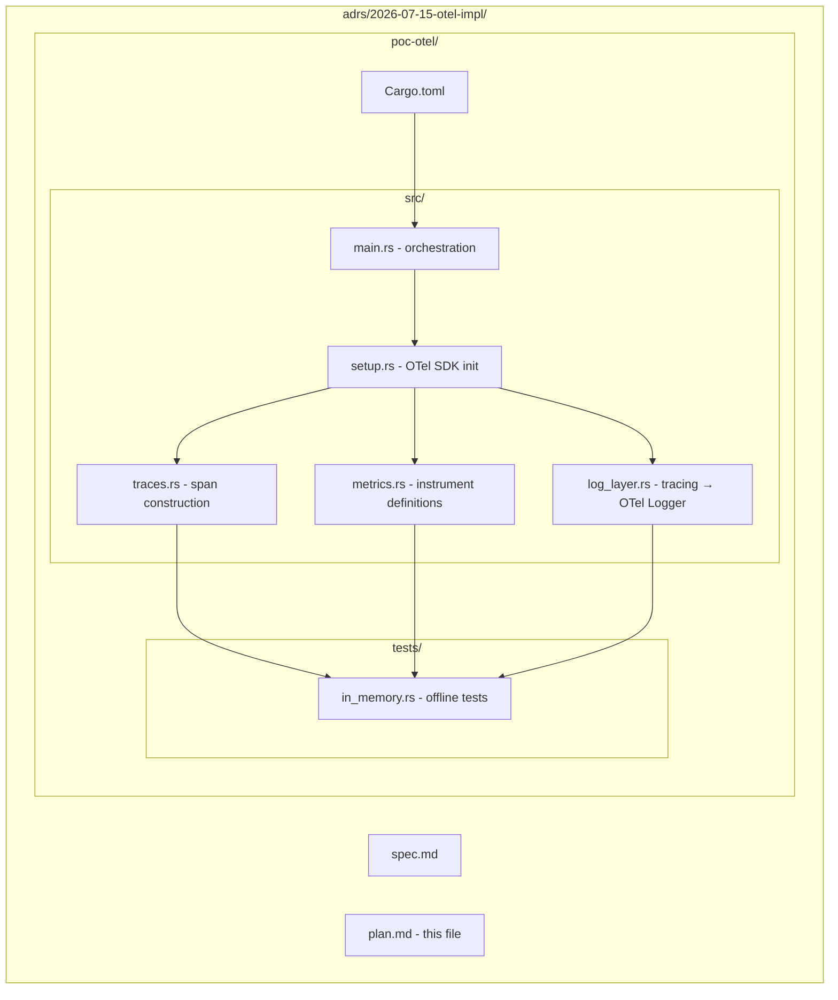
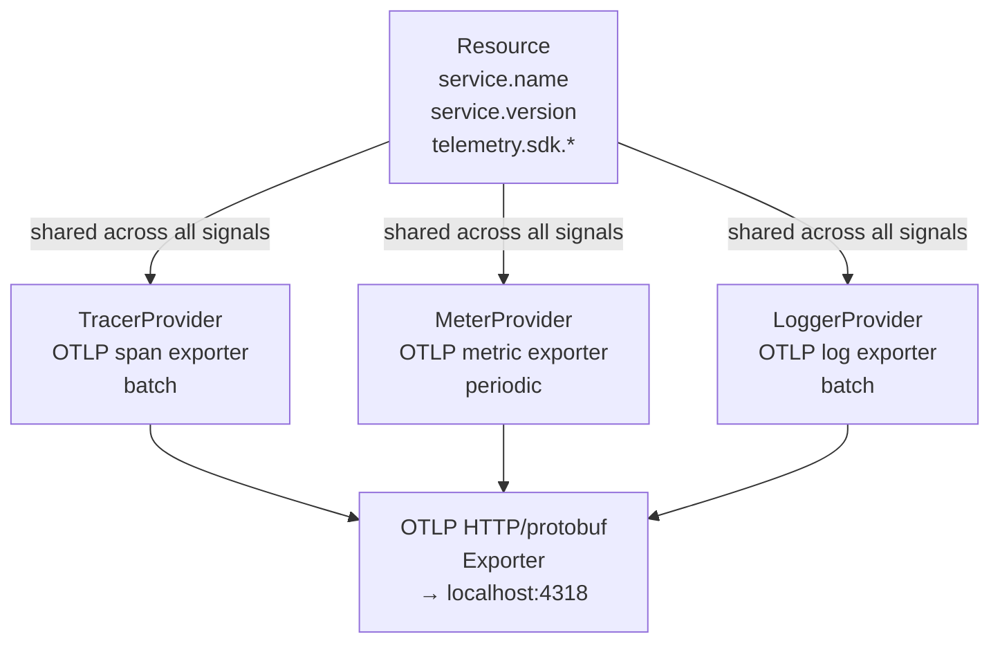
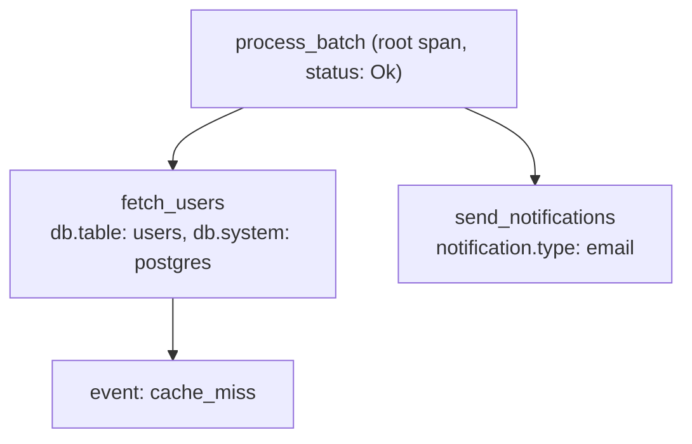
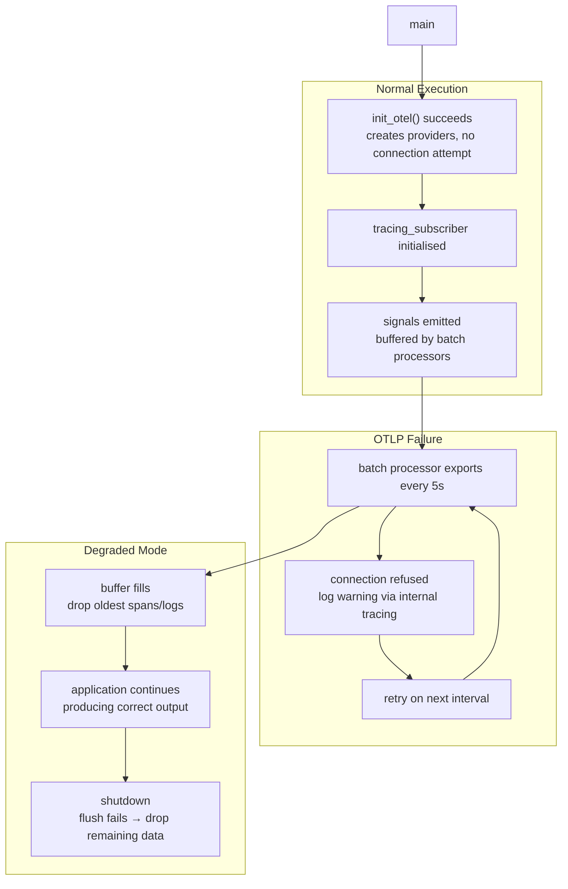
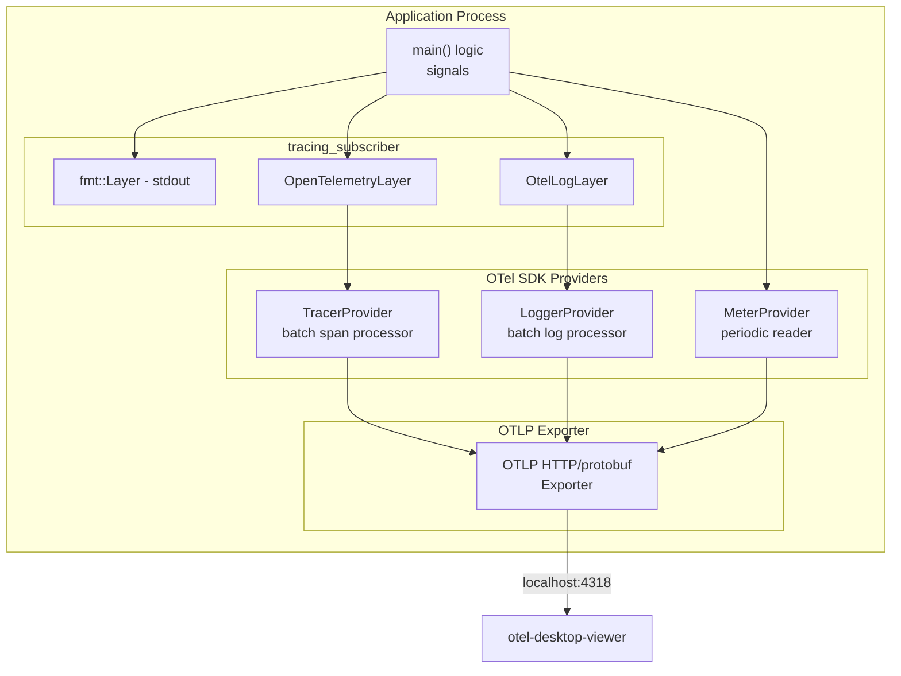
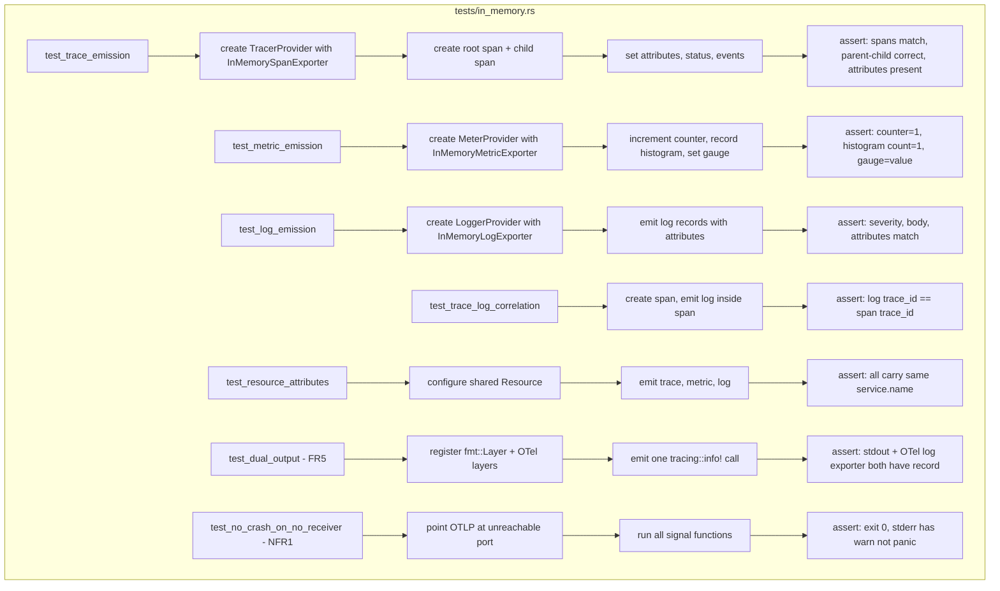

# Plan: OpenTelemetry Implementation for Rust Services

## 1. Requirements Traceability

| Spec Requirement | Plan Coverage | Verification |
|---|---|---|
| **§2.1** PoC binary emitting all three signals | §3.1 PoC crate structure, §3.2 SDK wiring, §3.3 data flow | `cargo run` with otel-desktop-viewer running |
| **§2.2** Survival with no collector | §5.3 exporter failure behaviour, tested in §4.3 | `cargo run` without receiver, clean exit |
| **§2.3** Switchboard integration, no rewrite | §6 switchboard integration plan | Existing `tracing` calls produce OTel data |
| **FR1** Trace emission | §3.2.1 tracer setup, §3.3.1 span creation, §3.4.1 tracing bridge | In-memory exporter tests + viewer check |
| **FR2** Metric emission | §3.2.2 meter setup, §3.3.2 instrument creation | In-memory exporter tests + viewer check |
| **FR3** Log emission | §3.2.3 logger setup, §3.3.3 log emission | In-memory exporter tests + viewer check |
| **FR4** OTLP export | §3.2.4 OTLP exporter config, §5.1 transport choice | All three signals visible in viewer |
| **FR5** No rewrite | §3.4 tracing bridge (tracing-opentelemetry + custom layer) | Stdout + OTel from same macro call |
| **FR6** Consistent identity | §3.2.5 shared Resource | Single `Resource` instance asserted in tests |
| **NFR1** No crash on failure | §5.3 batch processor defaults | Run without receiver, assert clean exit |
| **NFR2** Dependency overhead | §3.1.2 dependency list, §5.1 HTTP/protobuf choice, §4.4 binary size measurement | Measure delta vs switchboard baseline |
| **NFR3** Env var config | §5.2 env var mapping table | Test with `OTEL_EXPORTER_OTLP_ENDPOINT` override |
| **NFR4** Offline testability | §4.3 in-memory exporter tests | `cargo test` with no external deps |
| **NFR5** Dual output | §4.3 dual subscriber test | Both outputs present on single log call |

## 2. Technology Choices

### 2.1 OTLP Transport: HTTP/protobuf

**Choose**: `opentelemetry-otlp` with `http-proto` feature (reqwest-based, not tonic/gRPC).

| Factor | HTTP/protobuf | gRPC (tonic) |
|---|---|---|
| New dependencies | reqwest (already in workspace) + prost | tonic + prost + http-body + tower |
| Binary size impact | ~500KB | ~2-3MB |
| Compile time | Moderate | Significantly longer (tonic build scripts, codegen) |
| otel-desktop-viewer support | Port 4318 | Port 4317 |

The workspace already depends on `reqwest` (lens, switchboard). Adding tonic would introduce a ~2MB+ dependency with build-time code generation for a protocol we don't need. HTTP/protobuf is sufficient for the PoC and for switchboard's local-only deployment. If gRPC streaming becomes a requirement later, it can be added as an optional feature — the `opentelemetry-otlp` crate supports both transports behind feature flags.

### 2.2 Trace Bridge: tracing-opentelemetry

**Choose**: `tracing-opentelemetry` crate for traces.

This bridges existing `tracing` spans to OTel spans with zero changes to individual `tracing::info_span!()` / `tracing::debug_span!()` call sites. The bridge registers as a `tracing-subscriber` `Layer` that forwards span lifecycle events to the OTel SDK.

### 2.3 Log Bridge: tracing-subscriber Layer

**Choose**: Custom `tracing-subscriber` `Layer` that forwards `tracing::Event` records to the OTel `Logger`.

The `opentelemetry-appender-tracing` crate may be usable but its API stability at the versions we're targeting is unclear. A custom layer is ~60 lines of straightforward code and avoids an external dependency that may lag behind the OTel SDK version. If the official appender becomes the recommended path in a stable release, switching to it is a drop-in replacement.

### 2.4 Metrics: Direct OTel SDK API

**Choose**: Use `opentelemetry_sdk::metrics` directly via the `Meter` API.

The `tracing-opentelemetry` bridge does not support metrics. Metrics are created explicitly using the OTel `Meter` instrument API (counter, histogram, gauge). This is the intended path — the tracing bridge handles spans, the metrics API handles measurements.

### 2.5 Crate Versions (Target)

| Crate | Version | Features |
|---|---|---|
| `opentelemetry` | 0.28 | `metrics`, `logs` |
| `opentelemetry_sdk` | 0.28 | `metrics`, `logs`, `testing` |
| `opentelemetry-otlp` | 0.28 | `http-proto`, `trace`, `metrics`, `logs` |
| `tracing` | 0.1 | (already in workspace) |
| `tracing-opentelemetry` | 0.28 | (compatible with opentelemetry 0.28) |
| `tracing-subscriber` | 0.3 | `registry`, `env-filter` (already in workspace) |

Pin exact versions in `Cargo.toml`. These are pre-1.0 crates that may have breaking changes. The PoC validates that this specific version set works together.

## 3. Architecture

### 3.1 PoC Crate Structure



#### 3.1.1 Cargo.toml

```toml
[package]
name = "poc-otel"
version = "0.1.0"
edition = "2021"
publish = false

[dependencies]
opentelemetry = { version = "0.28", features = ["metrics", "logs"] }
opentelemetry_sdk = { version = "0.28", features = ["metrics", "logs", "testing"] }
opentelemetry-otlp = { version = "0.28", features = ["http-proto", "trace", "metrics", "logs"] }
tracing = "0.1"
tracing-opentelemetry = "0.28"
tracing-subscriber = { version = "0.3", features = ["registry", "env-filter"] }
tokio = { version = "1", features = ["macros", "rt-multi-thread"] }
```

No `serde_json` — this crate doesn't output JSON. The fmt subscriber handles stdout text.

### 3.2 OTel SDK Wiring (`setup.rs`)

The `setup()` function initialises four components and returns a shutdown guard:



**Initialization sequence**:
1. Build `Resource` from `OTEL_SERVICE_NAME` (fallback: `"poc-otel"`), `OTEL_RESOURCE_ATTRIBUTES`, and SDK telemetry attributes.
2. Build OTLP exporter using `opentelemetry_otlp::new_exporter_http()` reading `OTEL_EXPORTER_OTLP_ENDPOINT` (default `http://localhost:4318`).
3. Build `TracerProvider` with batch span processor using the OTLP exporter.
4. Build `MeterProvider` with periodic metric reader using the OTLP exporter.
5. Build `LoggerProvider` with batch log processor using the OTLP exporter.
6. Return a `ShutdownGuard` that calls `shutdown()` on all three providers on drop.

### 3.3 Data Flow

#### 3.3.1 Traces (`traces.rs`)

The PoC creates a trace tree with three spans:



All spans go through `tracing::info_span!()` macros, which the `tracing-opentelemetry` layer intercepts and forwards to the OTel `TracerProvider`. No explicit `opentelemetry::trace::Tracer` calls are needed.

#### 3.3.2 Metrics (`metrics.rs`)

Create one `Meter` from the `MeterProvider` and register three instruments:

| Instrument | Type | Attributes | Purpose |
|---|---|---|---|
| `requests_total` | Counter (u64) | `endpoint`, `status` | Count of simulated requests |
| `request_duration_ms` | Histogram (f64) | `endpoint` | Simulated latency distribution |
| `active_connections` | Gauge (u64) | `pool` | Simulated concurrent connections |

These use the direct OTel `Meter` API — not the tracing bridge.

#### 3.3.3 Logs (`log_layer.rs`)

A `tracing-subscriber` `Layer` implements `on_event()`:

```rust
impl<S: Subscriber + for<'a> LookupSpan<'a>> Layer<S> for OtelLogLayer {
    fn on_event(&self, event: &tracing::Event<'_>, _ctx: Context<'_, S>) {
        // 1. Extract severity from tracing::Level → opentelemetry::Severity
        // 2. Extract current span context (trace_id, span_id) from parent span
        // 3. Build OTel LogRecord with timestamp, severity, body (event message), 
        //    and fields as attributes
        // 4. Call logger_provider.logger("poc-otel").emit(log_record)
    }
}
```

This is ~50-70 lines of Rust. It's the only piece that can't be provided by an off-the-shelf crate and may be replaced by `opentelemetry-appender-tracing` if available.

#### 3.3.4 Tracing Subscriber Composition

The subscriber layers stack in `main.rs`:

```rust
let (tracer_provider, meter_provider, logger_provider, _guard) = setup::init_otel();

let otel_trace_layer = tracing_opentelemetry::layer().with_tracer(tracer_provider.tracer("poc-otel"));
let otel_log_layer = OtelLogLayer::new(logger_provider.logger("poc-otel"));
let fmt_layer = tracing_subscriber::fmt::layer();

tracing_subscriber::registry()
    .with(fmt_layer)
    .with(otel_trace_layer)
    .with(otel_log_layer)
    .with(tracing_subscriber::EnvFilter::from_default_env())
    .init();
```

Order: fmt layer first (human-readable), then OTel layers. The `EnvFilter` controls all layers (a warning-level event won't reach fmt or OTel if filtered out).

### 3.4 Signal Emission Timeline

```mermaid
flowchart TD
    main[main]

    subgraph initOtel["init_otel()"]
        createResource[create Resource]
        createExporter[create OTLP exporter]
        createTracerProvider[create TracerProvider]
        createMeterProvider[create MeterProvider]
        createLoggerProvider[create LoggerProvider]
        returnGuard[return ShutdownGuard]
    end

    subgraph traceProcessBatch["process_batch"]
        rootSpanEnter["[TRACE] root span process_batch begins"]
        subgraph fetchUsers["[TRACE] child span fetch_users"]
            cacheMiss["[TRACE] event cache_miss"]
            warnUser42["[LOG] warn user 42 not found in cache"]
        end
        subgraph sendNotifications["[TRACE] child span send_notifications"]
            errorTimeout["[LOG] error notification delivery failed"]
        end
        rootSpanExit["[TRACE] root span ends"]
        setStatusOk["[TRACE] root span status set to Ok"]
        metricRequests["[METRIC] requests_total += 1"]
        metricDuration["[METRIC] request_duration_ms record 42"]
    end

    metricConnections["[METRIC] active_connections set to 7"]
    logBatchInfo["[LOG] info batch processing started"]
    println["println Open http://localhost:8000"]
    shutdown["_guard dropped → shutdown() flushes all providers"]
    flushRemaining["batch processors send remaining data"]

    main --> initOtel
    initOtel --> initSubscriber["init tracing_subscriber<br/>(fmt + otel trace + otel log layers)"]
    initSubscriber --> rootSpanEnter
    rootSpanEnter --> fetchUsers
    fetchUsers --> sendNotifications
    sendNotifications --> setStatusOk
    setStatusOk --> metricRequests
    metricRequests --> metricDuration
    metricDuration --> rootSpanExit
    rootSpanExit --> metricConnections
    metricConnections --> logBatchInfo
    logBatchInfo --> println
    println --> shutdown
    shutdown --> flushRemaining
```



### 3.5 Failure Paths

#### 3.5.1 OTLP Endpoint Unreachable



The OTel SDK's batch processors are non-blocking during export failures. The application never waits for export to complete. This satisfies NFR1.

#### 3.5.2 Graceful Shutdown

`ShutdownGuard` implements `Drop`:

```rust
struct ShutdownGuard {
    tracer_provider: Option<TracerProvider>,
    meter_provider: Option<MeterProvider>,
    logger_provider: Option<LoggerProvider>,
}

impl Drop for ShutdownGuard {
    fn drop(&mut self) {
        if let Some(tp) = self.tracer_provider.take() {
            tp.shutdown().ok();
        }
        if let Some(mp) = self.meter_provider.take() {
            mp.shutdown().ok();
        }
        if let Some(lp) = self.logger_provider.take() {
            lp.shutdown().ok();
        }
    }
}
```

`shutdown()` on each provider flushes remaining buffered spans/metrics/logs and terminates the export.

### 3.6 OTel SDK Lifecycle



## 4. Testing Strategy

### 4.1 Offline Unit Tests (In-Memory Exporters)

The `opentelemetry_sdk` `testing` feature provides in-memory exporters for all three signals. Tests create providers with in-memory exporters and assert on the collected data without starting an OTLP receiver.



### 4.2 Manual Integration Test

Run the PoC alongside `otel-desktop-viewer`:

```bash
# Terminal 1: start the viewer
docker run -p 4318:4318 -p 8000:8000 ghcr.io/ctrlspice/otel-desktop-viewer:latest

# Terminal 2: run the PoC
cd adrs/2026-07-15-otel-impl/poc-otel
OTEL_SERVICE_NAME="test-poc" cargo run

# Open http://localhost:8000/traces, /metrics, /logs
```

Visual check: all three tabs contain data with correct attribute names and values.

### 4.3 Offline / CI Test Command

```bash
cd adrs/2026-07-15-otel-impl/poc-otel
cargo test  # all in-memory tests, no network
```

### 4.4 Binary Size Measurement

```bash
# Baseline (without OTel — before integration)
cd crates/agentkit-switchboard
cargo build --release
stat --format="%s" target/release/agentkit-switchboard

# After OTel integration (task 2.3)
cargo build --release
stat --format="%s" target/release/agentkit-switchboard
# delta must be < 2MB
```

### 4.5 Compile Time Measurement

```bash
# Cold build baseline
cargo clean
time cargo build --workspace 2>&1

# After OTel added to workspace
cargo clean
time cargo build --workspace 2>&1
# delta must be < 30%
```

## 5. Configuration and Operations

### 5.1 Environment Variable Mapping

The Rust OTel SDK does **not** implement the full OTel environment variable specification. Some env vars promoted by tools like `otel-desktop-viewer` have no effect and must be handled in code.

| Env Var | Rust SDK Support | Purpose | Default | Spec Section |
|---|---|---|---|---|
| `OTEL_EXPORTER_OTLP_ENDPOINT` | ✅ Read by OTLP exporter HTTP client | OTLP receiver URL | `http://localhost:4318` | FR4, NFR3 |
| `OTEL_EXPORTER_OTLP_PROTOCOL` | ✅ Read by OTLP exporter | Transport protocol | `http/protobuf` | NFR3 |
| `OTEL_SERVICE_NAME` | ✅ Read by `SdkResource::from_env()` / manual | Service identity | crate-dependent | FR6, NFR3 |
| `OTEL_RESOURCE_ATTRIBUTES` | ✅ Read by `SdkResource::from_env()` | Additional resource attrs | (empty) | FR6 |
| `OTEL_BSP_SCHEDULE_DELAY` | ✅ Read by `BatchSpanProcessor` | Trace export interval (ms) | 5000 | NFR1 |
| `OTEL_BSP_MAX_QUEUE_SIZE` | ✅ Read by `BatchSpanProcessor` | Trace buffer capacity | 2048 | §5 edge cases |
| `OTEL_METRIC_EXPORT_INTERVAL` | ✅ Read by `PeriodicReader` | Metric export interval (ms) | 60000 | NFR1 |
| `OTEL_BLRP_SCHEDULE_DELAY` | ✅ Read by `BatchLogProcessor` | Log export interval (ms) | 5000 | NFR1 |
| `RUST_LOG` | ✅ Read by `EnvFilter` (tracing, not OTel) | Tracing filter for stdout | `info` | NFR5 |
| `OTEL_TRACES_EXPORTER` | ❌ **Not auto-detected.** Must be wired in code. See §5.1.1. | Selects trace exporter | N/A | NFR3 |
| `OTEL_METRICS_EXPORTER` | ❌ **Not auto-detected.** | Selects metrics exporter | N/A | NFR3 |
| `OTEL_LOGS_EXPORTER` | ❌ **Not auto-detected.** | Selects logs exporter | N/A | NFR3 |

#### 5.1.1 The Exporter Selection Gap

Tools like `otel-desktop-viewer` instruct users to set:

```
export OTEL_EXPORTER_OTLP_ENDPOINT="http://localhost:4318"
export OTEL_TRACES_EXPORTER="otlp"
export OTEL_METRICS_EXPORTER="otlp"
export OTEL_LOGS_EXPORTER="otlp"
export OTEL_EXPORTER_OTLP_PROTOCOL="http/protobuf"
```

The Rust SDK respects `OTEL_EXPORTER_OTLP_ENDPOINT` and `OTEL_EXPORTER_OTLP_PROTOCOL` at the exporter level. However, `OTEL_TRACES_EXPORTER`, `OTEL_METRICS_EXPORTER`, and `OTEL_LOGS_EXPORTER` are part of the OTel SDK auto-configuration specification that the Rust SDK does **not** implement. Setting them has no effect.

The PoC and switchboard must always wire the OTLP exporter explicitly in code:

```rust
// ❌ This will NOT automatically pick up OTEL_TRACES_EXPORTER=otlp:
let tracer_provider = opentelemetry_sdk::trace::TracerProvider::builder()
    .with_simple_exporter(some_exporter)
    .build();

// ✅ Must always set the exporter explicitly:
let exporter = opentelemetry_otlp::new_exporter_http()
    .with_http_client(reqwest::Client::new())
    .build_span_exporter()?;
let tracer_provider = opentelemetry_sdk::trace::TracerProvider::builder()
    .with_batch_exporter(exporter)
    .build();
```

This gap is not a bug — it's a spec compliance level choice by the Rust SDK maintainers. The plan accounts for it by always building the full provider stack in `setup.rs` rather than relying on env vars to select exporters.

### 5.2 OTLP Exporter Configuration

```rust
use opentelemetry_otlp::WithExportConfig;

fn build_otlp_exporter() -> opentelemetry_otlp::OtlpExporter {
    opentelemetry_otlp::new_exporter_http()
        .with_http_client(reqwest::Client::new())
        .build()
}
```

The exporter reads `OTEL_EXPORTER_OTLP_ENDPOINT` automatically. If the env var is not set, it defaults to `http://localhost:4318`.

### 5.3 Batch Processor Defaults

The SDK's default batch processor settings provide reasonable behaviour for a local dev tool:

| Parameter | Default | Notes |
|---|---|---|
| `max_queue_size` | 2048 | Oldest items dropped when full |
| `scheduled_delay` | 5000ms | Export every 5 seconds |
| `max_export_batch_size` | 512 | Max items per export request |
| `max_concurrent_exports` | 1 | Serial exports |

These are acceptable for the PoC and switchboard. No tuning needed.

## 6. Switchboard Integration Plan (Task 2.3)

### 6.1 Current State

`main.rs` currently initialises:
```rust
tracing_subscriber::fmt()
    .with_env_filter(
        tracing_subscriber::EnvFilter::try_from_default_env()
            .unwrap_or_else(|_| format!("switchboard={}", cli.log_level).into()),
    )
    .init();
```

### 6.2 Target State

Replace the single `fmt()` subscriber with a layered subscriber:

```rust
fn init_telemetry(log_level: &str) -> otel::ShutdownGuard {
    let (tracer_provider, meter_provider, logger_provider, guard) = otel::init_otel();

    let fmt_layer = tracing_subscriber::fmt::layer()
        .with_target(true)
        .with_level(true);

    let otel_trace_layer = tracing_opentelemetry::layer()
        .with_tracer(tracer_provider.tracer("agentkit-switchboard"));

    let otel_log_layer = OtelLogLayer::new(logger_provider.logger("agentkit-switchboard"));

    let filter = tracing_subscriber::EnvFilter::try_from_default_env()
        .unwrap_or_else(|_| format!("switchboard={}", log_level).into());

    tracing_subscriber::registry()
        .with(fmt_layer)
        .with(otel_trace_layer)
        .with(otel_log_layer)
        .with(filter)
        .init();

    guard
}
```

### 6.3 Metrics Added

In `server/routes.rs` (or a new `otel/metrics.rs` module), create instruments at the route handler boundary:

| Instrument | Type | Attributes | Location |
|---|---|---|---|
| `switchboard.http.requests` | Counter | `method`, `path`, `status_code` | After response is sent |
| `switchboard.provider.latency` | Histogram | `provider_identity`, `model_name` | After upstream response |

### 6.4 Files to Change

| File | Change |
|---|---|
| `Cargo.toml` | Add `opentelemetry`, `opentelemetry_sdk`, `opentelemetry-otlp`, `tracing-opentelemetry` (pinned versions) |
| `src/main.rs` | Replace `tracing_subscriber::fmt().init()` with layered subscriber from `otel::init_telemetry()` |
| `src/otel/mod.rs` | New module: `setup()`, `ShutdownGuard`, `OtelLogLayer` |
| `src/server/routes.rs` | Add metric recording at route handler boundaries |

### 6.5 Risks and Mitigations

| Risk | Likelihood | Mitigation |
|---|---|---|
| Pre-1.0 OTel crate breaking changes | Medium | Pin exact versions. Wrap API behind internal `otel` module. Upgrade is a single-module change. |
| OTel dependency increases switchboard binary >2MB | Low | Use HTTP/protobuf transport (not gRPC). Measure before merging. If over budget, evaluate `opentelemetry-stdout` for dev-only. |
| `tracing-opentelemetry` version mismatch with `opentelemetry` SDK | Medium | PoC validates that `tracing-opentelemetry` 0.28 works with `opentelemetry` 0.28. Pin them together. |
| Collector fan-out: developer must run otel-desktop-viewer | Low | Docker one-liner in README. No config needed beyond env vars. |
| Metric high cardinality | Low | Review metric attributes in code review. No user IDs / session IDs on metric instruments. |

### 6.6 Rollout Order

1. **PoC** (this plan) — validate toolchain in isolated crate. No risk to workspace.
2. **Switchboard integration** — apply patterns from PoC into one crate. Has test coverage before merge.
3. **Workspace guidelines** — document the pattern (which crate versions, how to init, what NOT to do with metric attributes) so other crates can adopt consistently.

## 7. Spec Alignment Check

The plan covers all spec requirements. No contradictions or gaps.

| Spec | Plan | Status |
|---|---|---|
| §2.1 PoC binary | §3.1 crate structure, §3.3 data flow | Covered |
| §2.2 Survival with no collector | §3.5.1 failure path, §4.3 test | Covered |
| §2.3 Switchboard integration | §6 full integration plan | Covered |
| FR1 Traces | §3.2.1 tracer, §3.3.1 spans, §3.4.1 bridge | Covered |
| FR2 Metrics | §3.2.2 meter, §3.3.2 instruments | Covered |
| FR3 Logs | §3.2.3 logger, §3.3.3 log layer | Covered |
| FR4 OTLP export | §3.2.4 exporter, §5.1 transport | Covered |
| FR5 No rewrite | §3.4 tracing bridge, §3.3.4 composition | Covered |
| FR6 Consistent identity | §3.2.5 shared Resource | Covered |
| NFR1 No crash | §3.5.1, §5.3 batch defaults | Covered |
| NFR2 Dependency overhead | §2.5 pinned versions, §4.4 measurement | Covered |
| NFR3 Env var config | §5.1 mapping table | Covered |
| NFR4 Offline testability | §4.1 in-memory exporters | Covered |
| NFR5 Dual output | §3.3.4 subscriber composition, §4.3 test | Covered |
| Edge cases | §3.5 failure paths, §3.6 lifecycle | Covered |
