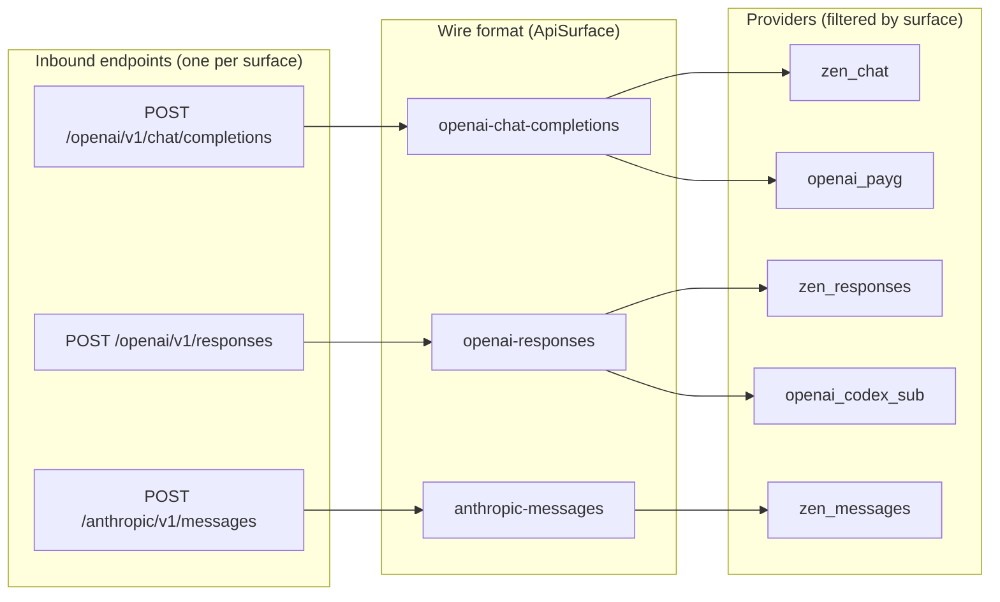

# Switchboard: API Surfaces

## Approach

Refactor the switchboard to treat wire format (API surface) as a first-class concept, decoupled from billing model and provider identity. Rename the ApiSurface enum to three explicit wire formats, remove the ConversationHandler translation layer, and proxy requests natively within a surface. Add inbound endpoints for the Responses and Messages surfaces. Represent OpenCode Zen as three provider entries sharing one base URL and API key. No new dependencies.

## Architecture

The switchboard exposes one inbound endpoint per wire format, each mapped to a surface. Routing is surface-aware: a request at /openai/v1/responses is routed only to providers whose api_surface is openai-responses. Endpoint selection is driven by surface, not billing: openai-chat-completions maps to /chat/completions, openai-responses to /responses, anthropic-messages to /messages. Request and response bodies pass through unchanged.

## Technologies

| Technology | Role |
|------------|------|
| axum 0.8 | HTTP framework and routing (existing) |
| reqwest 0.12 | Upstream HTTP client (existing) |
| serde + toml | Config deserialization (existing) |
| clap | CLI argument parsing (existing) |
| sqlx | Session database (existing) |
| tracing | Structured logging (existing) |

## Components

### ApiSurface enum

Three explicit wire-format variants

Rename Openai/Anthropic to OpenaiChatCompletions, OpenaiResponses, AnthropicMessages (serde: openai-chat-completions, openai-responses, anthropic-messages)

### HttpEndpoint impls

Surface-driven URL and header construction

build_url maps surface to path (/chat/completions, /responses, /messages); inject_headers presents the key per surface (Bearer for OpenAI, x-api-key for Anthropic)

### ConversationHandler removal

Drop the translation layer

Remove the trait and its passthrough impls; the forwarder passes request and response bodies through unchanged

### Route dispatch

One inbound endpoint per surface

Add POST /openai/v1/responses and POST /anthropic/v1/messages; map each path to its surface

### Router

Surface-aware candidate filtering

select_provider takes a surface and filters candidates by api_surface == surface; ProviderView gains a surface field

### Provider config

Multi-entry representation

api_surface stays a single field; Zen is three entries (zen_chat, zen_responses, zen_messages) sharing base_url and key

### Zen entries

OpenCode Zen provider

Three entries: base_url https://opencode.ai/zen/v1, bearer_token auth, pay_as_you_go billing, models from models.dev opencode provider

## Data Flow

A request arrives at an inbound endpoint, which determines the surface. The router filters candidate providers by surface and model, ranks by billing then cost, and forwards the request to the selected provider's endpoint. The response passes back unchanged, with token usage extracted for the session database.

## Deployment

No change: the switchboard remains a local proxy. The same binary and config file are used; only the config schema (surface names) and provider entries change.

