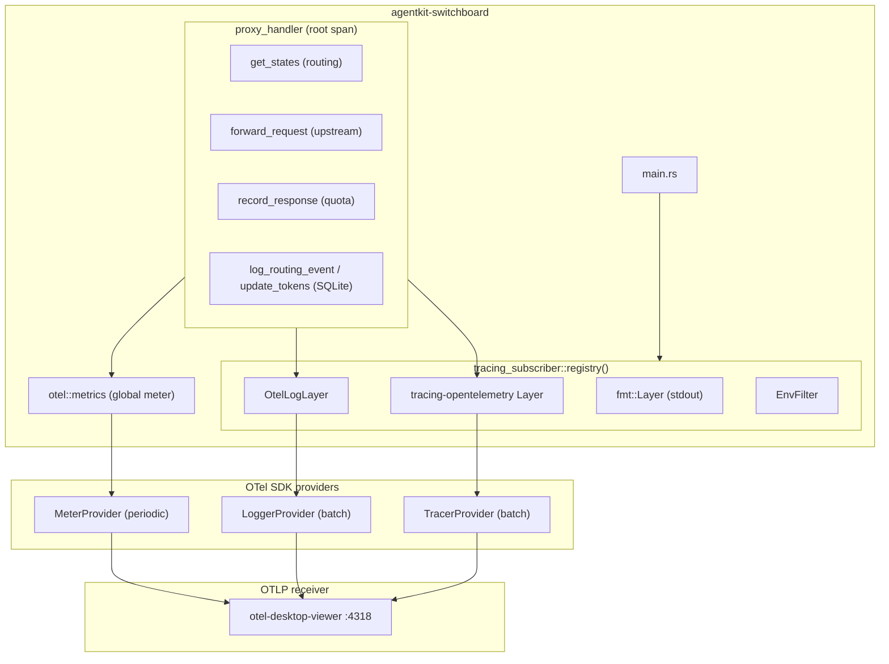

# Switchboard: OpenTelemetry Integration

## Approach

Port the PoC-validated OTel stack (adrs/2026-07-15-otel-impl/poc-otel) into the switchboard: add the OTel dependencies, create an otel module (exporter selection, setup, log layer, metrics), replace the plain fmt subscriber with a layered subscriber, record two metrics, and add #[tracing::instrument] spans on the request hot path. Exporter selection follows the OTel SDK env var spec (OTEL_TRACES_EXPORTER, OTEL_METRICS_EXPORTER, OTEL_LOGS_EXPORTER = otlp|console|none, unset means none). Existing tracing call sites are unchanged.

## Architecture

The switchboard composes a layered tracing subscriber (fmt, OTel trace, OTel log, EnvFilter) from an otel module. A TelemetryConfig reads per-signal exporter selection from the standard env vars and maps otlp to opentelemetry-otlp exporters and console to opentelemetry-stdout exporters; unset signals are not configured. The OTel SDK providers (TracerProvider, MeterProvider, LoggerProvider) share one Resource. On the request hot path, proxy_handler opens a root span with child spans for routing, upstream forward, quota recording, and session DB writes; metrics are recorded from the global meter.

## Technologies

| Technology                                    | Role                                              |
| --------------------------------------------- | ------------------------------------------------- |
| opentelemetry 0.32                            | OTel API (trace, metrics, logs)                   |
| opentelemetry_sdk 0.32                        | SDK providers with batch processing and rt-tokio  |
| opentelemetry-otlp 0.32                       | OTLP HTTP/protobuf exporters                      |
| opentelemetry-stdout 0.32                     | Console exporter (spans, metrics, logs to stdout) |
| tracing-opentelemetry 0.33                    | tracing span bridge to OTel traces                |
| tracing 0.1 (attributes)                      | #[tracing::instrument] spans                      |
| tracing-subscriber 0.3 (registry, env-filter) | Layered subscriber                                |

## Components

### otel module

OTel SDK initialisation and exporter selection

src/otel/mod.rs: TelemetryConfig::from_env() reads OTEL_TRACES_EXPORTER, OTEL_METRICS_EXPORTER, OTEL_LOGS_EXPORTER (otlp, console, none; unset/unknown = none + warn); build_resource (OTEL_SERVICE_NAME fallback agentkit-switchboard); per-signal providers via upstream exporters; ShutdownGuard; init_telemetry(log_level)

### OtelLogLayer

tracing-to-OTel log bridge

src/otel/log_layer.rs: ported from PoC; maps tracing::Level to Severity, event message to body, fields to attributes

### Metrics

HTTP and provider instruments

src/otel/metrics.rs: switchboard.http.requests counter (method, path, status_code) and switchboard.provider.latency histogram (provider_identity, model_name), cached via OnceLock on the global meter

### Subscriber composition

Layered tracing subscriber

main.rs: registry() with fmt + trace + log layers + EnvFilter; RUST_LOG override, fallback {crate_name}={log_level}; fmt-only fallback if OTel init fails

### Hot-path spans

Per-phase request timing

#[tracing::instrument] on proxy_handler, forward_request, get_states, record_response, log_routing_event, update_tokens, assign, lookup

### Metrics middleware

HTTP request counter

server/middleware.rs: records switchboard.http.requests after each response

### In-memory test harness

Hermetic telemetry assertions

tests use opentelemetry_sdk in-memory exporters to assert phase spans, metrics, and logs without a collector

## Data Flow

A request hits an inbound route; proxy_handler opens the root span. Child spans time routing (get_states), upstream forward (forward_request), quota recording (record_response), and session DB writes (log_routing_event, update_tokens). After the upstream response, switchboard.provider.latency is recorded; after the HTTP response, switchboard.http.requests is recorded. Telemetry flows to the per-signal selected exporter: otlp (default endpoint http://localhost:4318) or console (stdout); unset signals export nothing.

## Deployment

No deployment change: OTel is opt-in via the standard env vars (OTEL_TRACES_EXPORTER, OTEL_METRICS_EXPORTER, OTEL_LOGS_EXPORTER, OTEL_EXPORTER_OTLP_ENDPOINT, OTEL_SERVICE_NAME). With no exporter selected the switchboard runs unchanged with instrumentation compiled in. Local development uses OTEL_TRACES_EXPORTER=console for console output or otel-desktop-viewer for OTLP.
