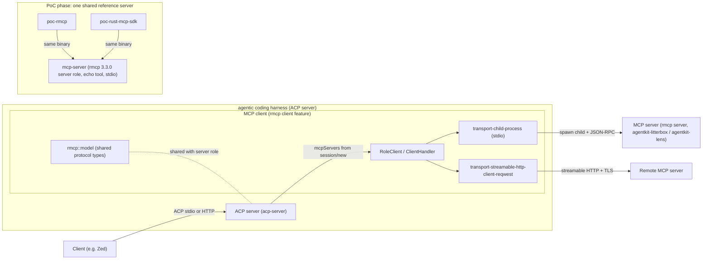

# Choose an MCP client SDK for Rust

**Status:** draft **Created:** 2026-09-13 **Author:** adrian

The agentic coding harness implements an ACP (Agent Client Protocol) server (adrs/2026-04-28-acp-server) and must act as an agent: it receives MCP server configuration from the client at session/new and connects out to those servers so the agent can call tools. Today the harness advertises mcpCapabilities {http: false, sse: false} and ignores the mcpServers field.

The project already standardised on rmcp, the official Model Context Protocol Rust SDK, for the server role: chosen in adrs/2026-02-03-mcp-server-sdk (accepted) and in production use in agentkit-litterbox and agentkit-lens (rmcp 3.1.2 with features macros, schemars, server, transport-io). rmcp ships both roles in one crate: the client feature adds ClientHandler, the RoleClient service, client lifecycle management, and the client transports transport-child-process (stdio) and transport-streamable-http-client-reqwest (streamable HTTP with rustls TLS). Protocol types (rmcp::model) and the JSON-RPC layer are shared across roles. Current on crates.io: rmcp 3.3.0 (2026-09-10).

Selection principle: keep one MCP implementation across both roles. A second client-only SDK would fork the protocol codebase, double the maintenance burden, and let client and server type handling drift inside the same binary. rmcp's client is the default choice and is displaced only if it fails a functional or non-functional requirement below.



---

## Evaluation

A library evaluation was carried out on 2026-09-13 against the client interfaces of every Rust crate with a usable MCP client. Shortlist: rmcp 3.3.0, rust-mcp-sdk 2.0.0, pmcp 2.20.0, smg-mcp 2.3.3. Rejected as general-purpose client SDKs: mcp-client 0.1.0 (the original official crate, published once and superseded by rmcp), mcp-core 0.1.50 (protocol types only, unmaintained since 2025-05), vtcode-mcp and mistralrs-mcp (editor- and inference-specific), mcpdial and mcp-valve (CLIs).

### Candidate interfaces

**rmcp 3.3.0** (official modelcontextprotocol SDK; Apache-2.0; 26.1M downloads). A ClientHandler (all-default trait; the unit type works) served over a transport returns the Peer handle; the lifecycle (initialize plus notifications/initialized) is implicit in serve(), with serve_with_lifecycle selecting Initialize (legacy), Discover (server/discover) or Auto (probe v2, fall back). Stdio child spawn is first-class via TokioChildProcess over a tokio Command - explicit argv, shell-free (EC-006). Streamable HTTP client over reqwest/rustls. Auto-paginated list_all_tools() and call_tool(CallToolRequestParams). Server-to-client notifications arrive via ClientHandler default methods. Protocol types are shared with the server role - the same crate already pinned at 3.1.2 in agentkit-litterbox and agentkit-lens; one dependency, one protocol implementation per binary.

**rust-mcp-sdk 2.0.0** (rust-mcp-stack; MIT; 268K downloads). Explicit client construction: create_client(McpClientOptions) + start() + shut_down(), with a separate ClientHandler trait. Stdio child spawn is first-class and the safest of the candidates: create_with_server_launch(command, argv-Vec, env, options) - a command string and explicit argv array, no shell. Streamable HTTP and backward-compatible SSE. Strongest conformance claim of any candidate: 100% of official tests - 110/110 server and 440/440 client on 2026-07-28. 2.x implements only the stateless 2026-07-28 protocol (2025-11-25 servers need the 1.x LTS line); the 2.0 major is recent (2026-08-27).

**pmcp 2.20.0** (paiml; MIT; 105K downloads). Explicit Client::new(transport) + initialize()/server_discover() handshake and the deepest tool surface (call_tool, call_tool_typed, task variants, auto-paginating list_all\_\* with an iteration cap). Dual-era: v1 (2025-11-25) default, v2 (2026-07-28) opt-in per client. Disqualified on interface grounds: StdioTransport reads and writes the current process's own stdin/stdout and cannot spawn a server child process - pmcp's own client examples rely on the harness plumbing the server's stdio into the process. The harness's primary transport would have to be hand-built as a custom Transport over child pipes. The 1.x line also had the broken releases recorded in the server-SDK comparison.

**smg-mcp 2.3.3** (smg-project; Apache-2.0; 1.4M downloads). Not a standalone SDK: it is the SMG gateway's client layer (McpOrchestrator, McpToolSession, ToolInventory, approval engine, tenant context) and its dependency list pins rmcp ^1.7 - a gateway wrapper on top of rmcp 1.x. Excluded.

### Interface comparison matrix

| Criterion                          | rmcp 3.3.0                      | rust-mcp-sdk 2.0.0                   | pmcp 2.20.0                               | smg-mcp 2.3.3             |
| ---------------------------------- | ------------------------------- | ------------------------------------ | ----------------------------------------- | ------------------------- |
| Client construction                | handler .serve(transport)       | create_client(opts) + start()        | Client::new(transport)                    | McpOrchestrator (gateway) |
| Handshake                          | implicit in serve(); modes      | request_discover (stateless v2)      | explicit initialize() / server_discover() | internal                  |
| Stdio child spawn                  | TokioChildProcess (argv)        | create_with_server_launch(cmd, argv) | own stdin/stdout only                     | via rmcp 1.7              |
| Streamable HTTP client             | reqwest/rustls (+agnostic)      | streamable-http + SSE compat         | streamable-http, SSE, WS, WASM            | yes                       |
| Tool list                          | list_all_tools() auto-paginated | request_tool_list()                  | list_all_tools() with cap                 | ToolInventory             |
| Tool call                          | call_tool(params) + MRTR        | call_tool(struct) + MRTR             | call_tool + typed/task/meta               | orchestrator              |
| Inbound handling                   | ClientHandler trait             | ClientHandler trait                  | builder host handlers                     | gateway                   |
| Protocol eras                      | 2026-07-28 + 2025-11-25         | 2026-07-28 only (2.x)                | v1 default, v2 opt-in                     | n/a                       |
| Conformance                        | official reference impl         | 440/440 client claimed               | TS-SDK compatible                         | n/a                       |
| Shared types with our rmcp servers | same crate                      | separate                             | separate                                  | rmcp 1.x                  |
| Shell-free spawn (EC-006)          | yes                             | yes                                  | absent                                    | via rmcp                  |

### Selection

Two candidates are carried forward to proof of concept. The PoC crates are written and run during implementation of this ADR, mirroring how the server-SDK ADR ran its POC harnesses: rmcp and rust-mcp-sdk. Both clients connect to one shared reference MCP server (poc_implementations/mcp-server) built on the already-adopted server SDK (rmcp 3.3.0, server role) - the same server implementation is spawned by both clients, never duplicated per client. The shared server implements the current protocol era (2026-07-28 via server/discover) alongside the legacy initialize handshake.

Protocol-era finding (recorded from the first PoC run): the TS reference server @modelcontextprotocol/server-everything depends on @modelcontextprotocol/sdk ^1.30.0, whose LATEST_PROTOCOL_VERSION is 2025-11-25 and which registers no server/discover handler. rust-mcp-sdk 2.x implements only the stateless 2026-07-28 protocol, so it cannot connect to that server (-32601 Method not found on server/discover); rmcp 3.3.0 negotiates the legacy initialize handshake and succeeds. The comparison therefore uses the shared rmcp-based mcp-server, which speaks both eras, so each client is tested against the same server over the same protocol era. The server-everything mismatch is documented here as the reason the reference server is a shared Rust implementation rather than the TS reference package. pmcp receives no PoC - its missing client-side child spawn disqualifies it, and compensating would mean owning custom protocol plumbing. smg-mcp is not a competing SDK.

### PoC runs (2026-09-14)

Both PoCs ran against the same shared mcp-server (poc_implementations/mcp-server) via the runner at poc_implementations/run-pocs.sh. Each spawned the shared binary over stdio, completed the handshake over the current protocol era, listed tools, and called the echo tool. Output was identical in shape (fixed output shape from the ADR tasks):

```
handshake=complete
tool_count=1
first_five_tools=echo
echo_result=Echo: Hello, MCP!
```

Both completed with exit 0; no failures. pomcp's missing client-side child spawn was confirmed against the shared server (no child-spawn transport exists), and smg-mcp was not run (not a standalone SDK). The protocol-era finding is recorded above.

### Provisional ranking

1. rmcp - official SDK, complete client surface, shell-free spawn, dual-era lifecycle modes, and the only candidate sharing its type system with the server SDK already adopted in this workspace. Expected winner.
1. rust-mcp-sdk - 440/440 client conformance and the cleanest spawn API; own types; recent 2.x major; no dual-era negotiation.
1. pmcp - disqualified on interfaces.
1. smg-mcp - gateway wrapper, not standalone.

The final pick for the harness MCP client is confirmed by the PoCs at implementation time, checked by AC-003 (Stdio PoC) and AC-004 (HTTP PoC).

## Problem

The harness needs to list and call tools on the MCP servers its clients configure, but no MCP client SDK has been chosen. The existing SDK decision (adrs/2026-02-03-mcp-server-sdk) covers the server role only, and the ACP server harness currently advertises no MCP capabilities.

## Goals

- Select an MCP client SDK in Rust for the agentic coding harness
- Prefer the SDK already chosen for the server role (rmcp) to keep a single protocol implementation
- Cover the two transport classes the harness needs: stdio spawning of local servers and streamable HTTP to remote servers
- Validate the choice with a working proof of concept over each transport

## Non-goals

- Re-evaluating the MCP server SDK choice (accepted, adrs/2026-02-03-mcp-server-sdk)
- Implementing OAuth 2.0 authorization flows for servers that require them
- Client-side handling of MCP resources and prompts beyond tool access
- Evaluating non-Rust client SDKs

## Functional Requirements

### FR-001: Tool Discovery

The client SDK supports listing the tools exposed by a connected MCP server, including names, descriptions, and input schemas

**Slug:** `tool-discovery`

### FR-002: Tool Invocation

The client SDK supports calling a tool with JSON arguments and returning the structured result, including tool-level errors and protocol-level errors

**Slug:** `tool-invocation`

### FR-003: Stdio Transport

The client SDK supports spawning an MCP server as a child process and speaking MCP over its stdin and stdout

**Slug:** `stdio-transport`

### FR-004: Streamable HTTP Transport

The client SDK supports connecting to a remote MCP server over streamable HTTP with TLS

**Slug:** `streamable-http-transport`

### FR-005: Initialization Handshake

The client SDK performs the MCP initialize handshake: protocol version negotiation and capability exchange, with clear errors on mismatch

**Slug:** `initialization-handshake`

### FR-006: Shared Protocol Implementation

The client and server roles share one protocol implementation and type system so client and server code in the same binary cannot drift

**Slug:** `shared-protocol-implementation`

## Non-functional Requirements

### NFR-001: Consistency With Existing Choice

The client SDK is the one already selected for the server role (rmcp) unless it fails a functional requirement or this non-functional set

**Slug:** `consistency-with-existing-choice`

### NFR-002: Stable Release

The client must be usable from a stable crates.io release; git or path dependencies are not acceptable for the harness

**Slug:** `stable-release`

### NFR-003: Maintenance

The SDK is actively maintained and officially supported; the reference implementation of the protocol is preferred

**Slug:** `maintenance`

### NFR-004: Ecosystem Fit

The SDK fits the existing async (Tokio) stack and uses rustls for TLS; no new heavyweight runtime or platform-native TLS dependencies

**Slug:** `ecosystem-fit`

### NFR-005: Secure Outbound Defaults

TLS certificate verification is on by default with no insecure-by-default option; credentials and headers are forwarded only to the configured server origin, never to other hosts, and are not written to logs

**Slug:** `secure-outbound-defaults`

## Acceptance Criteria

### AC-001: Client SDK Selected

One client SDK is selected with documented justification; if the primary candidate (rmcp client) is rejected, the reasons and the chosen alternative are recorded

**Slug:** `client-sdk-selected`

### AC-002: Candidate Comparison

At least two client implementations are evaluated against the functional and non-functional requirements, including rmcp client and at least one alternative

**Slug:** `candidate-comparison`

### AC-003: Stdio PoC

A proof of concept connects over stdio to an MCP server (e.g. agentkit-litterbox or agentkit-lens), lists tools, and calls one tool successfully

**Slug:** `stdio-poc`

### AC-004: HTTP PoC

A proof of concept connects over streamable HTTP to a remote MCP server, lists tools, and calls one tool successfully

**Slug:** `http-poc`

### AC-005: Same Crate As Server

The harness's client role uses the same rmcp crate as its server role, sharing protocol types within one binary

**Slug:** `same-crate-as-server`

## Edge Cases

### EC-001: Server Process Exit

A spawned MCP server exits or crashes mid-session; the client surfaces the error and the harness tears the connection down cleanly

**Slug:** `server-process-exit`

### EC-002: Protocol Version Mismatch

A server negotiates an unsupported protocol version; the client fails the handshake with a clear error instead of misbehaving

**Slug:** `protocol-version-mismatch`

### EC-003: Capability Gap

A server advertises no tools or lacks a required capability; the client returns an empty list and does not panic

**Slug:** `capability-gap`

### EC-004: Remote Server Unreachable

A remote streamable HTTP server is unreachable, times out, or returns transport-level errors; the client surfaces the error and the session can be closed cleanly

**Slug:** `remote-server-unreachable`

### EC-005: Fallback Path

If rmcp's client proves unusable in the proof of concept, the fallback is a thin custom client built on rmcp's protocol types or the documented alternative SDK, and this decision is revisited

**Slug:** `fallback-path`

### EC-006: Untrusted Spawn Command

Client-supplied MCP server commands are untrusted input: the harness spawns them with explicit argv and no shell interpretation, and does not blanket-forward its own environment or secrets to the child

**Slug:** `untrusted-spawn-command`
