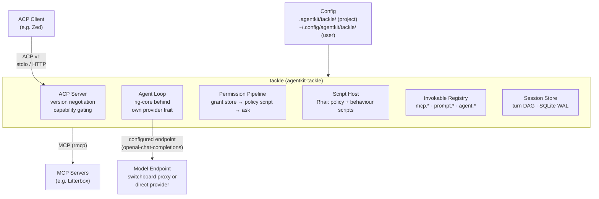

# Tackle Implementation Plan

## Approach

Incremental, dependency-ordered build of a new workspace crate agentkit-tackle across ten milestones. Each milestone closes a named set of spec requirements, is independently testable, and ships with its offline tests before the next begins; milestone numbering is thematic, not strictly sequential — the dependency graph on the tasks is authoritative, and turn-loop tool-call integration lands with the registry and pipeline tasks.

M1 — Foundations (FR-022, FR-021): scaffold crates/agentkit-tackle; extend agentkit-path with config_dir alongside the existing data_dir; layered configuration (user layer, then project .agentkit/tackle/config.toml with project precedence, rejecting endpoint, wire-format, and credential fields at project level); definition discovery and bounded frontmatter parsing; the TOFU trust record with the consent flow wired to a stub. Exit: unit tests for merge precedence, project-field rejection, and trust-record lifecycle.

M2 — Storage (FR-003, FR-004, FR-017, FR-024): implement the storage module within agentkit-tackle, adopting the schema and engine evaluation from adrs/2026-06-13-acp-server-session-storage with the extensions (turn kind, first_retained_turn_id, attribution, ownership leases, soft delete) behind the SessionStore trait with SQLite and in-memory backends. Exit: store unit and migration tests against in-memory SQLite, including fork-before-and-after-compaction assembly.

M3 — ACP core (FR-001, FR-002, FR-003, FR-021): initialize with version negotiation; capability advertisement with unstable features behind _meta-advertised gates; the six session methods with replay rules; built-in default persona and actor; first-session seed. Exit: golden-transcript lifecycle fixtures replayed against a strict deserializer.

M4 — Model layer (FR-005, FR-006, FR-007, FR-008, FR-023, FR-027): the ModelProvider trait with the rig-core implementation; the tackle-owned turn loop; streaming with messageId discipline; stop-reason mapping; request cap with announcement; usage cadence; session config options and mid-session model switches; retries and failure paths. Exit: cassette-based loop tests covering cap, retry, and mid-stream failure.

M5 — MCP pool (FR-013): rmcp connections from client and user configuration; async connect with per-server timeouts; namespacing with duplicate precedence; elicitation forwarding; spawn hygiene. Exit: mock server tests covering hang, failure, duplicates, and elicitations.

M6 — Invokables (FR-009, FR-010, FR-011, FR-012, FR-026): the registry with visibility flags; available_commands_update with hints; /name expansion; /!name direct execution; model_invokable prompts as tools; agent invocation; first-token interception. Exit: dispatch and error-path tests.

M7 — Permissions (FR-014): the in-memory grant store; the fixed-order pipeline; request_permission integration. Exit: pipeline unit tests including veto, fail-closed, and headless paths.

M8 — Script host (FR-015, FR-016): the two Rhai engine builders; resource limits and fail-closed semantics; the behaviour host API; budgets. Exit: engine tests for limits, timeouts, stdout hygiene, panic safety, and budget exhaustion.

M9 — Fork and compaction UX (FR-018, FR-019, FR-020): session/fork plus the /fork fallback; seed rules; compaction turns with in-band announcements; the /compact turn; the titling script. Exit: end-to-end fork and compaction tests against recorded transcripts.

M10 — Hardening and conformance (FR-025, NFR-004, NFR-005): OTel spans and redaction; the golden-transcript conformance suite against stable-only, unstable, and strict-deserializer builds; the two-process integration test; release polish. Exit: full suite green offline; conformance wired into CI.

## Architecture

Structural decisions, each with the alternative rejected:

1. New crate agentkit-tackle, not an extension of the echo harness. The echo harness validated the protocol; its in-memory session model and static responses are contrary to everything tackle does. Fresh implementation on the published SDK; the echo harness remains as a protocol validator and is not superseded.

2. One crate. agentkit-tackle is a single crate with the twelve modules of the module tree, storage included. The case for extracting storage was examined and failed: its second consumer is aspirational prose in a draft ADR, its API is being delivered in the same effort as the rest of tackle, and its schema is as conversation-shaped as the permission pipeline is authorisation-shaped — neither is more reusable than the other, and the most reusable piece (the hardened Rhai engine builder) is the thinnest. The principle applied: crate boundaries go where there is a demonstrated second consumer or a compiler-enforceable discipline need, not where code is thick or abstractly reusable. What matters about storage survives as a module: the SessionStore trait with SQLite and in-memory backends (the in-memory backend is what makes the agent loop, permissions, and scripts testable), the migration discipline, and the schema adopted from adrs/2026-06-13-acp-server-session-storage — whose standalone-library scope note is amended accordingly, its engine evaluation and schema preserved, with prompt turns renamed to turns per CONTEXT.md. Module discipline holds the seams: modules depend on each other only via public APIs (pub(crate), clippy-enforced), with trait boundaries at the two seams most likely to promote first — SessionAccess (what the script host needs: history search, fork, prompt, compaction recording, titling) and GrantStore (what the permission pipeline needs). Future extractions with explicit triggers, recorded so promotion fires on evidence: a storage crate if a second conversation-storage consumer materialises; a config crate when the litterbox migration to .agentkit/litterbox/config.toml materialises shared layering semantics; a rhai-sandbox crate when a second Rhai embedding appears; an otel crate when a third component duplicates the switchboard pattern. Rejected: two crates (the storage split rests on the storage ADR's speculative consumer framing) and a tackle crate family (mutual dependency between agent and invokables, the permissions-to-ACP ask path, unvalidated seams, and a workspace precedent of component-sized single crates). Schema extensions carried by the promotion: turn kind (interaction, seed, compaction), first_retained_turn_id, actor and agent-instance attribution metadata, ownership leases, soft delete.

3. Tackle owns the agent loop; rig provides model interaction primitives only. rig has split its API: rig-core owns the provider-agnostic contracts (CompletionModel, normalized streaming with tool-call delta assembly, tool contracts) while the run-loop lives in the sibling rig-agent crate, which tackle does not depend on. rig's high-level loop cannot express the ACP-specific requirements — the per-tool-call permission pipeline, messageId-disciplined chunk streaming, cap announcements, and usage cadence. Rejected: rig-agent (wrong boundary), hand-rolled reqwest wire-format clients (reimplements what rig already tests).

4. The invokable registry is the single dispatch point. MCP tools, reusable prompts, and agent spawning all dispatch through one permission-gated path; the ACP command surface and model tool exposure are views over the same registry. Rejected: separate command, skill, and tool paths — the conflation this design set out to remove.

5. The permission pipeline is a fixed-order chain — grant deny records, then policy script, then grant allow records, then the fixed ask fallback — not a pluggable pipeline. Pluggable ordering is an insecure-configuration surface the spec forbids (NFR-005).

6. Policy and behaviour script engines are structurally different builds: the engine builder registers different function sets, so a policy engine cannot act even if its script tries. Not a runtime convention — a property of engine construction.

7. Cross-process coordination happens only through SQLite: ownership leases and the shared turn DAG. No IPC, no lock files, no singleton assumptions; multiple instances per project are the normal case.

8. The DAG is provided by daggy, not hand-rolled. daggy 0.8 (built on petgraph 0.8) supplies the Dag type: acyclicity and single-parent semantics enforced by construction, with add_child as the append model matching turn appends. The relationship to sqlx and SQLite is fixed: SQLite is the source of truth, daggy is a rebuildable in-memory mirror, never a second truth. The write path is DB-first: every mutation is one SQLite transaction, and only after commit is the same append applied to the in-memory Dag, so a crash leaves the mirror stale-but-rebuildable, never ahead. Reads split by scope: SQLite answers anything spanning sessions or processes (session/list, ownership leases, fork lineage, soft delete); daggy answers in-process structural queries over the loaded session (tree views, children, the session tree service); context assembly runs as the recursive CTE in SQL. Sync is rebuild, not merge: the mirror is constructed from rows by a single constructor on session open, and discarded and rebuilt whenever the ownership lease is lost or another process extends a shared ancestor — no incremental merge logic. Property tests assert the CTE walks and daggy traversals produce identical orderings, so the SQL graph logic is verified against the library rather than trusted. Durability remains SQLite — no library exists for conversation-DAG persistence (Pi hand-rolls JSONL, OpenCode hand-rolls SQLite), so the SQL surface is kept minimal: FK-enforced single-parent inserts plus one recursive CTE. Rejected: petgraph's general DiGraph (no DAG invariant), a pure hand-rolled parent-pointer structure (unverified graph logic), graph-free SQL only (the important logic would have no independent implementation to test against), and daggy as a second source of truth (mirror drift).

9. Dual frontmatter support, marker-dispatched: --- fences parse as YAML via yaml_serde, +++ fences parse as TOML via toml. YAML is not omissible — it is the pervasive convention in existing skill and agent definitions (OpenCode, Claude Code, Pi, Goose), so definitions lift into tackle unchanged; TOML keeps the workspace convention available for those who prefer it. yaml_serde is the maintained fork of the deprecated serde_yaml, published by the official YAML organization, resolving the supply-chain concern of depending on a fork. Bounded parsing (size caps) applies to both and bounds anchor and alias expansion.

10. Trust records live in trust.toml in the user configuration directory, keyed by normalized repository remote mapping relative paths to SHA-256 hashes. Human-editable so revocation is deleting an entry; readable before any database exists; configuration-adjacent rather than application state. Rejected: storing trust in the session database (state, not configuration; not user-inspectable) and Codex-style boolean project trust (coarser than file-level hash pinning).

11. Timestamps: jiff with RFC 3339 serde at the ACP boundary, matching the wire format losslessly; the storage schema keeps integer unix timestamps per the storage ADR, converted at the store boundary. Rejected: chrono (the workspace incumbent in switchboard) — kept there; for a new component jiff's maintained 1.0 API and RFC 3339 serde integration win.

12. Credentials in memory are secrecy SecretBox values: zeroize on drop, no Serialize impl by default so logs and traces cannot exfiltrate them, access only through the explicit ExposeSecret discipline.

13. Built-in defaults (persona, actor, compaction and titling scripts, the /fork prompt) are embedded assets loaded through the same discovery path as user definitions — replaceable by construction rather than by special-case code.

14. The version-negotiation boundary is built for multiple protocol versions from day one, implementing v1 only; v2 is additive when it stabilises. Unstable ACP features are compile-time gated behind SDK cargo features and runtime gated on client capability advertisement, always with stable-variant fallbacks — never sent ungated, because the v1 SDK deserializes unknown update variants strictly (Quest F1).

Module tree: src/cli.rs; src/config/; src/loader/; src/store/; src/acp/; src/agent/; src/mcp/; src/invokables/; src/permissions/; src/scripts/; src/builtins/; src/telemetry/.

Key types: ModelProvider (tackle-owned trait; rig-core behind it so pre-1.0 churn is a single-module change); SessionStore (tackle-owned trait, SQLite and in-memory backends); SessionAccess (trait seam between the script host and session services — history search, fork, prompt, compaction recording, titling); GrantStore (trait seam behind the permission pipeline's grant lookup); Invokable (enum over Mcp, Prompt, Agent with visibility flags); PermissionDecision (Allow, Deny, Ask with reason); HookEngine (policy and behaviour variants built from different function registries); CompactionRecord (summary, first_retained_turn_id, attributed script).

## Technologies

| Technology | Role |
|------------|------|
| agent-client-protocol 2.x | ACP runtime SDK: Agent trait, AgentSideConnection, capability and schema types; wire protocol version 1 is stable; unstable features ship behind cargo features we gate at compile time and advertise via _meta at runtime |
| agent-client-protocol-http | Companion crate providing HTTP/SSE and WebSocket transports for the ACP server's http mode; stdio transport comes from the core runtime crate |
| rmcp 3.3 | MCP client role, features: client, transport-child-process, transport-streamable-http-client-reqwest, macros, schemars. Settled in adrs/2026-09-13-mcp-client-sdk (accepted); the workspace currently pins 3.1.2 in litterbox — tackle adopts 3.3.0 as evaluated there, and the workspace upgrade is intended; the agent-client-protocol-rmcp companion crate was evaluated and rejected — it bridges MCP servers into ACP sessions for proxies, whereas tackle consumes MCP as a client for its own agent loop |
| rig-core 0.42 | Model interaction contracts: CompletionModel, normalized streaming with the shared tool-call assembler, tool contracts, usage types, cassette test infrastructure. Pinned to an exact version; the sibling rig-agent run-loop crate is deliberately not a dependency (tackle owns the loop). Rejected: the llm crate (thinner usage data, no cassette testing — see adrs/2026-06-14-model-provider-sdk) |
| daggy 0.8 | The DAG, provided rather than hand-rolled: Dag type over petgraph 0.8 with acyclicity and single-parent semantics enforced by construction; backs the in-memory session tree service and serves as the test oracle for the SQL traversals |
| sqlx 0.9 | SQLite persistence, features: runtime-tokio, sqlite, migrate. Settled in adrs/2026-06-13-acp-server-session-storage over rusqlite (sync API in an async codebase, no migration engine) and oxigraph (RDF overhead, RocksDB build chain) |
| rhai 1.26 | Embedded scripting for policy and behaviour scripts, sync feature for Send+Sync engines in tokio. Safety API verified against 1.26: set_max_operations, set_max_call_levels, set_max_expr_depths, set_max_variables, set_max_functions, set_max_modules, set_max_string_size, set_max_array_size, set_max_map_size, on_progress for time and stack limits, on_parse_token for parse-stage protection. Chosen over external-process hooks (the Codex model: IPC overhead, stdout pollution of the ACP stream, weaker sandboxing) and over WASM runtimes such as wasmtime or extism (disproportionate host-binding complexity for small scripts) |
| axum 0.8 | HTTP serving beneath the SDK's HTTP transport. Workspace precedent in switchboard; tower ecosystem provides connection timeouts |
| tokio 1 | Async runtime, full features |
| clap 4 | CLI with derive: transport selection, db-path, config overrides |
| serde + toml + yaml_serde | Dual frontmatter parsing, marker-dispatched: --- fences as YAML via yaml_serde (the official YAML organization's maintained fork of the deprecated serde_yaml — the pervasive convention in existing skill and agent definitions), +++ fences as TOML via toml (the workspace convention). Layering, merge precedence, and field-rejection rules are hand-rolled on top — the config crate adds nothing for custom security rejection semantics |
| jiff | Timestamps and spans: RFC 3339 serde integration matching the ACP wire format losslessly, maintained 1.0 API. Rejected: chrono (workspace incumbent in switchboard, retained there) — for a new component jiff's pit-of-success API and lossless serialization win |
| secrecy 0.10 | SecretBox with zeroize-on-drop and no default Serialize impl for credential values in memory; access only via ExposeSecret, making log and trace redaction a type-level property. Rejected: sec (no zeroize) and redact (same) |
| agentkit-path | Platform path discovery, extended with config_dir alongside data_dir; single source of platform paths for the workspace |
| agentkit-models | Model metadata from the bundled models.dev snapshot: context window sizes for usage_update, per-model pricing for cost |
| agentkit-credentials | Credential resolution via helper commands on PATH (the switchboard model): a top-level credential_helper command invoked with the endpoint name as identity, returning the secret and handling env vars, keyring, and OAuth refresh internally; auth = none | helper per endpoint, with wire presentation derived from the wire format; no secret values or env var names in configuration |
| sha2 | SHA-256 hashing for TOFU trust records over project scripts, personas, and actors |
| tracing + opentelemetry 0.32 | Structured logging and OTel spans per the switchboard-otel pattern |

## Components

### cli

Binary entrypoint and process lifecycle

Milestone 1. The CLI is deliberately minimal: tackle is a server launched by ACP clients, so all session interaction including resume is client-driven over ACP, not CLI-driven. Flags: --transport stdio|http (default stdio), --bind and --http-port for http mode (default 127.0.0.1:3811), --db-path overriding the session database location, --config-dir overriding config discovery, --version, --help. Boots telemetry, loads configuration, builds the engine graph, runs the ACP server until SIGINT/SIGTERM. One process per stdio client connection by design; HTTP mode serves multiple client connections in one process (that is its reason to exist); nothing assumes singleton operation across processes (NFR-002). Tests: flag parsing, graceful shutdown, stderr-only diagnostics

### config

Layered configuration and trust gating

Milestone 1 (FR-022). The full schema lives in config.example.toml alongside this plan: [endpoints.<name>] (multiple named upstreams, each a base_url plus wire_format pair — the wire_format enum is tackle's own, using the api-surfaces ADR vocabulary but re-declared locally rather than imported from switchboard, and each value selects the rig provider implementation for the endpoint; wire presentation is derived from the wire format; credentials resolve through a top-level credential_helper command invoked with the endpoint name as identity, per the switchboard model, with auth = none | helper per endpoint — user configuration only, rejected with a named error in project configuration; Scout finding 2), models addressed as <endpoint>/<model> with the session model selector populated from per-endpoint model discovery — GET /models, whose OpenAI list shape is consistent across OpenAI, Anthropic's Models API (pagination normalized), Ollama's compatibility layer, and switchboard — riding rig's model-listing support where the provider implements it; discovery is primary, queried at session setup, cached per process, and non-fatal: on failure or empty result the endpoint's configured static models list is the fallback and the degraded state is reported as a notice; mid-session model switches via the model config option are validated against the new model's context window with auto-compaction announcement and a context note, taking effect the following turn, [defaults] (default actor and endpoint-qualified model), [mcp_servers.*] (transport = stdio | http, matching the rmcp transport naming; stdio: explicit argv plus named env entries, no shell interpretation, no blanket forwarding; http: url; merged with client-provided mcpServers, client precedence on collision with shadowed servers reported at first turn), [scripts.<name>] (events and file; the event determines the script's kind — pre_tool_use registrations run in policy engines expecting a verdict, all other events run in behaviour engines with the host API — so no role is declared, and mixing decision events with workflow events in one entry is a configuration error). Built-in compaction and titling scripts are default registrations at the lowest precedence, overridden wholesale by a same-name entry — no separate toggles. Maintains trust.toml in the user config directory: normalized repository remote mapping relative paths to SHA-256 hashes, human-editable for revocation, read before any database exists; executable configuration loads once at start, never hot-reloaded (Scout finding 1). Tests: merge precedence, rejection paths, trust-record lifecycle, hash-change detection

### loader

Definition loading and validation

Milestone 1 (FR-021, FR-022). Discovers personas, actors, prompts, and scripts; parses frontmatter with marker-based format dispatch (--- as YAML via yaml_serde, +++ as TOML via toml) with bounded parsing (size caps bound anchor and alias expansion); validation errors name the file and key. Built-in default persona and actor compiled in via include_str and registered as fallbacks so session/new always succeeds; built-in overrides surfaced to the user (Quest F4, F24). Prompt frontmatter: description, declared parameters, user_invokable and model_invokable flags, optional compaction tag. Tests: discovery ordering, both frontmatter formats, malformed-definition errors, built-in fallback

### storage

Turn DAG persistence (storage module)

Milestone 2 (FR-003, FR-004, FR-017, FR-024). The storage module adopts the schema and engine evaluation from the adrs/2026-06-13 prototype; the full DDL lives in schema.sql alongside this plan: sessions (head_turn_id, kind interactive|ephemeral, fork lineage, ownership lease columns, active flag for soft delete), turns (parent_id, kind interaction|seed|compaction, first_retained_turn_id, attribution metadata, per-turn usage deltas — input, output, cost — with session totals summed over own turns so forks never double-count; acyclicity by application discipline: FK plus pre-existing parent), messages (role user|assistant|tool_call|tool_result|system, content as JSON-serialised ACP content blocks so images replay faithfully, with tool calls stored as request and response pairs — tool_call carrying the namespaced invokable and arguments JSON, tool_result referencing it via tool_call_id with is_error for denials and failures; parallel use is multiple position-ordered pairs; dangling calls from cancellation get synthetic cancelled results at assembly time), and a content-addressed definitions store (definitions table: SHA-256, kind, name, server-reported version for MCP tools, full content snapshot for personas, actors, and prompts or tool descriptor JSON for MCP tools; turn_definitions join recording the versions in effect per turn) so sessions time-travel over definition changes — a prompt edited mid-session shows later turns pointing at the new hash, and the store doubles as per-use evidence alongside the per-load TOFU trust record. Permission grants are in-memory only, deliberately not persisted. SQLite is the source of truth; the in-memory daggy::Dag is a rebuildable structural mirror maintained DB-first (transaction commits, then the same append applies locally; rebuild from rows on lease loss or foreign appends to shared ancestors — never merged incrementally) and is distinct from the in-memory SessionStore backend, which is a full store implementation for tests. The mirror backs the session tree service; property tests assert SQL walks match daggy traversals as an oracle. SessionStore trait keeps SQLite and in-memory backends interchangeable. Database at agentkit-path data_dir with 0600 permissions, never inside a repository. Tests: migrations, assembly cases (fork before and after compaction, multiple compactions, keep-recent resume, reversibility), lease contention, soft-delete invariants, daggy-oracle property tests, mirror-rebuild-on-conflict

### acp

ACP server surface

Milestone 3 (FR-001, FR-002, FR-003, FR-021). Built on the agent-client-protocol runtime crate: Agent trait implementation over AgentSideConnection, stdio transport from the core crate, HTTP transport from agent-client-protocol-http. initialize with version negotiation (respond with the latest supported version); capability advertisement: loadSession, list, close, resume, delete, image prompts, MCP http; unstable features (compaction updates, notices, fork) behind _meta gates, sent only when the client advertises support — the SDK deserializes unknown variants strictly, so ungated RFD updates break clients (Quest F1). session/new returns immediately; session/load replays full user-visible history in DAG order with original content, stable ids, ephemeral turns excluded, exactly one usage snapshot (Quest F6); one messageId per logical message on all notifications (Quest F3). Tests: golden-transcript fixtures against a strict deserializer; negotiation edge cases

### agent

Turn loop and model integration

Milestone 4 (FR-005, FR-006, FR-007, FR-008, FR-023). Context assembly behind an immutable pinned prefix (system prompt plus standing instructions that compaction can never elide — Scout finding 9); system prompt builder (persona body plus manifest sections); ModelProvider trait with the rig-core implementation speaking the per-endpoint wire format (openai-chat-completions and anthropic-messages in v1 via rig's providers; models addressed as <endpoint>/<model> across named endpoints), using rig's normalized streaming types and shared tool-call assembler; stop-reason mapping onto ACP values; configurable model-request cap (default 8) with an explanatory agent message before returning max_turn_requests (Quest F9); usage_update after each model request plus an initial session-setup snapshot, with used from the last request input tokens, size from agentkit-models, cost from its pricing (Quest F11); retries with exponential backoff honouring retry-after, reported as status cards; hard failures as JSON-RPC errors, mid-stream failures as agent message plus stop reason; partial output preserved in the DAG; provider context-length errors translated into actionable messages without retry loops (Quest F10, F25). Tests: cassette-based loop tests; cap, retry, and failure-path coverage

### mcp

MCP client pool

Milestone 5 (FR-013). rmcp connections from client-provided mcpServers and user configuration; asynchronous connect with per-server timeouts so session/new never blocks; per-server status surfaced at the first turn (Quest F5); tool namespacing mcp.<server>.<tool> with duplicate-name precedence (client wins, shadowed config servers reported at first turn); elicitations forwarded to session/request_permission with explicit origin attribution, semantically distinct from tool permission prompts, never writing the grant store (Scout finding 3); explicit-argv spawn with no shell interpretation and no blanket environment forwarding; stdio server stderr is relayed to tackle's stderr line-prefixed with the server name and rate-capped, never touching stdout; server logs are never ingested or re-emitted as tackle telemetry — servers ship their own OTel libraries with export destinations configured via their explicit env entries, and tackle emits only its own client-side spans; trace-context propagation into MCP requests (traceparent via _meta) is future work. Tool result sizes capped to bound context and cost flooding (Scout finding 13). Tests: mock stdio and HTTP servers; hang, failure, duplicate, and elicitation paths; stderr relay prefixing and rate cap

### invokables

Unified registry and dispatch

Milestone 6 (FR-009, FR-010, FR-011, FR-012, FR-026). Single registry for mcp.*, prompt.*, and agent.* invokables with user_invokable and model_invokable flags; the model sees namespaced names so cross-server collisions cannot occur, within-namespace collisions resolve by layer precedence (project over user) and same-layer collisions are configuration errors; available_commands_update with parameter hints mapped from frontmatter (Quest F12). /name expands a prompt with {{ parameter }} substitution into the conversation for the model; /!name executes an MCP tool directly with no model request — advertised as a command named ! so clients autocomplete the prefix — reported as tool_call and tool_call_update with end_turn, result stored in the turn, bypassing the permission pipeline (user is the authority), recognised only on the user-typed input path via exact first-token match — never in model output, seeds, script payloads, or script-sent prompts (Scout finding 8); /! on a non-MCP invokable is a precise error; oversized outputs truncated at 16 KiB with a size marker, full content retained in storage. model_invokable prompts exposed to the model as tools whose invocation loads the expanded body into context (Quest F13). Tests: dispatch tables, expansion, interception edge cases, truncation

### permissions

Permission pipeline and grant store

Milestone 7 (FR-014). Session-scoped grant store held in memory only — written by tool-invocation allow_always and reject_always responses, gone on session close, process exit, and resume after restart; no grants table exists in the schema. Fixed pipeline order: grant deny records authoritative; then the pre_tool_use policy script (allow and deny final, ask falls through, previously_granted flag passed so scripts act as a veto layer without grant access — Scout finding 5); then allow_always honouring; then the fixed ask fallback, not configurable, never resolving to allow (NFR-005). Script-initiated invocations do not exist: scripts never invoke tools, so the pipeline governs model-initiated calls and user direct invocation is the only other path (the earlier permission-profile concept is deleted — it authorised an API that no longer exists). Cancelled and timed-out permission requests are reject-once; reject_always informs the model once; ask reasons surface in the prompt content (Quest F20). Labels state the session scope honestly (Quest F19). Tests: pipeline order, veto, fail-closed, headless auto-reject, timeout

### scripts

Rhai script host

Milestone 8 (FR-015, FR-016). The full script API — event payloads, host function signatures, return conventions, and complete example scripts for every event — lives in scripts-api.md alongside this plan. Two structurally separated engine builders: policy engines register only decision inputs (request with structured arguments, actor info, interactive indicator, history_search) and physically lack fork_session, send_prompt, and record_compaction; behaviour engines register the full host API. Hard limits via the verified rhai 1.26 safety API: set_max_operations, set_max_call_levels, set_max_expr_depths, set_max_variables, set_max_functions, set_max_modules (zero), set_max_string_size, set_max_array_size, set_max_map_size; on_progress enforcing ~1s policy and ~10s behaviour time limits plus stack tracking; on_parse_token guarding the parse stage; 256 KiB script size cap; fresh engine per invocation; argument payload caps — oversized payloads are replaced by a digest map (#{ truncated: true, size, sha256 }) so scripts can detect but cannot read them (Scout finding 6). Script error or timeout fails closed to ask with the error surfaced; on_print and on_debug redirected to stderr; host functions wrapped in catch_unwind; history_search row and byte capped (Scout finding 7). Budgets are fixed internal safety limits, deliberately not user configuration: max live ephemeral forks per session, max send_prompt per script, turn, and session, cost cap enforced at the parent, await_completion timeout, script-driven nesting forbidden beyond depth one, script-driven model calls surfaced in the client (Scout finding 10). Tests: limit enforcement, fail-closed paths, stdout hygiene, panic safety, budget exhaustion

### builtins

Default scripts and first-run content

Milestones 3, 8, 9 (FR-019, FR-020, FR-021). The default compaction and titling scripts are ordinary script registrations shipped at the lowest precedence through the same discovery path — embedded assets, but no separate configuration surface: a user or project [scripts.compaction] or [scripts.titling] entry replaces the built-in wholesale, and the shipped scripts double as the customization examples. Also shipped: the /fork fallback prompt and the /compact prompt for v1 clients, and the built-in default persona and actor (registered as fallbacks so session/new always succeeds) plus a no-tools summariser actor used by the default scripts. First-session seed message lists loaded configuration layers with counts and documents the / and ! syntaxes (Quest F4, F12, F24). Tests: built-in scripts pass the script-host limit suite; override precedence; first-run flow with empty configuration

### telemetry

Observability

Milestone 10 (FR-025). OTel spans per the switchboard-otel pattern for turns, tool calls, and token usage; credentials redacted at the type level via secrecy and tool arguments redacted in logs; all harness diagnostics to stderr, never stdout (ACP stdio integrity). Tests: span presence, redaction assertions

## Data Flow

Prompt turn: session/prompt arrives at the ACP layer, which resolves the session and ownership lease, then hands the prompt to the agent loop. The loop assembles context from storage (DAG walk from the session head, stopping at compaction turns, behind the immutable pinned prefix), builds the system prompt (persona body plus manifest sections), and sends the request through the ModelProvider to the configured endpoint. Streaming chunks flow back through the ACP layer with per-message identifiers. Each model-requested tool call resolves through the invokable registry into the permission pipeline; approved MCP calls execute on the rmcp pool, streaming tool-call updates and feeding results into the next model request until a terminal stop reason; usage_update follows each model request.

Permission ask: a pipeline ask surfaces as session/request_permission with honest session-scope labels and the ask reason in the prompt content; allow_always writes the session-scoped grant store; cancelled and timed-out requests are reject-once.

Direct invocation: /!name arrives as prompt text (advertised as a command named ! for client autocomplete), is intercepted by exact first-token match on the user-typed path, executed by the registry with no model request, reported as tool_call and tool_call_update, stored in the turn, and answered with end_turn.

Fork: session/fork (capable clients) or the /fork fallback prompt (v1 clients) creates a new session sharing the ancestor DAG; the session_forked behaviour script inserts a harness-authored seed message and may drive provisioning via send_prompt — the model then calls the sandbox tool through the normal pipeline; the new session id is reported in the parent turn for v1 clients.

Compaction: the default post_turn script inspects context usage and, on threshold, or on compaction_requested from /compact, forks an ephemeral session, drives a summarisation prompt through it, and records a compaction turn; subsequent context assembly stops the walk at that turn; the user sees an in-band announcement with trigger and token counts plus a visible usage_update drop.

Titling: the title_trigger script summarises recent turns in an ephemeral fork and sets the title via session_info_update; failures are silent.

Resume: fully client-driven per the ACP spec — the client calls session/list (optional cwd filter, cursor pagination; the spec mandates no ordering, so tackle returns sessions ordered by updatedAt descending as its own behaviour, making the latest session for a project the first entry under the cwd filter), then resumes by id: session/load replays the full user-visible history as session/update notifications before responding (interactive clients), session/resume reattaches without replay and may return initial mode and config state (headless continuation). Both require acquiring the ownership lease — a tackle extension for the multi-instance reality, not protocol; a lease held elsewhere yields a precise error.

## Deployment

Single static binary distributed through the workspace release process and nix. Launched by ACP clients once per connection (stdio default; HTTP for multi-client hosts); multiple instances per project are normal and share the session database under the platform data directory with restrictive file permissions — the database is never written inside a repository. No daemon and no external services; the model endpoint and configured MCP servers are the only network peers, with credentials sourced through agentkit-credentials, held in secrecy types in memory, and never forwarded to MCP server environments. First run creates nothing on disk beyond the data directory and works entirely from built-in defaults; project configuration under .agentkit/tackle/ is adopted only after the TOFU trust consent flow recorded in trust.toml, and its executable definitions are hash-pinned thereafter.

