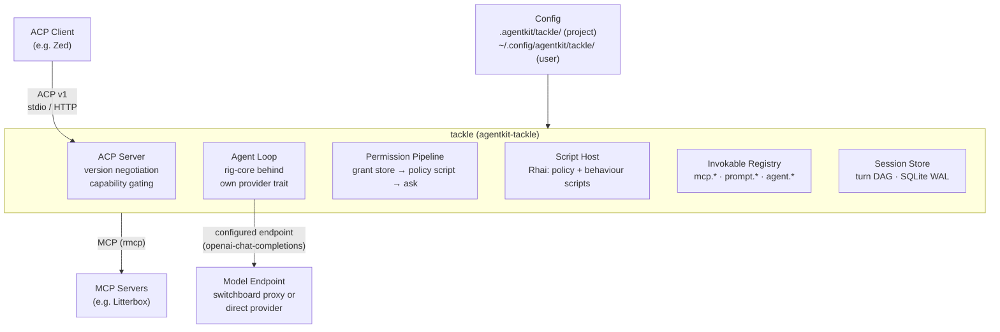

# Tackle: ACP-Native Agentic Coding Harness

**Status:** draft  **Created:** 2026-09-17  **Author:** adrian

Tackle is the real agentic coding harness for which earlier ADRs selected the building blocks: the ACP server harness (adrs/2026-04-28-acp-server) validated the protocol and chose the ACP Rust SDK; the MCP client SDK decision (adrs/2026-09-13-mcp-client-sdk) chose rmcp; the session storage ADR (adrs/2026-06-13-acp-server-session-storage) designed the turn DAG; the model provider SDK ADR (adrs/2026-06-14-model-provider-sdk) selected rig-core; switchboard (adrs/2026-06-14-switchboard) provides optional cost-aware routing; agentkit-credentials and agentkit-models provide credential sourcing and model metadata.

Tackle assembles these into a thin, ACP-native harness: an ACP v1 server for client interaction, an MCP client for all external capability, a turn-DAG session store, a unified invokable registry, an in-core fail-closed permission pipeline, and a Rhai script host for policy and workflow extension. The harness owns permission assessment and enforcement, deliberately isolated from any sandboxed development environment so the agent cannot rewrite its own access control. Sandboxing itself remains Litterbox's role, reached only via MCP.

Prior-art reviews of Pi, Codex CLI, OpenCode, and Goose recipes, a terminology survey, and security/UX reviews of this design are in research/ (harness-review.md, terminology.md, scout-findings.md, quest-findings.md). Terminology is normative in the workspace-root CONTEXT.md.

## Problem

The workspace has chosen libraries for ACP, MCP, model interaction, and session storage, but no harness integrates them: there is no agent that can hold a real conversation, call tools under permissions, persist and fork sessions, or be extended by users. The existing ACP server returns static echo responses and keeps sessions in memory.

## Goals

- Assemble the workspace's prior decisions (rmcp, rig-core, turn-DAG storage, credential sourcing) into a working ACP v1 harness
- Store sessions as a turn DAG supporting forking, compaction as a context lens, and multi-instance persistence
- Serve one invokable registry for both user-invoked and model-invoked operations
- Provide a script host so policy decisions and workflows are user-authored, not harness features
- Enforce permissions in-core, fail-closed, isolated from sandboxed environments

## Non-goals

- Sandboxing or container management (Litterbox's role, reached only via MCP)
- Provider routing, quota tracking, or cost optimisation (switchboard's role; loosely coupled via endpoint configuration only)
- Async sub-agents and proposal review flows (future ADR; elicitation-based, per-session overridable)
- Progressive disclosure of the prompt manifest (future ADR)
- Persistent permission grants (session-scoped only in v1; future work needs a management surface)
- ACP v2 implementation (version-negotiation boundary only)
- Built-in file or shell tools (delegated to MCP servers and ACP client capabilities)
- Request mutation in the permission pipeline (future; secret substitution and partial completion noted as use cases)
- Session import and export as an interchange format (interesting future work: package the turn DAG, definition snapshots, and provenance for replay and investigation; no standard exists today — ACP replay streams and OTel GenAI content capture are the nearest neighbours)
- Ancestor message editing (clients re-submit revised content as new turns, branching the DAG; no copy-on-write editing exists in v1)

## Functional Requirements

### FR-001: ACP v1 Server

Tackle implements ACP v1 over stdio and HTTP transports with protocol version negotiation per the initialization spec, responding with the latest supported version

**Slug:** `acp-v1-server`

### FR-002: Capability Advertisement

Tackle advertises loadSession, sessionCapabilities for list, close, resume, and delete, promptCapabilities for image content, and mcpCapabilities for HTTP; RFD-shaped features (fork, compaction updates, notices) are advertised via unstable capabilities and _meta and are sent only when the client advertises support, with stable-variant fallbacks always available

**Slug:** `capability-advertisement`

### FR-003: Session Lifecycle

Tackle supports session/new, session/list, session/resume, session/load, session/close, and session/delete against persistent storage; close cancels ongoing work and releases the ownership lease but the session stays listable and loadable, delete soft-hides it from session/list; session/load replays the full user-visible history in DAG order with original content and stable message and tool-call ids, never replays turns of ephemeral sessions, and sends exactly one usage snapshot after replay derived from the per-turn usage records

**Slug:** `session-lifecycle`

### FR-004: Session Ownership

Each session has an ownership lease with heartbeat surfaced in session/list; a session/prompt against a session actively owned by another connection fails with a precise error; session/delete is soft, never destroys turns referenced by forks, and refuses live sessions

**Slug:** `session-ownership`

### FR-005: Turn Loop

Each session/prompt assembles context by walking the turn DAG from the head and stopping at compaction turns, builds the system prompt from the actor persona plus harness sections, streams model output as message and thought chunks with one messageId per logical message, maps stop reasons onto ACP stopReason values, and enforces the model-request cap from configuration (default 8) with an explanatory agent message before returning max_turn_requests

**Slug:** `turn-loop`

### FR-006: Model Endpoint Configuration

The model endpoints are user-configuration only: named upstreams, each a base URL plus wire format (openai-chat-completions and anthropic-messages in v1), models addressed as endpoint-qualified names, and credential resolution through a credential helper command per the switchboard model with no secret values or env var names in configuration; project configuration must not set or override endpoint or credential settings; rig-core is wrapped behind a tackle-owned provider trait

**Slug:** `model-endpoint-config`

### FR-007: Usage Reporting

Tackle sends usage_update after each model request and once at session setup, deriving used from the last request input token count, size from agentkit-models context-window metadata, and cost from agentkit-models pricing or endpoint-reported values; usage is persisted per turn as the delta that turn's requests incurred, session cumulative cost is the sum over the session's own turns — ancestor turns' costs belong to their creating sessions so forks never double-count — and the post-replay snapshot derives from the per-turn records

**Slug:** `usage-reporting`

### FR-008: Error Handling

Tackle owns retries with exponential backoff honouring retry-after for transient failures, reports retry attempts as tool-call status cards, surfaces hard failures as JSON-RPC errors and mid-stream failures as an agent message plus terminal stopReason, preserves partial output in the DAG, translates provider context-length errors into actionable messages, and never retry-loops on them

**Slug:** `error-handling`

### FR-009: Invokable Registry

All operations are invokables namespaced by mechanism: mcp.<server>.<tool>, prompt.<name>, and agent.<actor>, each with user_invokable and model_invokable flags; the model sees namespaced names so cross-server tool collisions cannot occur; collisions within a namespace resolve by layer precedence (project over user) while same-layer collisions are configuration errors; model_invokable prompts are exposed to the model as tools whose invocation loads the expanded body into context

**Slug:** `invokable-registry`

### FR-010: Reusable Prompts

Prompts are markdown files with frontmatter carrying description, declared parameters with {{ templating }} substitution, visibility flags, and an optional compaction tag; parameter definitions map to ACP AvailableCommandInput hints; unknown commands and arity mismatches fail with a precise JSON-RPC error carrying the usage string and store nothing

**Slug:** `reusable-prompts`

### FR-011: Direct Invocation

A user may execute an invokable directly by typing /!name arguments, which runs the MCP tool with no model request, reports tool_call and tool_call_update notifications, responds end_turn, and stores the result in the turn for later model context; direct invocation bypasses the permission pipeline because the user is the authority; a command named ! is advertised via available_commands_update so clients autocomplete the prefix, and the /! prefix is recognised only on user-typed input, never in model output, seed messages, script payloads, or script-sent prompts; oversized outputs are truncated at a fixed internal limit (16 KiB) with an explicit marker recording the original size, full content retained in storage; /! on a non-MCP invokable fails with a precise error — direct invocation supports MCP tools only

**Slug:** `direct-invocation`

### FR-012: Manifest Injection

The system prompt includes every prompt invokable name and description plus the invokable listing, and instructs the model never to emit command syntax as literal text

**Slug:** `manifest-injection`

### FR-013: MCP Integration

Tackle connects MCP servers from client-provided mcpServers, user configuration, and trust-gated project configuration using rmcp, connecting asynchronously with per-server timeouts so session/new returns immediately and per-server status is reported at the first turn; duplicate server names resolve by precedence: the client-declared server wins and the shadowed config server is reported at the first turn; MCP elicitations surface via session/request_permission with explicit origin attribution and never write the grant store; server spawn uses explicit argv with no shell interpretation and no blanket environment forwarding; MCP tool results are truncated at the same fixed internal limit as direct invocation outputs

**Slug:** `mcp-integration`

### FR-014: Permission Pipeline

Every model-initiated invocation passes through, in order: grant store deny records which short-circuit, then the pre_tool_use policy script if any (allow and deny final, ask falls through, receives a previously_granted flag), then grant store allow records, then the fixed ask fallback which is not configurable regardless of the interactive indicator, which informs scripts only; the grant store is in-memory only — keyed by actor and invokable, scoped to the session's active life in the current process, gone on close, on process exit, and on resume after restart, written only by tool-invocation allow_always and reject_always responses; scripts never invoke tools directly, so the pipeline and user direct invocation are the only paths to tool execution; cancelled permission outcomes are reject-once — including headless clients, whose rejection emerges from client cancellation rather than any harness-side auto-reject or timeout (tackle imposes no timeout on permission requests) — reject_always informs the model once, and ask reasons surface in the permission prompt content

**Slug:** `permission-pipeline`

### FR-015: Policy Scripts

Policy scripts are Rhai scripts registered at pre_tool_use receiving the request as structured data including named tool arguments, actor information, an interactive indicator, and history_search; engines enforce operation, call-level, expression-depth, and collection-size limits, a time limit around one second, a script size cap, no module imports, a fresh engine per invocation, and argument payload caps; script error or timeout fails closed to ask with the error surfaced; script output goes to stderr never stdout; host functions are panic-safe

**Slug:** `policy-scripts`

### FR-016: Behaviour Scripts

Behaviour scripts are Rhai scripts registered at session_forked, post_turn (with context usage in the payload), compaction_requested, and title_trigger, with host functions fork_session, send_prompt, await_completion, insert_seed, record_compaction, and set_session_title, plus history_search, context_usage, and log available to all scripts; policy engines structurally lack every acting function; scripts never invoke tools directly — model-mediated tool calls from script-driven prompts pass through the normal pipeline; events fire in every session including ephemeral ones, with the session kind in the payload so scripts decide how to handle their own re-entrancy; budgets bound live ephemeral forks — live from fork_session until the fork's current turn completes or times out, regardless of whether the script awaits it — prompts per script and turn and session, and await timeouts; script-driven model calls are surfaced to the client as ACP notices; nested script-driven prompts are forbidden beyond depth one

**Slug:** `behaviour-scripts`

### FR-017: Ephemeral Sessions

Forks created by behaviour scripts are marked kind ephemeral, share the parent DAG without copying, are never revert points, are excluded from session/list by default with a configuration option to include them marked via _meta, attribute usage and cost to the parent session, and are never replayed by session/load

**Slug:** `ephemeral-sessions`

### FR-018: Compaction

Compaction is modelled as a compaction turn in the DAG holding a summary message and first_retained_turn_id; context assembly emits the summary and resumes from first_retained_turn_id for keep-recent compaction or terminates for full compaction; deleting the turn restores full context; an immutable pinned prefix of system prompt and standing instructions can never be elided; records are attributed to the producing script and summaries are stored as system-role messages marked untrusted in metadata, wrapped in delimiters when assembled into model context; compaction-tagged prompts are intercepted: the compaction_requested event fires instead of a model turn in the main session; compaction is always announced in-band with stable variants including trigger and token counts plus a usage_update, with RFD-shaped compaction updates sent only to clients advertising the capability; the manual path defines a complete /compact turn with before and after counts

**Slug:** `compaction`

### FR-019: Forking

Tackle implements the session/fork RFD for clients that advertise support, with fork updates flowing only after the client attaches to the fork; for v1 clients a built-in user-invokable /fork prompt creates the fork, seeds it, and reports the new session id within the parent turn; seed messages are harness-authored static user-facing content with their own messageId; forks are titled from their parent at creation (derived, not model-generated) and the title_trigger script may replace them later

**Slug:** `forking`

### FR-020: Session Titling

A default title_trigger behaviour script summarises recent turns in an ephemeral fork and sets the session title via session_info_update; the event fires after every completed turn while the session has no title, and the script decides what to do; titling failures are silent and never block; updatedAt is sent each turn for list sorting

**Slug:** `session-titling`

### FR-021: First-Run Experience

Tackle ships a built-in default persona and actor so session/new always succeeds with no user configuration; missing provider credentials surface through the ACP authentication flow rather than prompt failure; a first-session seed message lists the configuration layers loaded with counts; configuration errors name the file and key

**Slug:** `first-run`

### FR-022: Config Discovery

Tackle loads ./.agentkit/tackle/config.toml overriding ~/.config/agentkit/tackle/ with subdirectories personas, actors, prompts, and scripts; project scripts, personas, actors, and prompts are trust-gated: first-use consent via a permission prompt, TOFU hash pinning keyed by repository remote plus file hash, re-consent on any change, loaded once at process start with no hot reload; overrides of built-in defaults are surfaced to the user

**Slug:** `config-discovery`

### FR-023: Content Types

Tackle accepts text and image content blocks in session/prompt and rejects unsupported content types with a JSON-RPC invalid-params error rather than dropping them

**Slug:** `content-types`

### FR-024: Session Storage

Sessions persist to SQLite in WAL mode at the platform data directory from agentkit-path with restrictive file permissions outside any repository; the schema extends the storage ADR with turn kind and first_retained_turn_id and adds the content-addressed definition table — permission grants are deliberately in-memory only; turns carry actor and agent-instance attribution in metadata and per-turn usage deltas (input, output, cost); message content is stored as JSON-serialised ACP content blocks so images replay faithfully

**Slug:** `session-storage`

### FR-025: Observability

Tackle emits OpenTelemetry spans following the switchboard-otel pattern for turns, tool calls, and token usage; logs redact credentials and tool arguments; all harness diagnostics go to stderr

**Slug:** `observability`

### FR-026: Agent Invocation

Invoking agent.<actor> spawns a new agent instance of that actor running a nested turn loop within the current turn: the invocation arguments form the prompt, the nested actor's tool calls pass through the same permission pipeline, the final message returns as the tool result, and usage is attributed to the parent session; nested loops share the parent turn's model-request cap, agents cannot spawn further agents (a fixed one-level nesting limit), and agent invokables are model-invokable only; async sub-agents remain a non-goal

**Slug:** `agent-invocation`

### FR-027: Session Config Options

Tackle exposes ACP configOptions: a model selector populated from per-endpoint model discovery with static config lists as fallback and degraded discovery reported as a notice, and an actor selector; mid-session model switches are validated against the new model's context window with auto-compaction announcement and a context note, taking effect the following turn

**Slug:** `session-config-options`

## Non-functional Requirements

### NFR-001: Thin Core

The harness ships no built-in tools beyond registry and dispatch necessities; every built-in behaviour including compaction and titling scripts is individually disableable and replaceable so users can roll their own

**Slug:** `thin-core`

### NFR-002: Multi-Instance

No component assumes singleton operation: multiple tackle processes run per project sharing the session database safely, with ownership leases preventing concurrent turn execution on one session

**Slug:** `multi-instance`

### NFR-003: Performance

session/new returns immediately without blocking on MCP connections; context assembly is a single recursive CTE walk whose cost is bounded in practice by compaction rather than by assembly limits — DAG depth is unbounded by design; startup is fast with schema verification only

**Slug:** `performance`

### NFR-004: Testability

The suite runs offline using rig cassettes and recorded fixtures; a golden-transcript conformance suite replays recorded ACP sessions against stable-only features, unstable-feature builds, and a strict deserializer; a two-process integration test covers shared-database session lifecycle

**Slug:** `testability`

### NFR-005: Security Posture

Fail-closed throughout: allow is unreachable as a default, scripts are sandboxed with hard limits and no grant access, project executable configuration is trust-gated, credentials never enter model context or logs, and the permission system cannot be rewritten by the agent it governs

**Slug:** `security-posture`

### NFR-006: Protocol Conformance

Strict ACP v1 compliance on the stable surface; RFD-shaped behaviour is always behind advertised capabilities with stable fallbacks, verified by the conformance suite

**Slug:** `protocol-conformance`

## Acceptance Criteria

### AC-001: Agent Loop Works

A client completes a prompt turn against a real model with streamed chunks, tool calls through connected MCP servers, and a correct terminal stopReason

**Slug:** `agent-loop-works`

### AC-002: Persistence

Sessions survive process restart; session/load replays the full user-visible history with stable identifiers and a single usage snapshot

**Slug:** `persistence`

### AC-003: Fork Fallback

In a v1 client, /fork creates a fork with a seed message and reports the new session id in the parent turn; the fork is openable via session/list and session/load

**Slug:** `fork-fallback`

### AC-004: Compaction

Compaction reduces the context the model receives, is announced in-band with trigger and token counts, leaves stored history intact, and is reversible by deleting the compaction turn

**Slug:** `compaction-works`

### AC-005: Permission Pipeline

allow_always grants are session-scoped and honestly labelled, policy scripts can veto granted calls, and unconfigured tools prompt

**Slug:** `permission-pipeline-works`

### AC-006: Direct Invocation

/!name executes an MCP tool without a model request, reports the result as a tool call, stores it in the turn, and never triggers a permission prompt

**Slug:** `direct-invocation-works`

### AC-007: Reusable Prompts

/name expands a prompt with parameters into the conversation; unknown commands and arity mismatches produce precise errors naming the usage string

**Slug:** `reusable-prompts-works`

### AC-008: First Run

With an empty configuration, session/new succeeds with the built-in default actor and the first-session seed lists what was loaded

**Slug:** `first-run-works`

### AC-009: Multi Instance

Two tackle processes share one session database; a session actively owned by one refuses prompts from the other with a precise error

**Slug:** `multi-instance-works`

### AC-010: Trust Gating

Project scripts from an untrusted repository require explicit consent before loading; a hash change re-prompts; consent is recorded per repository remote

**Slug:** `trust-gating-works`

## Edge Cases

### EC-001: Client Lacks Capabilities

A client advertising no unstable capabilities receives only stable-variant updates; compaction and fork richness degrade to agent messages and usage updates without breaking the stream

**Slug:** `client-lacks-capabilities`
### EC-002: MCP Server Failure

A configured MCP server hangs or fails at session creation; the session opens without it and the failure is reported at the first turn

**Slug:** `mcp-server-failure`
### EC-003: Context Overflow With Compaction Disabled

Provider context-length errors surface as actionable messages noting that the default compaction script is disabled or absent and naming it; no retry loop

**Slug:** `context-overflow-compaction-disabled`
### EC-004: Script Failure

A policy script error or timeout fails closed to ask with the error surfaced; a behaviour script failure degrades gracefully, skipping titling or marking compaction failed without blocking the session

**Slug:** `script-failure`
### EC-005: Concurrent Prompt

A prompt against a session actively owned by another connection returns a precise ownership error rather than corrupting the turn DAG

**Slug:** `concurrent-prompt`
### EC-006: Elicitation Grant Separation

An MCP server elicitation answered with allow_always never grants tool permissions; elicitation prompts are visually and semantically distinct from tool permission prompts

**Slug:** `elicitation-grant-separation`
### EC-007: Pasted Command Text

Conversation text pasted with a leading / or /! is never hijacked as a command; only exact first-token matches on user-typed input are intercepted

**Slug:** `pasted-command-text`
### EC-008: Model Emits Command Syntax

The model emitting /name or /!name as reply text is stored as plain message content and never executed

**Slug:** `model-emits-command-syntax`
### EC-009: Fork Script Failure

A failing session_forked script never fails the fork; the user sees a notice when the client supports them, otherwise an agent message in the parent turn, and the fork continues without the seed, working without environment replication if the model never provisions it

**Slug:** `fork-action-failure`
### EC-010: Permission Cancelled

A client cancelling a permission request is treated as reject-once and the turn ends cancelled without error noise

**Slug:** `permission-cancelled`
### EC-011: Script Budget Exhaustion

A behaviour script exceeding its prompt or fork budget is refused for the remainder of the trigger while the session continues normally

**Slug:** `hook-budget-exhaustion`

