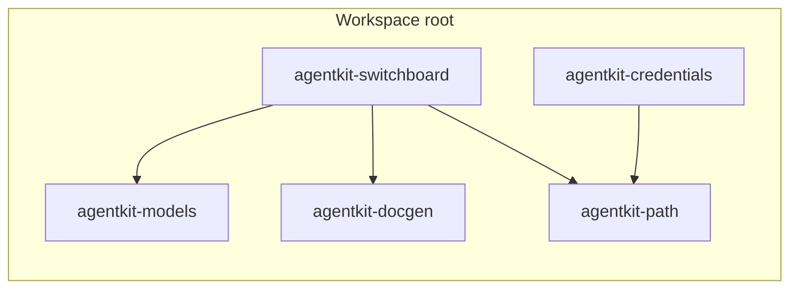
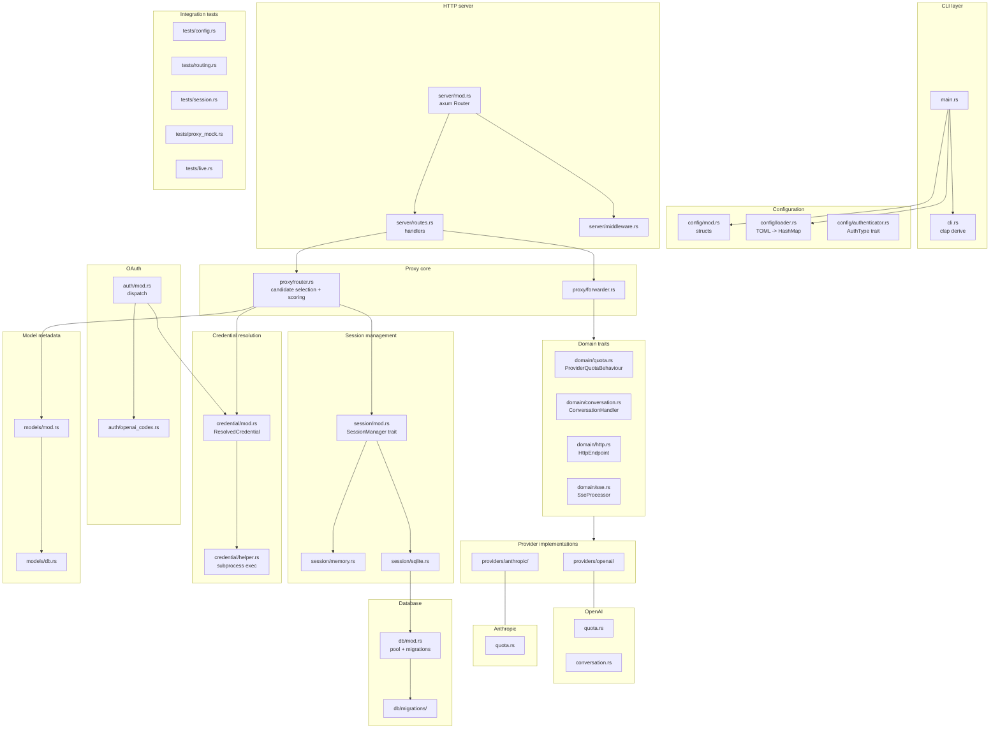
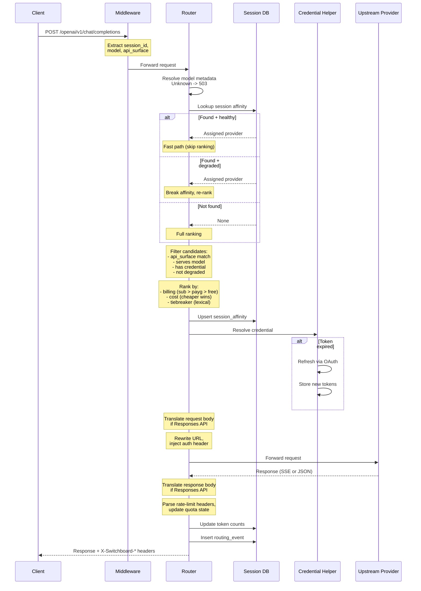

# Architecture

## Crate dependency graph

Dependency highlights:
- `agentkit-switchboard` depends on tokio, axum, reqwest, sqlx, serde, oauth2 — it does **not** depend on keyring or rig-core.
- `agentkit-credentials` ships two binaries (`agentkit-credential-keychain` and `agentkit-credential-file`) sharing protocol types in a library module. Only the keychain binary depends on `keyring-core`.
- `agentkit-models` bundles a models.dev snapshot at compile time via `build.rs`.
- `agentkit-path` provides platform-consistent data directory paths shared across all crates.

## Module map

## Request lifecycle

## Security

Credentials are **never** written to the config file, session database, or API responses. They are stored exclusively via credential helpers (system keychain or file with 0600 perms). Log output redacts credential values — helper binary invocations are logged without the credential blob.

## Logging

Uses `tracing` + `tracing-subscriber` with structured JSON output. Key events at each log level:

| Level | Signal |
|---|---|
| `error` | All providers degraded for model, OAuth refresh failure |
| `warn` | Provider degraded, session switched, credential helper not found |
| `info` | Routing decision per request, proxy start/shutdown |

Filter with `RUST_LOG=switchboard=debug` or the `--log-level` flag.
