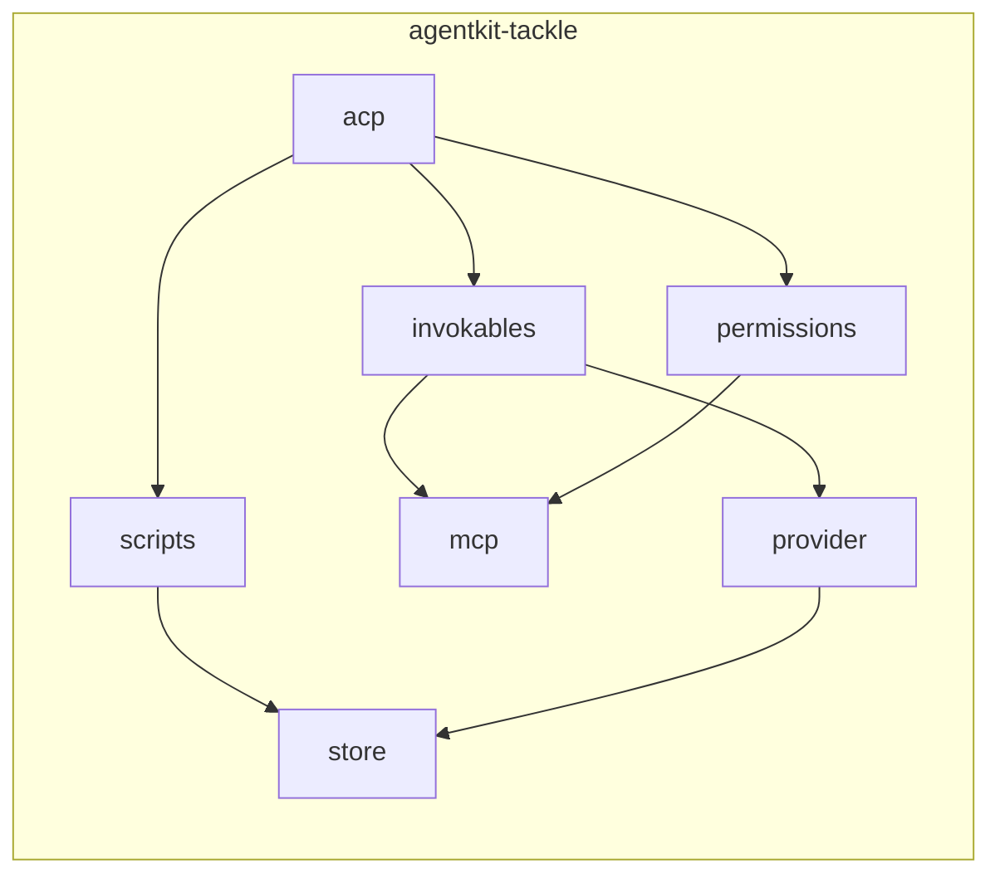
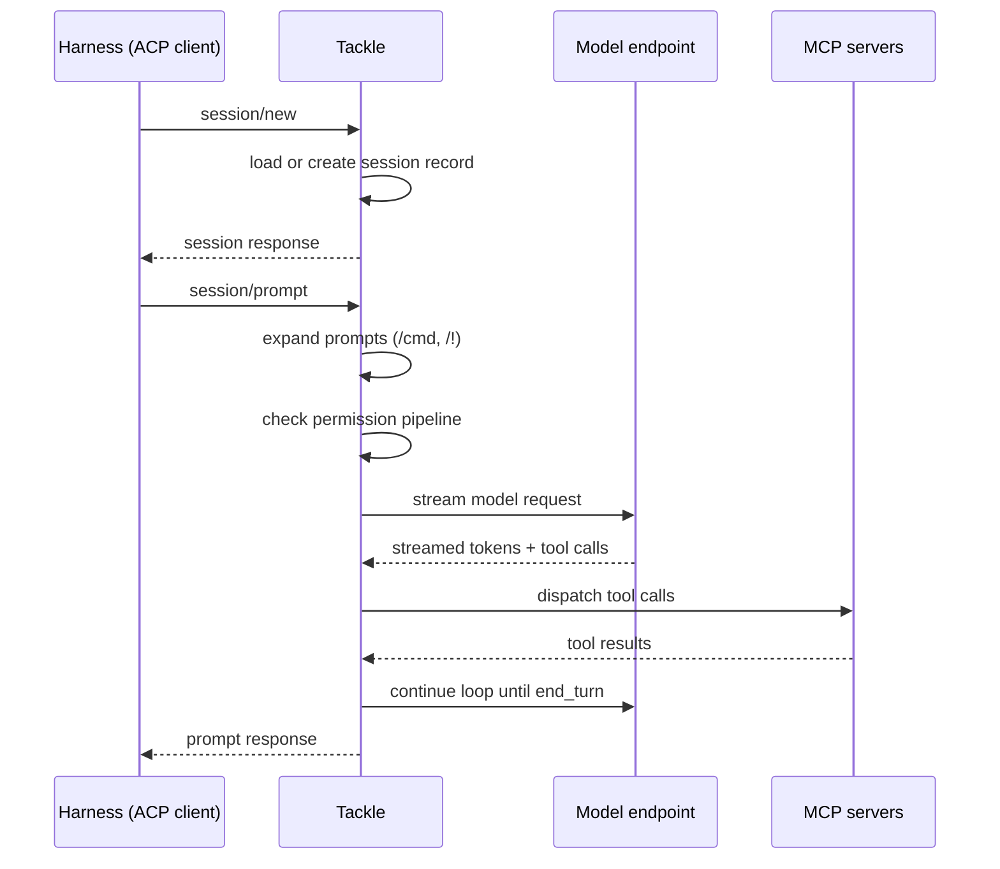

# Architecture

Tackle is built around three cooperating layers: the ACP protocol layer, the model loop, and persistent session storage.

## Crate dependency graph

## Session lifecycle

Every prompt is persisted before the model request and again after it completes, so a crash mid-stream leaves a resumable partial turn.

## Storage

The store is an abstraction with two backends:

- **SQLite** — the default, creating leading directories as needed.
- **In-memory** — used by tests.

Sessions form a tree: forking down a new path reuses the parent history. Turn, tool-call, and usage records are scoped to the session's lease.

## Behaviour scripting

Rhai scripts receive a host API over `SessionAccess` and run on the `policy` or `behaviour` engines. Built-ins (the default persona and actor, the summariser actor, and the compaction and titling scripts) are embedded in the binary and registered at the lowest precedence, so project configuration always wins.

## Transports

- **stdio** — `agent_client_protocol` over stdin/stdout, one connection per process.
- **HTTP** (unstable) — axum-based transport sharing the same `run_agent_over` handler chain as stdio.
