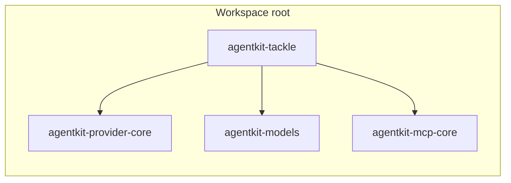

# Overview

`agentkit-tackle` is the ACP server crate. It hosts agent sessions, proxies model traffic to any compatible endpoint, dispatches tools to MCP servers, and persists everything to the session store.

## Crate dependency graph



## Module map

- `store` — session, turn, and tool-call persistence over SQLite and in-memory backends.
- `provider` — model loop, streaming, retry policy, and failure classification.
- `mcp` — client pool, namespaced tools, elicitation forwarding, spawn hygiene.
- `invokables` — unified registry of prompts and tools for expansion and `/!` direct invocation.
- `permissions` — fixed-order permission pipeline with consent grants.
- `scripts` — Rhai engines for policy and behaviour, plus the host API exposed to scripts.
- `builtins` — default persona, actors, and Rhai scripts embedded in the binary.
- `acp` — ACP session and prompt handlers, forking, compaction, titling, first-run, and transports (stdio, HTTP).
- `telemetry` — OpenTelemetry spans with type-level redaction.
- `config_loader` / `config` — project configuration parsing and merging.

## Development

```bash
cargo test -p agentkit-tackle
cargo clippy -p agentkit-tackle --all-targets -- -D warnings
```
