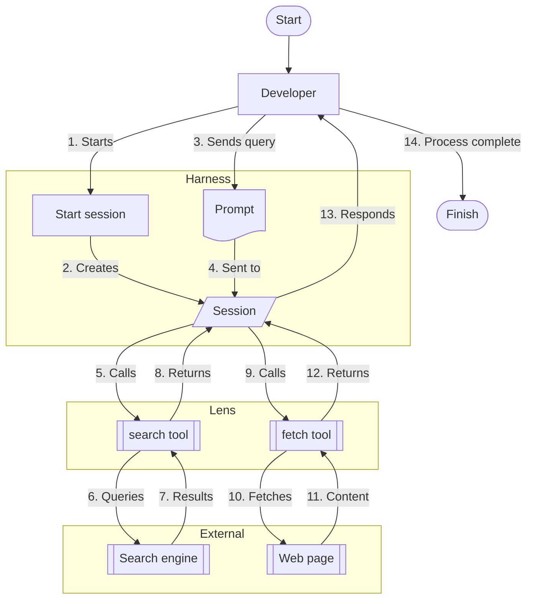

# 👋 Introducing Lens

Lens is an MCP server providing tools for querying search engines and fetching web pages. It currently supports only Brave Search, though Kagi is planned in the near future. It's private and secure by default, using only paid search engines and denying access to resources on your LAN.

## Workflow

To better visualise how Lens works, let's walk through a simple example of an agent searching for information and fetching a relevant page.

## Prerequisites

None!
