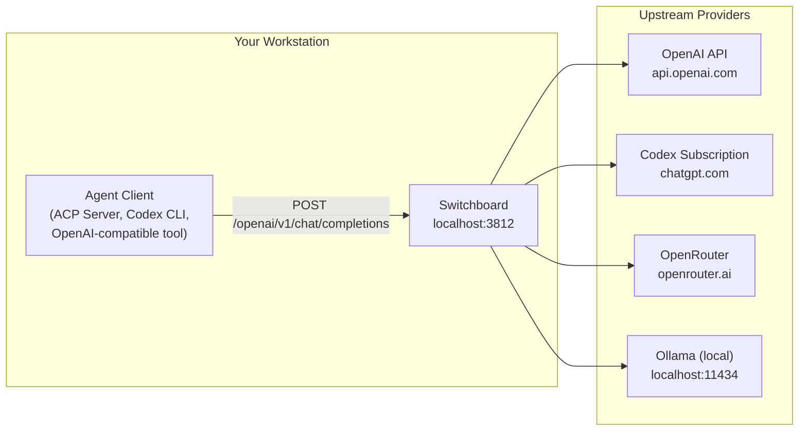

# 👋 Introducing Switchboard

Switchboard is a local HTTP proxy that automatically routes AI model requests to the most cost-effective provider available. It sits between your agent tools and upstream model providers, selecting where each request goes based on a scoring algorithm that maximises subscription quota usage before falling through to pay-as-you-go providers.

## Why Switchboard?

A developer working with AI agents typically has access to several model providers:

- **Subscription tokens** (Claude Code OAuth, OpenAI Codex subscription, GitHub Copilot) — flat-rate billing with time-windowed quotas (5-hour rolling windows, weekly caps). No per-token cost within quota.
- **Pay-as-you-go API keys** (OpenAI, Anthropic Platform, OpenRouter, Together, Groq) — per-token billing with rate limits and monthly spend caps.
- **Local models** (Ollama) — free, no auth, no limits beyond hardware.

Without a proxy, choosing which provider to use is manual and static: you hardcode an API key and pay per token even when a subscription with remaining quota is available. When subscription quota runs out, requests fail instead of falling through to a pay-as-you-go provider.

Switchboard solves this by acting as a **local HTTP proxy** that accepts requests in an OpenAI-compatible format and routes them intelligently.

## How it works

Switchboard exposes a single OpenAI-compatible endpoint at `http://127.0.0.1:3812/openai/v1/chat/completions`. When a request arrives it:

1. Determines the requested model and API surface from the path prefix.
2. Checks session affinity from its SQLite database (persists across restarts).
3. Filters candidate providers by model availability, credential validity, and health.
4. Ranks remaining providers: subscription quota > pay-as-you-go > free, then by cost.
5. Forwards the request to the best provider, translating between API formats if needed (e.g. Chat Completions to Responses API for Codex subscription).
6. Tracks quota and rate-limit state from response headers, automatically degrading and recovering providers.

## Key features

- **Cost-aware routing**: preferentially routes through subscription providers while quota remains, falls back to pay-as-you-go only when necessary.
- **Session affinity with persistence**: session-to-provider mappings survive restarts via SQLite, preserving KV cache benefits.
- **Automatic failover**: when a provider returns 429 (quota exhausted), the session is re-assigned to the next-best provider transparently.
- **Credential pooling**: multiple API keys or OAuth tokens for the same provider are treated as separate providers with independent rate-limit tracking.
- **OAuth token management**: built-in `auth login` subcommand handles the OAuth authorization code flow with PKCE, stores tokens via a [credential helper](../utilities/credentials) (system keychain or file-based).
- **Model metadata aggregation**: bundled models.dev snapshot merged with user TOML overrides provides a single source of truth for model capabilities and pricing.
- **Protocol translation**: transparently converts between Chat Completions and Responses API formats for providers like Codex subscription.
