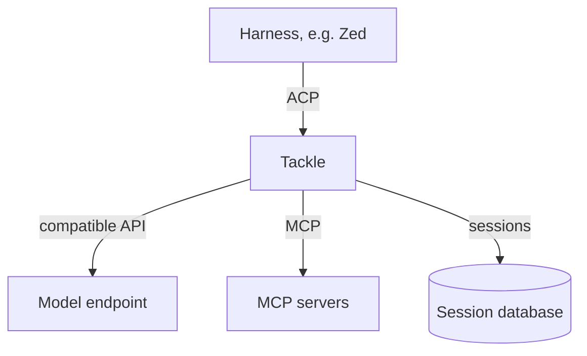

# 👋 Introducing Tackle

Tackle is an [Agent Client Protocol](https://agentclientprotocol.com) (ACP) server for coding agents. It hosts agent sessions end to end: it talks to any compatible model endpoint, connects to MCP servers for tools, and persists every session — prompts, model turns, tool calls, and usage — in a local session database you can fork, compact, and resume.

## What it does

- **ACP sessions over stdio and HTTP** — wire up any ACP-compatible harness, such as Zed, or drive sessions over an HTTP transport.
- **Persistent sessions** — every turn is stored before and after model requests, so work survives restarts and mid-stream failures.
- **MCP tool pools** — namespaced tools from multiple MCP servers, with spawn hygiene, timeout handling, and elicitation forwarding.
- **Session ergonomics** — fork sessions down a new path, compact long histories with in-band announcements, and let the model pick its own title.
- **Direct invocation** — call MCP tools explicitly with `/!tool-name`, bypassing the model.
- **Behaviour scripting** — respond to events like `post_turn` and `compaction_requested` with Rhai scripts and persona/actor overrides.
- **Observability** — OpenTelemetry spans for turns, tool calls, and token usage, with type-level redaction of sensitive payloads.

## Workflow



1. Your harness starts a session with Tackle over stdio or HTTP.
2. Tackle proxies model requests to your configured endpoint, streaming tokens back to the harness.
3. Tool calls are dispatched to MCP servers from the project configuration.
4. Everything is persisted in the session database, ready to fork or resume.

## Getting started

Run the binary from the repository:

```bash
cargo run -p agentkit-tackle
```

It speaks ACP on stdin/stdout by default; see [Reference](./reference/cli.mdx) for flags and configuration.
